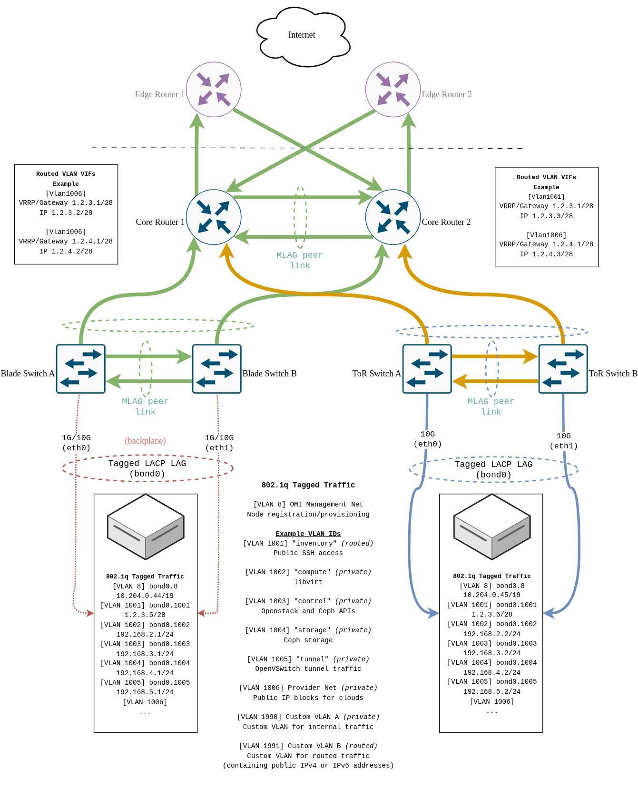

# OpenMetal Infrastructure Explained

## Overview

At OpenMetal, all bare metal nodes come preconfigured with bonded network
interfaces using LACP (802.3ad). This setup forms a `bond0` interface
combining two physical NICs, giving your server both redundancy and
additional bandwidth.

Every switchport connected to your node is configured as a **trunk port**,
allowing multiple VLANs to pass through. This makes it easy to layer
additional VLANs on top of the existing bond interface without needing
physical changes.

Some VLANs, such as the “Inventory” (`bond0.1001`) and “Provider”
(`bond0.1006`), are **routed VLANs**. These are backed by virtual interfaces on
OpenMetal’s core switches and use **VRRP** (Virtual Router Redundancy Protocol)
for high availability.

Because of this, routed VLANs will always consume **five reserved IPs** from
each prefix:

- **1 IP** for the VRRP gateway address
- **2 IPs** for the core switches
- **1 IP** for the network address
- **1 IP** for the broadcast address

For example, in a `/28` block (`1.2.3.0/28`):

| IP Address    | Usage                 |
|---------------|------------------------|
| 1.2.3.0       | Network address         |
| 1.2.3.1       | VRRP gateway            |
| 1.2.3.2       | Core switch 1           |
| 1.2.3.3       | Core switch 2           |
| 1.2.3.4–1.2.3.14 | Usable IPs for devices |
| 1.2.3.15      | Broadcast address       |

You can view your cluster’s assigned VLANs and IP prefixes in  
**Central → Assets → Networking**.

How-to guide on creating VLANs and IP prefixes in your Central Dashboard
-[OpenMetal VLAN Guide](https://openmetal.io/docs/manuals/openmetal-central/adding-ip-addresses)

### Physical Network Layout

Our pod networks use a collapsed core topology with n+1 redundancy at each level.
Blade server chassis act like their own "rack" in terms of network layout, and
are directly connected to the core. Top-of-rack (ToR) switches each connect
upwards to the core, and between themselves.

Small, Standard, and GPU servers are blade-type servers. All other server types
connect via the ToR switches.



### Notes and Reminders

- VLANs must be provisioned in **OpenMetal Central** before use.
- Only VLANs assigned to your cluster will pass through trunked interfaces.
- If you need help provisioning a VLAN, OpenMetal support team can assist.

---

## Use Case

You’ve added a new VLAN to your project via OpenMetal Central  
(e.g., VLAN ID `1993` with IP range `192.168.10.0/24`) and want to configure  
it on an existing node. Since `bond0` is already in place, you’ll simply  
attach the new VLAN as a subinterface.

---

## Option 1: Manual (Linux CLI)

```bash
ip link add link bond0 name bond0.1993 type vlan id 1993
ip addr add 192.168.10.5/24 dev bond0.1993
ip link set bond0.1993 up
````

If a gateway is needed:

```bash
ip route add default via 192.168.10.1
```

---

## Option 2: Using NetworkManager (RHEL/CentOS)

```bash
nmcli con add type vlan dev bond0 id 1993 \
  ifname bond0.1993 con-name vlan-custom \
  mtu 1500 ipv4.method manual \
  ipv4.addresses 192.168.10.5/24
```

Add gateway and DNS (if needed):

```bash
nmcli con mod vlan-custom ipv4.gateway 192.168.10.1
nmcli con mod vlan-custom ipv4.dns "1.1.1.1,8.8.8.8"
```

Activate the new connection:

```bash
nmcli con up vlan-custom
```

---

## Option 3: Netplan (Ubuntu)

Edit your Netplan config file (e.g., `/etc/netplan/50-cloud-init.yaml`):

```yaml
network:
  version: 2
  vlans:
    bond0.1993:
      id: 1993
      link: bond0
      addresses: [192.168.10.5/24]
      gateway4: 192.168.10.1
      nameservers:
        addresses: [1.1.1.1, 8.8.8.8]
```

Apply the configuration:

```bash
netplan apply
```

Verify VLAN Connectivity
Once the VLAN subinterface is configured and brought up, verify connectivity
from a remote host that can reach the same VLAN.

From another host on the same VLAN or with routing to it:

```bash
ping 192.168.10.5
```

If you receive responses, the configuration is working as expected.

If pings fail, verify the VLAN is assigned in Central and that firewalls or
security groups aren’t blocking ICMP.
