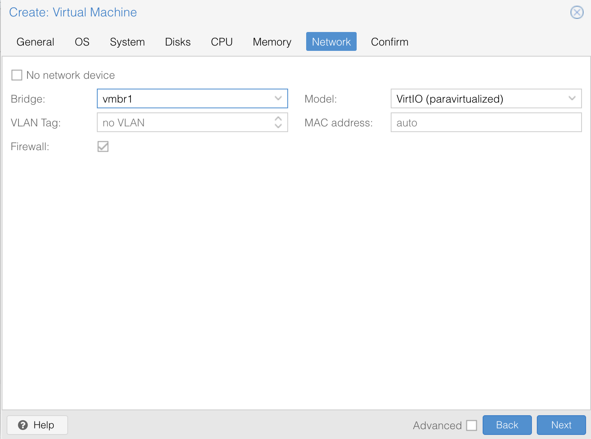

# Installing Proxmox VE on Bare Metal

Author: Nemanja Ilic

If you’ve ever wanted to turn a physical server into a full-featured
virtualization host, **Proxmox Virtual Environment (Proxmox VE)** is one of the
best open-source platforms you can use. It combines KVM virtualization and LXC
containers with an easy-to-use web interface, clustering support, storage
management, and advanced networking features.

Proxmox is widely used by homelab enthusiasts, small businesses, and even
enterprise deployments because it offers flexibility without licensing costs.
With it, you can create and manage virtual machines (VMs), set up private
networks, and even run complex high-availability clusters.

## Where to Get Proxmox VE

You can download Proxmox VE directly from the [official website](https://www.proxmox.com/en/downloads).
The ISO installer is what you’ll use to install it onto your bare metal server.

The installation process is straightforward and not very different from
installing a typical Linux distribution, but the most important part comes
later: configuring the **networking**. That’s what will let you connect to
the Proxmox web interface and make your virtual machines usable.

## Start the Proxmox Installation

First, you’ll need to mount an ISO downloaded from the official website.
For this guide, we used **proxmox-ve_8.4-1.iso** and mounted it through IPMI.


Once you boot the server from the Proxmox ISO, you’ll see the installation
welcome screen:


Here, we chose **Proxmox VE (Graphical) Installation**.

The installer will walk you through a few steps:

- Selecting the installation target disk:

    

- Choosing a filesystem (ZFS, ext4, XFS, btrfs - ZFS is common for redundancy
if you have multiple disks):


- Setting your location and time zone:

    

- Set the admin password and email:

    

:::note
Keep in mind that this password will be used both for logging into the
web UI and for SSH access to the server after the installation is complete.
:::

- Configuring management network settings:

    

At this stage, you’ll be asked to set a hostname, IP address, gateway,
and DNS server.

**This is a common stumbling point,** especially in data center environments
with VLANs or routed subnets. If you enter the wrong details, the installation
will still complete, but you won’t be able to reach the web interface at
`https://your-server-ip:8006`. Don’t panic though, you can fix this afterward,
and we’ll walk you through the steps later in this guide.

Here is our summary of all of the options we chose:


After confirming everything is set, click **Install** and wait for the process
to complete.


## Correcting the Network Configuration

Once the installation is complete, if you can’t access the web interface at the
IP shown on the Proxmox welcome screen, don’t worry. The good news is that even
if something went wrong during setup, you can easily fix it afterward. Proxmox
networking is managed through the familiar Debian
file: `/etc/network/interfaces`.
<!-- markdownlint-disable MD013 -->
Here’s an example of a corrected configuration we used for a Proxmox host
named `stormy-dino`

```bash
# /etc/network/interfaces
# Proxmox host networking - stormy-dino

auto lo
iface lo inet loopback

# --- Physical NICs (bonded) ---
iface enp82s0f0np0 inet manual
iface enp82s0f1np1 inet manual

auto bond0
iface bond0 inet manual
    bond-slaves enp82s0f0np0 enp82s0f1np1
    bond-miimon 100
    bond-mode 802.3ad
    bond-xmit-hash-policy layer2+3

# --- Public / Management (Inventory VLAN 365) ---
auto bond0.365
iface bond0.365 inet manual
    vlan-raw-device bond0

auto vmbr0
iface vmbr0 inet static
    address 173.231.226.213/28
    gateway 173.231.226.209
    bridge-ports bond0.365
    bridge-stp off
    bridge-fd 0
    dns-nameservers 8.8.8.8

# --- Private VM Network (Compute VLAN 366) ---
auto bond0.366
iface bond0.366 inet manual
    vlan-raw-device bond0

auto vmbr1
iface vmbr1 inet static
    address 192.168.2.1/24
    bridge-ports bond0.366
    bridge-stp off
    bridge-fd 0

    # Enable IP forwarding
    post-up   sysctl -w net.ipv4.ip_forward=1

    # NAT: VMs on 192.168.2.0/24 go out via public (vmbr0)
    post-up   iptables -t nat -A POSTROUTING -s 192.168.2.0/24 -o vmbr0 -j MASQUERADE
    post-down iptables -t nat -D POSTROUTING -s 192.168.2.0/24 -o vmbr0 -j MASQUERADE

    # Forwarding rules
    post-up   iptables -A FORWARD -i vmbr1 -o vmbr0 -j ACCEPT
    post-up   iptables -A FORWARD -i vmbr0 -o vmbr1 -m state --state RELATED,ESTABLISHED -j ACCEPT
    post-down iptables -D FORWARD -i vmbr1 -o vmbr0 -j ACCEPT
    post-down iptables -D FORWARD -i vmbr0 -o vmbr1 -m state --state RELATED,ESTABLISHED -j ACCEPT

# --- Provider VLAN (376) for Public VM IPs ---
auto bond0.376
iface bond0.376 inet manual
    vlan-raw-device bond0

auto vmbr2
iface vmbr2 inet manual
    bridge-ports bond0.376
    bridge-stp off
    bridge-fd 0

# --- Optional VLANs (ready to be enabled if needed) ---

# Control VLAN 367
# auto bond0.367
# iface bond0.367 inet manual
#     vlan-raw-device bond0
# auto vmbr3
# iface vmbr3 inet manual
#     bridge-ports bond0.367
#     bridge-stp off
#     bridge-fd 0

# Storage VLAN 374
# auto bond0.374
# iface bond0.374 inet manual
#     vlan-raw-device bond0
# auto vmbr4
# iface vmbr4 inet manual
#     bridge-ports bond0.374
#     bridge-stp off
#     bridge-fd 0

# Tunnel VLAN 375
# auto bond0.375
# iface bond0.375 inet manual
#     vlan-raw-device bond0
# auto vmbr5
# iface vmbr5 inet manual
#     bridge-ports bond0.375
#     bridge-stp off
#     bridge-fd 0

source /etc/network/interfaces.d/*
```
<!-- markdownlint-enable MD013 -->
and simply reload the configuration with `ifreload -a`.

:::note
The IP addresses, gateways, and VLAN IDs shown here
(e.g., 173.231.226.213/28, VLAN 365, 366, and 376)
are specific to our environment. In your setup, you’ll
need to use the subnets and VLANs assigned to you in OpenMetal Central
(or by your own network team). The structure of the configuration will
be the same, but the actual values, IP ranges, gateway, and VLAN IDs
should match your project’s allocation.
:::

### In plain English

- **bond0**: combines two NICs into one logical interface with LACP for
redundancy and better throughput.

- **vmbr0**: management bridge on VLAN 365 (Inventory) with the host’s
public IP (`173.231.226.213`). This is how you reach the Proxmox web UI
and manage the server.

- **vmbr1**: private bridge on VLAN 366 with NAT. Any VM connected here
gets a private IP (`192.168.2.x`) and reaches the internet through the host.

- **vmbr2**: provider bridge on VLAN 376. Any VM connected here can be assigned
a **routed public IP** (`173.231.226.226–.238`) and is directly reachable from
the internet.

This setup gives you three distinct options:

- A stable management plane (`vmbr0`).

- Safe internal networks with internet access (`vmbr1`).

- Public-facing services on dedicated routed IPs (`vmbr2`).

## Why This Matters

During installation, Proxmox might only configure
a **single NIC with a static IP**. In our case, the installer
suggested `173.231.226.208` as the address, which wasn’t the right choice.

We corrected it afterward to use:

- **173.231.226.213/28** as the host’s management IP on
the **Inventory VLAN (365)**

- **173.231.226.209** as the correct gateway for the management network

This ensured the Proxmox host could reach the outside world, DNS worked
properly, and the web interface was accessible.

## Wrapping Up

At this point, Proxmox VE is installed and reachable. You can log in at:

```bash
https://<your-server-ip>:8006
```

from any browser. The corrected `/etc/network/interfaces` ensures your host has
the right management IP and that your virtual machines can use NAT to reach the
internet.

This aligns closely with how **OpenMetal’s Infrastructure** is structured
([see the documentation here](https://openmetal.io/docs/manuals/baremetal/tutorials/baremetal-networking)),
but tailored to a standalone Proxmox server.


Once you’re logged in, head over to **Updates > Repositories** and make sure
your repositories are up to date. For this test, we used
the **No-Subscription** repository.


Disable Enterprise repositories:


Then go back to the **Updates** tab and click **Upgrade** at the top of the
screen to apply the updates.


Once we have all the upgrades, we can start working on VM creation.

## Creating Virtual Machines on Proxmox

Once Proxmox is installed and networking is properly configured, the real fun
begins: spinning up virtual machines (VMs). VMs are the reason you installed
Proxmox in the first place - they let you run multiple isolated operating
systems on the same physical hardware.

In our case, we set up three key bridges:

- **vmbr0** → Public management bridge on VLAN 365, used by the Proxmox host
itself.

- **vmbr1** → Private NATed bridge on VLAN 366. VMs here get private
IPs (`192.168.2.x`) with internet access through NAT. We will cover this setup
in detail below.

- **vmbr2** → Provider bridge on VLAN 376. Attach a VM here if it needs a
dedicated public IP address and direct exposure to the internet.

This design gives us maximum flexibility: management access through Inventory
VLAN, internal VMs with NAT for private workloads, and routed public IPs for
internet-facing services - closely aligned with OpenMetal’s bare metal
networking model shown in the diagram bellow:


### Step 1: Upload an ISO Image

Before you can create a VM, you need an installation ISO for the operating
system you want to run (e.g., Ubuntu, Debian, Windows).

1. Log into the Proxmox web interface at `https://your-public-ip:8006`.
2. Navigate to your Proxmox node in the left sidebar.
3. Go to **Local (storage)** → **ISO Images**.
4. Click **Upload**, then select the ISO from your computer.

    

### Step 2: Create a New VM

1. At the top right of the Proxmox UI, click **Create VM**.
2. Fill in the general settings:
    - **Node**: Choose your server (in our case, `stormy-dino`).
    - **VM ID**: Leave the default or set your own.
    - **Name**: Something descriptive, like `ubuntu-nat` or `win-test`.

### Step 3: Select the ISO

In the **OS** step:

- Choose the ISO image you uploaded earlier.
- Proxmox should detect the OS type (Linux, Windows, etc.) automatically.

### Step 4: Configure System Resources

- **CPU**: Assign the number of cores.
- **Memory**: Allocate RAM (e.g., 4096 MB = 4 GB).
- **Disk**: Pick storage size and the storage backend (local ZFS in our case).

### Step 5: Configure Networking

This is where our `/etc/network/interfaces` setup comes into play.

- If you want the VM to be **publicly reachable with a dedicated IP**,
select **vmbr2** (Provider VLAN 376).
- If you want the VM to use the **Proxmox host’s management network**,
select **vmbr0** (Inventory VLAN 365).
- If you want the VM to live in the **private network with NAT**,
select **vmbr1** (Compute VLAN 366).



For example:

- A **production web server** → **vmbr2** (Provider VLAN, public IP).
- A **management or utility VM** → **vmbr0** (Inventory VLAN).
- A **test Ubuntu VM or internal database** → **vmbr1** (private, NATed).

### Step 6: Finish and Start

- Review your settings.
- Click **Finish**.
- Start the VM and open the console to complete the OS installation.

    

## What This Means in Practice

Thanks to our earlier network configuration, you now have three clear
networking options for VMs:

- **vmbr0 (Inventory VLAN 365)** → Used for Proxmox management and utility
VMs on the inventory network.
- **vmbr1 (Compute VLAN 366, NAT)** → Any VM connected here automatically has
internet access without needing a public IP. That’s because we enabled NAT
rules in `/etc/network/interfaces`, allowing VMs in `192.168.2.0/24` to reach
the internet through the host’s public interface.
- **vmbr2 (Provider VLAN 376)** → Assign public IPs to VMs here when you need
them to be directly reachable from the internet. Below is an example of a
public-facing VM running a simple webpage served by the Nginx web server:


This setup makes it easy to:

- Keep internal systems private.
- Only expose what you must to the public internet.
- Mimic a real data center-like environment, just like OpenMetal does.

## Configuring Networking During Ubuntu VM Installation

When creating an Ubuntu VM and attaching it to `vmbr1`, the guest won’t
automatically get an IP address. Why? Because there’s no DHCP server handing
out addresses on that bridge. Instead, we set a static IP manually during
installation.

On the **Network configuration** screen, choose **Manual** instead of DHCP,
and then enter:

- **Subnet:** `192.168.2.0/24`
- **Address:** `192.168.2.10` (or any free IP in that range)
- **Gateway:** `192.168.2.1` (the Proxmox host’s IP on vmbr1)
- **Nameserver:** `8.8.8.8` (or your preferred DNS server)


Once the installation finishes, your VM will:

- Use `192.168.2.10` as its private IP.
- Route traffic through `192.168.2.1` (Proxmox) and reach the internet via NAT.
- Stay invisible from the outside world unless you explicitly forward ports.

This is the clean, safe way to give test VMs internet access without burning
public IPs.

## Verifying That the VM Works

At this point, your Ubuntu VM is installed and running but we shouldn’t just
assume the networking is working, let’s prove it step by step instead.

### 1. Check the VM’s IP Address

Inside the VM, run:

```bash
ip a
```

You should see the private IP you set during installation (for
example `192.168.2.10`). This confirms the VM actually picked up the correct
configuration.


### 2. Test Connectivity to the Proxmox Host

Your Proxmox host (the NAT gateway) lives at `192.168.2.1`. To test that the
VM can reach it:

```bash
ping -c3 192.168.2.1
```

If you get replies, it means your VM can talk to its gateway.


### 3. Test Internet Connectivity

Since NAT is enabled on Proxmox, the VM should be able to reach the internet.
Test it by pinging:

```bash
ping -c3 8.8.8.8
```


This checks raw connectivity. Then check DNS resolution:

```bash
ping -c3 google.com
```


If both succeed, your VM can resolve hostnames and reach the outside world.

### 4. Update the System

To make sure everything really works, run:

```bash
sudo apt update
```

This pulls the latest package lists from Ubuntu’s servers. If you see
repositories being updated, you’re golden.


This confirms that the private VM network (`vmbr1`) is working correctly
— traffic flows out through the Proxmox host and into the internet,
exactly as designed.

### 5. Confirm NAT Is Working

One last neat trick: check what public IP your VM is seen as on the internet.
Run:

```bash
curl -s ifconfig.me; echo
```

It should show the **public IP of your Proxmox host** (e.g. `173.231.226.213`),
not the VM’s private address. That’s the proof that NAT is working exactly as
intended.


This set of checks shows that the VM:

- Has the correct private IP.
- Can talk to its Proxmox gateway.
- Can reach the internet through NAT.
- Is using the Proxmox host’s public IP for outbound traffic.

With that, your private VM network (`vmbr1`) is fully validated.

## Conclusion

Proxmox is a powerful platform for managing virtualized environments, and with
the right network configuration it can closely mirror how production data
centers operate. In this guide, we installed Proxmox on bare metal, corrected
the initial network setup, and configured `/etc/network/interfaces` so the host
supports three distinct networks:

- **vmbr0 (Inventory VLAN 365):** management and utility VMs, plus the Proxmox
host itself.
- **vmbr1 (Compute VLAN 366, NAT):** private networking where VMs get outbound
internet via NAT, ideal for internal systems and test workloads.
- **vmbr2 (Provider VLAN 376):** public-facing VMs with dedicated routed IPs,
directly accessible from the internet.

We demonstrated this by creating an Ubuntu VM, configuring its networking
during installation, and validating connectivity with real-world tests. This
combination of public-facing and private NAT-backed VMs on the same host gives
you the foundation of a true data center-like environment, just like the model
described in OpenMetal’s networking documentation.

From here, you can expand further: add VLANs for storage or control, implement
firewalling, or layer in advanced services. The key takeaway is that Proxmox is
not just for labs when properly configured, it can simulate or even serve as
production-ready infrastructure.
