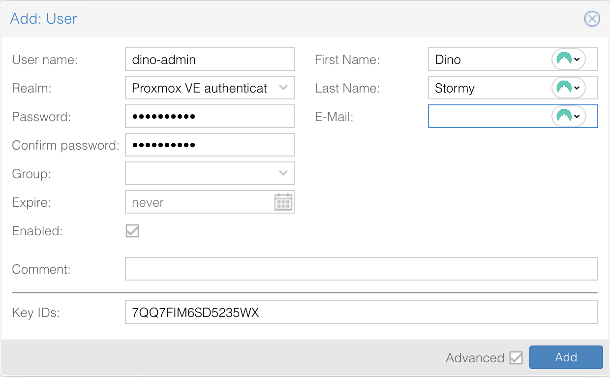
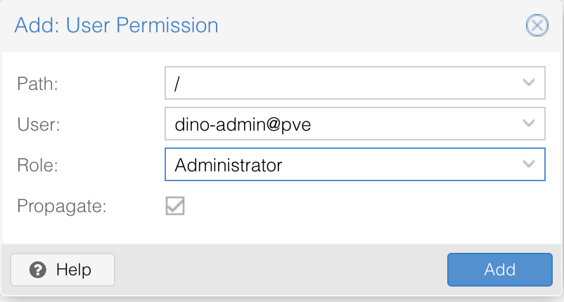
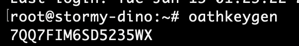
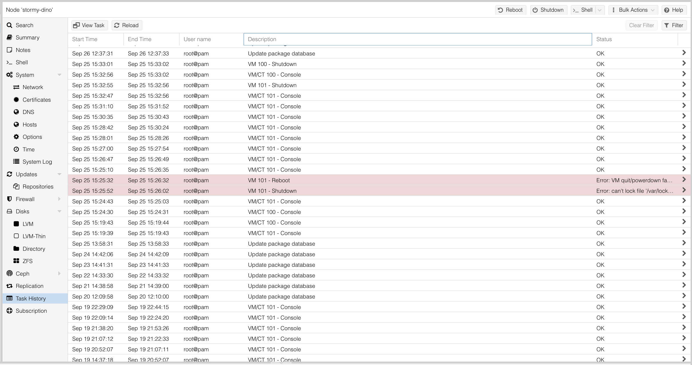

# Securing a Proxmox VE Bare Metal Host

Author: Nemanja Ilic

When Proxmox VE is deployed directly on bare metal, especially in a public or
internet-reachable environment, taking a few basic hardening steps early can
significantly reduce risk. Proxmox itself is a mature and secure platform, but
like any powerful management system, its default exposure should be tightened
before hosting production workloads.

## Secure Access to the Management Interface

The Proxmox web interface provides full administrative control over the host
and all virtual machines. Community best practices strongly recommend limiting
access to this interface wherever possible.

If feasible, expose the Proxmox UI only on a dedicated management network or
restrict access to known administrator IP addresses using firewall rules. To
do this, open the Proxmox web interface, select your node, navigate to
**Firewall**, and add inbound rules that allow access only from trusted
administrator IPs.


:::warning
**Important:** Be extremely cautious when adding firewall rules. Enabling the
firewall without proper allow rules may result in losing access to the node.
:::

The example above is just a small set of rules added to **Node Firewall**.

Avoid using the root account for daily administration where possible. Instead,
use dedicated administrative users for managing Proxmox and limit root access
to maintenance tasks.

In addition, enable two-factor authentication (2FA) for all administrative
users. Proxmox supports TOTP-based 2FA out of the box and this is widely
recommended in official documentation and forums. Below is a walkthrough on how
you can create a new administrative user and enable two-factor authentication
for that user.

In Proxmox UI, from the left side menu, select **Datacenter**. From the
Datacenter menu, expand **Permissions**, select **Users** and then click
**Add**. The options you may choose are listed in the screenshot below:



:::info
**Important:** When using OATH/TOTP authentication, a Key ID is required. One
way to generate a compatible key is by running the `oathkeygen` command on the
Proxmox node and entering the generated value into the **Key IDs** field.
:::

Once this is done, click Add button to create a new user. Next we will need to
add permissions for this user. To do that, head over to Permissions menu, click
**Add > User Permissions** and make sure you have everything selected:



This will give your user Administrator privileges.

To enforce two-factor authentication, edit the **pve** authentication realm
(which you will find under **Permissions > Realms**) and select the desired TFA
method.

:::info
Enabling TFA at the realm level applies to all users authenticating
against that realm.
:::note


Next, log out of the Proxmox UI and log back in using the newly created user.


After entering your username and password, Proxmox will prompt you for a second
authentication factor.


During the previous steps, a TOTP secret key was generated using the `oathkeygen`
command. This key represents the shared secret between Proxmox and your two-factor
authentication application.



To complete the setup, open your preferred 2FA application (such as Duo, Google
Authenticator, Authy, or similar) and create a new TOTP entry. When prompted,
manually enter the generated key as the application's secret key and give it a
recognizable name, for example “Proxmox”.

Once the key is added, your 2FA application will begin generating 6-digit
verification codes. Enter the current code when prompted by the Proxmox login
screen to complete authentication.

## Harden SSH Access

SSH access to the Proxmox host should be locked down early, disabling
password-based SSH authentication and requiring SSH key-based authentication
only is a good starting point. In order to do so, make sure following lines in
your `/etc/ssh/sshd_config` file are exactly like this:

```
PasswordAuthentication no
KbdInteractiveAuthentication no
PubkeyAuthentication yes
```

If it's not like this, make sure to change it and then restart `sshd`.
Additionally, access to the host can be further restricted by minimizing direct
root usage and relying on controlled administrative access where appropriate.

These steps are standard Debian hardening practices and are fully supported on
Proxmox hosts. They significantly reduce the risk of brute-force attacks and
credential leaks.

## Apply a Minimal Host Firewall

Proxmox includes a built-in firewall that can be enabled at the datacenter,
node, or VM level. At minimum, apply a simple host-level firewall policy that
allows only required services, such as:

- Proxmox web interface (TCP 8006)
- SSH (restricted to trusted IPs)
- Cluster or storage traffic as needed

Blocking all other inbound traffic at the host level reduces unnecessary
exposure without impacting normal Proxmox functionality. Proxmox supports
firewall rules at the Datacenter, Node, and Virtual Machine levels, so feel
free to apply whatever suits you the best. For example, if you set up a node
firewall via UI, you'll be able to see the configuration inside
`/etc/pve/nodes/{your-node}/host.fw` file. This is a simple example of what the
file can look like:

```
root@stormy-dino:~# cat /etc/pve/nodes/stormy-dino/host.fw
[OPTIONS]
enable: 1

[RULES]
IN ACCEPT -source 11.22.33.44/32 -p tcp -dport 22 -log nolog # Allow SSH
from admin IP
IN ACCEPT -source 11.22.33.44/32 -p tcp -dport 8006 -log nolog # Allow Proxmox
UI from admin IP
```

## Keep the System Updated and Lean

Proxmox is based on Debian, and keeping the underlying system up to date is an
essential part of security. Regularly apply security updates for both Debian
and Proxmox packages. Updates can be applied directly from the Proxmox web
interface or via standard Debian package management tools.

Remove unused services and packages from the host where possible. A lean system
has a smaller attack surface and is easier to monitor and maintain over time.

## Monitor Logs and Backups

Review system and authentication logs periodically for unexpected activity.
Proxmox provides clear logging for login attempts, task execution, and system
events, which makes early detection of issues easier. Proxmox makes this
visibility straightforward. Useful system information is available under
**Node > System > System Log** in the web interface. For deeper inspection,
standard Debian logs such as `/var/log/auth.log` and `journalctl` are also
available on the host.

Task history can also be useful as you can check lot of things, like updates,
VM behaviors, any console view attempt and so on.



Enable backup verification and periodically validate that backups are
restorable. While this is often considered an operational task, it is also a
security measure, protecting against data loss caused by misconfiguration or
malicious actions.

## Final Thoughts

Securing a Proxmox VE bare metal host does not require complex tooling or
invasive changes. By limiting management access, enforcing strong
authentication, applying a minimal firewall, and keeping the system updated,
you align with long-standing Proxmox community recommendations and official
guidance. These small, well-tested steps provide a solid security baseline
while keeping the platform flexible and easy to operate.