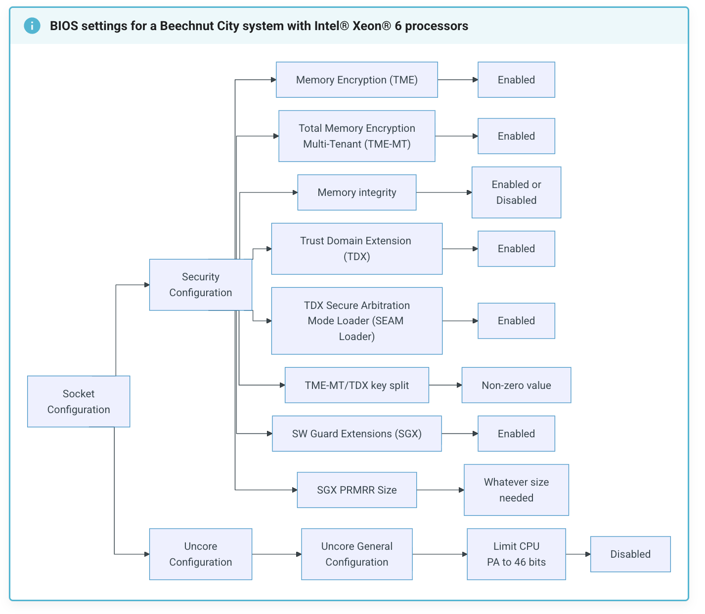
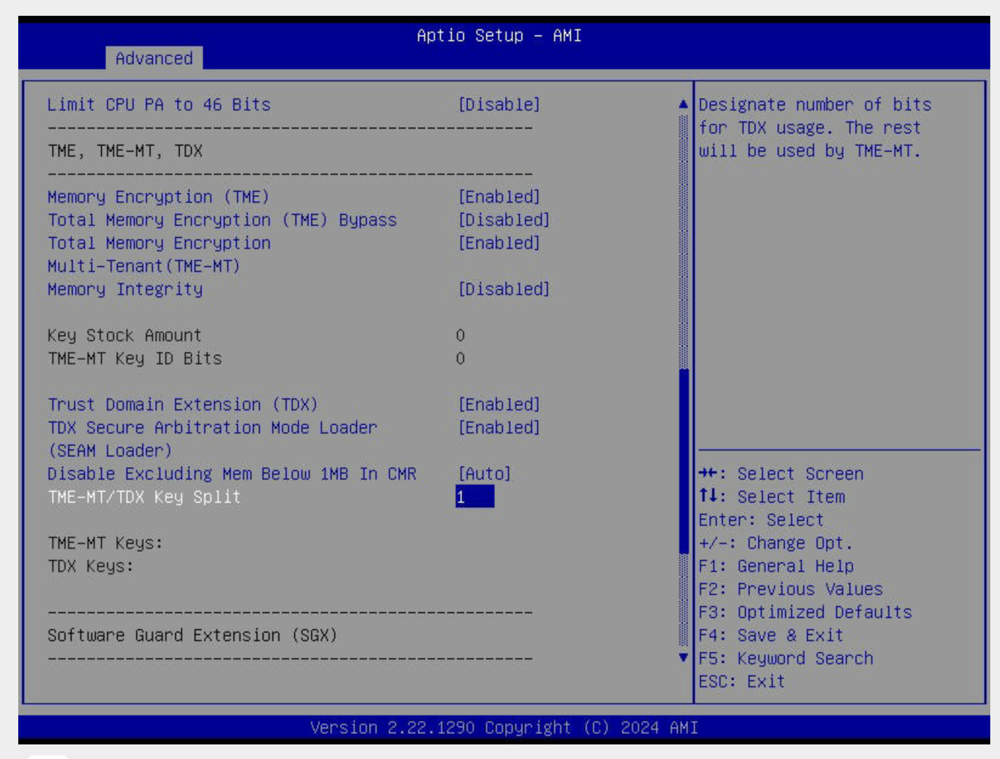
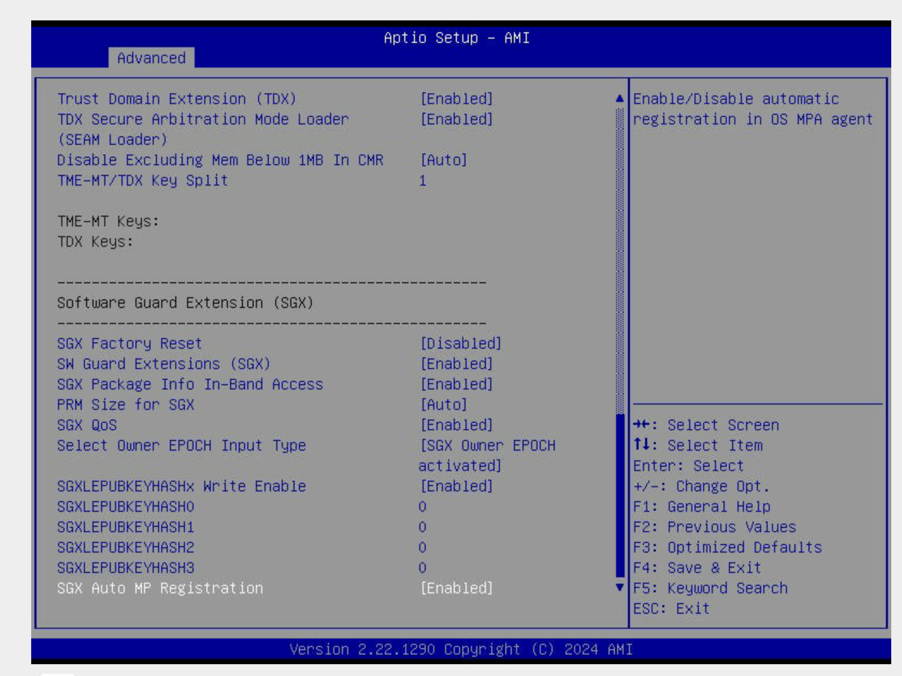

# Enabling Intel TDX on Bare Metal

[Intel Trust Domain Extensions (TDX)](https://openmetal.io/resources/hardware-details/intel-trust-domain-extensions-tdx/)
is part of Intel's confidential computing
stack, and it's designed to give virtual machines a hardened boundary from the
host system. When TDX is enabled, workloads run inside encrypted,
integrity-protected "Trust Domains" that stay isolated even if the hypervisor
or host OS is compromised. It's a big deal for customers handling sensitive or
regulated workloads who don't want to rewrite applications just to get stronger
isolation.

As interest grows, we've been getting the same question from users running on
OpenMetal bare metal: **"How do I actually enable TDX on my hardware?"** The
short answer is: you need the right CPU, the right memory layout, and the right
BIOS settings. Below is a walkthrough of what that looks like, based on the
systems we use. In order to access your hardware's BIOS, make sure you have
[IPMI access](https://openmetal.io/docs/manuals/openmetal-central/ipmi-access) first.

:::info Performance Benchmarks

Want to see how Intel TDX performs on real bare metal workloads
(including confidential blockchain and AI)? Check out the
[performance benchmarks blog post](https://openmetal.io/resources/blog/intel-tdx-performance-benchmarks-on-bare-metal-optimizing-confidential-blockchain-and-ai-workloads/)
for data and insights.

:::

## Hardware Requirements

Before touching the BIOS,
[make sure the server can support TDX at all](https://openmetal.io/resources/blog/intel-tdx-and-sgx-requirements/).
Intel's requirements are not flexible here.

### CPU

Only specific modern Intel CPUs are TDX-capable. You'll need either:

- **5th Gen Intel Xeon Scalable**, or
- **Intel Xeon 6**

These processors include the architectural features and silicon extensions that
make TDX possible. See
[Intel's TDX CPU documentation](https://cc-enabling.trustedservices.intel.com/intel-tdx-enabling-guide/03/hardware_selection/).

### Memory

TDX also requires a particular memory layout. For each CPU socket, **all slot-0
DIMM positions across every memory channel must be populated**. In practice,
that means:

- At least 8 DIMMs per socket
- Symmetric configuration across channels

If this condition isn't met, the firmware simply won't expose TDX. See
[Intel's memory requirements documentation](https://cc-enabling.trustedservices.intel.com/intel-tdx-enabling-guide/03/hardware_selection/#dimm-ie-main-memory-requirements).

Once CPU and memory check out, you can move on to BIOS configuration.

## Before You Enter the BIOS: Identify Your Platform

Intel groups TDX-capable systems into different platform families, and each of
those families exposes slightly different BIOS options. So before you start
hunting through firmware menus, figure out exactly which CPU and platform your
server is running.

On Linux, just run `lscpu`. This gives you the CPU model and microarchitecture
so you can match your system to the correct section of Intel's TDX hardware
setup guide. For example,
[many of our OpenMetal servers](https://openmetal.io/resources/media-and-press/openmetal-unveils-v4-hardware-catalog-for-superior-performance-across-applications/)
use the **Intel Xeon
Gold 6530** and based on
[Intel's documentation](https://cc-enabling.trustedservices.intel.com/intel-tdx-enabling-guide/04/hardware_setup/),
this CPU falls under a
**Beechnut City system with an Intel Xeon 6 processor**, which determines which
set of BIOS settings we must follow in the hardware enablement guide.

## BIOS Configuration for TDX

Once you're in the BIOS, the exact layout depends on your platform, but the
required settings are the same overall. Below is Intel's recommended
configuration for a Beechnut City / Xeon 6 system:


Then in practice, on our hardware, the BIOS looks like this:




### Key Settings you'll enable

| Setting                                      | Value           |
|----------------------------------------------|-----------------|
| Memory Encryption (TME)                      | Enabled         |
| Total Memory Encryption (TME-MT)             | Enabled         |
| Memory Integrity                             | Optional        |
| Trust Domain Extension (TDX)                 | Enabled         |
| TDX Secure Arbitration Mode Loader (SEAM)    | Enabled         |
| TME-MT/TDX Key Split                         | Non-zero (we use 1) |
| Software Guard Extensions (SGX)              | Enabled         |
| Limit CPU PA to 46 bits                      | Disabled        |
| PRM Size for SGX                             | Auto            |

That's the full set required for TDX enablement. Once saved and rebooted, your
Linux environment should detect TDX support.

## Verifying TDX After Boot

After BIOS configuration, once you're back in terminal, run:

```bash
lscpu | grep tdx
```

If TDX is enabled in firmware and supported by the CPU and kernel, you'll see
flags confirming it. If not, revisit your BIOS settings or confirm you're
running on a platform that supports TDX.

Now that you're all set, you can proceed with
[adding the modules you need](https://cc-enabling.trustedservices.intel.com/intel-tdx-enabling-guide/04/hardware_setup/#deploy-specific-intel-tdx-module-version).

## Conclusion

Intel TDX adds a meaningful security boundary for virtualized workloads by
protecting memory and execution even in the presence of a compromised host or
hypervisor. On bare metal, where firmware, hardware layout, and Linux
configuration are fully under your control, TDX becomes practical rather than
theoretical. While it doesn't replace good OS hardening or application
security, it significantly raises the bar for isolation and is a strong option
for running sensitive workloads without changing how they're built or deployed.
