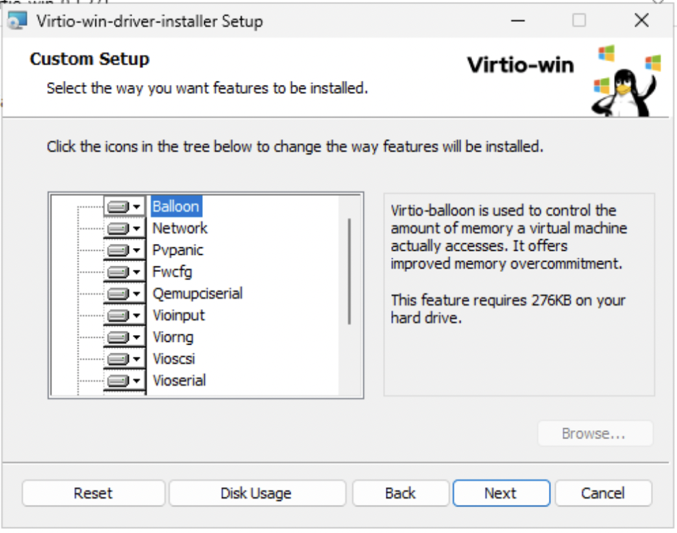
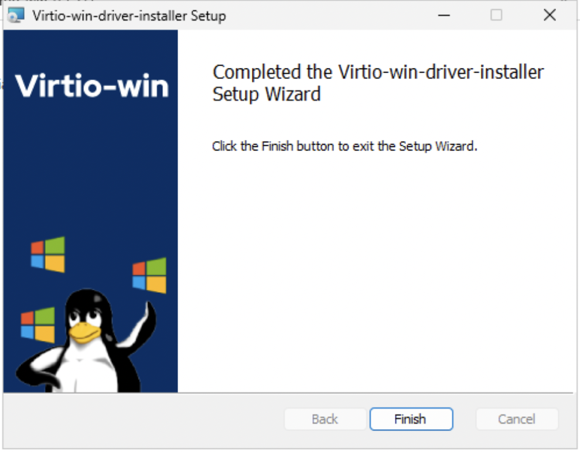
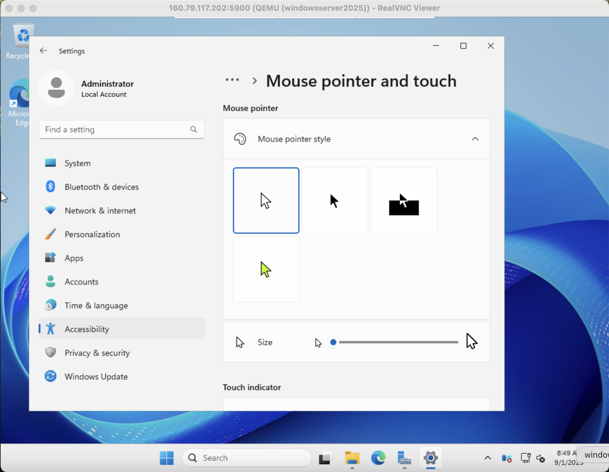
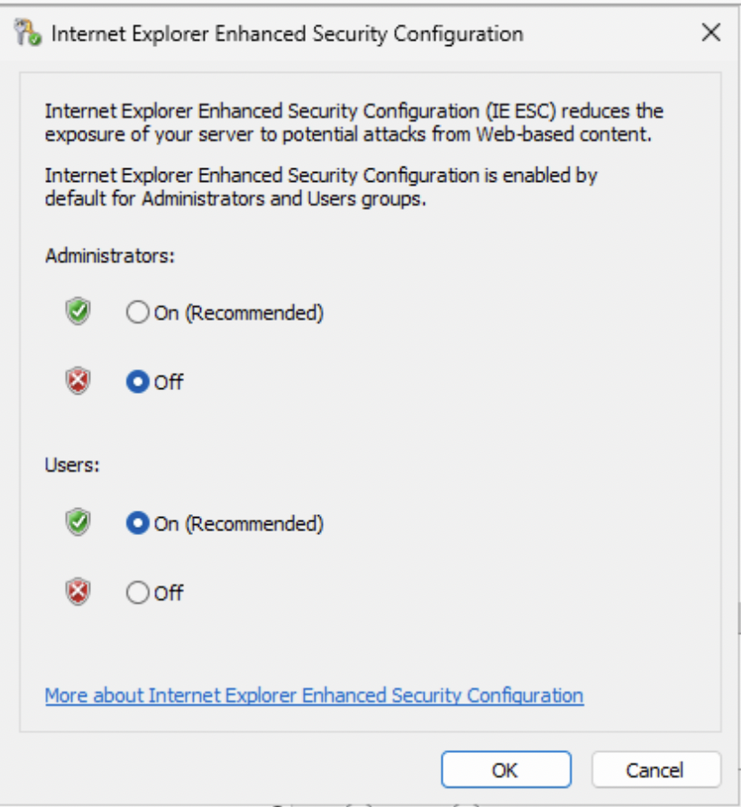
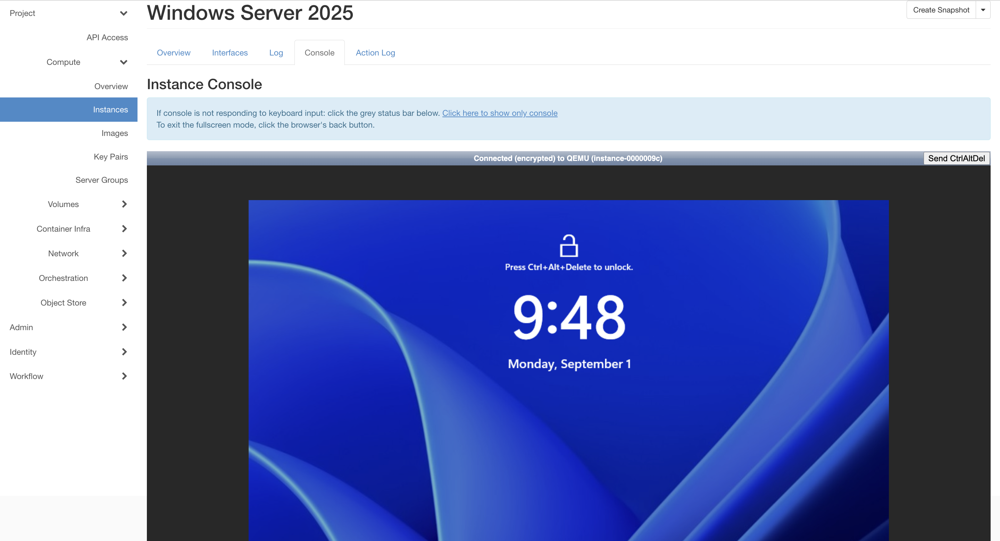

# Building Windows Cloud Images on OpenMetal

Written by Yuriy Shyyan

Co-Authored by Sean Lafferty

[//]: # (Description: Nested Virtualization, Remote VNC, Image Extraction)
[//]: # (Difficulty: Hard)
[//]: # (Priority: High)

This document is meant as a guide to utilizing an OpenMetal Private Cloud Core
to build various Windows Images for OpenStack on KVM with Virtio Storage drivers.

> The initial concept for this guide is to be able to bring nearly nothing and
> come out with a Windows VM Image ready for cloud use.

## Images for OpenStack

In order to run a virtual machine on OpenStack, an Operating System image is
needed. These OS images are quite different from ISO images and are often a
point of confusion. While ISOs typically contain installation media and have
‘Live’ capabilities, VM images usually contain a snapshot of a fully installed
and configured Operating System that is copied to newly provisioned instances
with some slight post modification abilities via cloud deployment utilities
such as Cloudbase Init.

Many Linux Operating Systems provide cloud VM image snapshots that you can
download and upload for use on your cloud. OpenMetal provides a few of the
most recent and common Linux distribution images to newly provisioned OpenMetal
clouds. At time of writing Windows does not provide public OpenStack native
images so you must create one manually which can be customized for your needs.

## Tools required for this guide

For this guide the administrator will need the following:

- **OpenMetal Cloud**
- **VNC Viewer**
- **Windows ISO** image with desired OS selections.
- **RedHat Virtio Drivers ISO**

## OpenMetal Cloud

OpenMetal Private Cloud Core provides support for Nested Virtualization and
the networking needed in order to follow along with this guide, however any
OpenStack cloud with similar storage mechanics, nested virtualization enabled
and adequate network access can follow these directions.

> As an alternative you can use a local Console/VNC capable KVM hypervisor host
> to create the Windows Instance Image.

In our experience, Windows VM image building is best done on the platform on
which it will be used as disk conversion utilities rarely provide the desired
result. We have seen a lot of ‘No Boot Drive Found’ errors when dealing with
differing storage media.

> **Note: The drivers for network and storage type during installation are
> required to match the storage in production**.


## VNC Viewer

For the purposes of connecting to the nested instance to proceed with Windows
installation media we will need console access. This can be simulated using VNC.
We will be using [VNC Viewer by RealVNC](https://www.realvnc.com/en/connect/download/viewer/),
if you are familiar with other VNC software the underlying process remains the
same.


## Windows ISO

Several methods are available to obtain a Windows ISO image.

- Direct download
- The Windows Media Creation tool
  
   Generates a Windows ISO for specific distributions locally.

- Azure Marketplace allows for image downloads with a sufficient account.

Microsoft Offers a variety of Evaluation Images for testing that can later be
licensed.

> While outside the scope of this guide, community consensus indicates at
> Evaluation trial expiration, the following behavior may be encountered:
>
> - System may ask for activation and shut down often.
> - You may see Windows license expiration notice on a regular basis.

Licensing is **strongly** recommended on Production deployments.

For this guide we will use the **Windows Server 2019 Evaluation Image**. More
evaluation images can be found in Microsoft’s Evaluation Center.


<https://www.microsoft.com/en-us/evalcenter/download-windows-server-2019>

## **RedHat Virtio Drivers ISO**

Additional drivers must be provided during installation to allow Windows to detect
VirtIO network and storage types. You will attach an additional ISO to the
instance as it is created to enable the ability to interact with OpenStack’s
default storage types within Windows. More information as well as the ISO
download link can be found here:

<https://fedorapeople.org/groups/virt/virtio-win/direct-downloads/archive-virtio/?C=M;O=D>


### virtio-win Version

> **Caution!** In our experience newer **does not** mean it will work for your
> desired OS distribution. Depending on the Operating System - older versions
> of virtio-win may be suitable for older versions of Windows. For example, the
> latest version of this driver (0.1.217-2) did not work well on Windows 10
> Enterprise, but a version before it did (0.1.215-2). Unfortunately this is a
> trial by fire experience, there are ways to identify the right fit during
> installation that will be covered later in the guide.

## Preparing our Environment

Now that you have obtained the above it’s time to setup our initial instance,
deploy KVM packages to build our Windows instance, download and upload our ISOs,
and go through the Windows setup process.

## Provision Network for VM Access

We deployed an internal network called Private with a 192.168.0.0/24 subnet, and
set up a router connected to the External network with a port on the internal
network for our Private network’s gateway. We also got a Floating IP added to a
provisioned Ubuntu instance. For more information on setting up some initial
networking you can refer to our guide here: [Networking in OpenStack](https://openmetal.io/docs/manuals/users-manual/create-a-network/)


## Security Groups

One of the most common things to forget is that OpenStack has a closed by default
security model, so since we will need to access the instance over SSH (port 22)
and eventually connect with VNC Viewer (port 5900), we will want to create a
rule allowing our IP to either all ports, or specific ports. We created a
security group called “Remote Windows Image Building”


## Create and Access our Instance

> Note: This example uses an Ubuntu 20 (Focal) Image however, any OS on which
> you can install KVM on should work.

The screenshots below illustrate some of the selections made during Instance
creation. For more on how to create and access instances on OpenStack refer to
[How to create an instance](https://openmetal.io/docs/manuals/openstack-users/how-to-create-an-instance/).

- Ubuntu 20 VM Image
- 4 VCPU, 16 GB Ram, 50 GB Disk (m1.large flavor)
- On Private Network
- With selected SSH public key
- Security Groups for SSH (Firewall)
- Floating IP for external access

Here are some screenshots from our selections.


Once created, attach our floating IP to the instance which should now be
accessible via SSH from the IP we allowed in our Security Group. Any SSH Client
can be used to access the Ubuntu instance using your private key pair for
authentication.

> **Note**: The username for the Ubuntu cloud image is **ubuntu.** That user
> will have root/administrative privileges to configure the rest of what we need.


## Install Packages

Running a Virtual Machine inside of this instance requires KVM (Kernel-based
Virtual Machines) packages and their dependencies. Additional tools and utilities
are installed to  help us navigate the environment and facilitate ISO downloads.

```bash
sudo apt update -y
```

```bash
sudo apt -y install qemu qemu-kvm libvirt-clients libvirt-daemon-system virt-manager bridge-utils cpu-checker libosinfo-bin dnsmasq
```

Let’s make sure the system supports virtualization and acceleration.

```bash
$ grep -Eoc '(vmx|svm)' /proc/cpuinfo
4
$ kvm-ok 
INFO: /dev/kvm exists
KVM acceleration can be used
```

For the vmx/svm check you are making sure that the CPUs loaded into your system
support virtualization. The number should match the number of VCPUs assigned to
the instance or CPUs on your host.

`kvm-ok` is a command to confirm KVM acceleration is available on running hardware.

## Download and transfer necessary artifacts

When you create your Windows Instance, the previously mentioned Windows ISOs and
the virtio-win driver ISO need to be available on the instance.

Download the win-virtio driver ISO with the following command.

> **Note**: You can modify the link according to the version of win-virtio
> that you would like to test with.

```bash
$ wget https://fedorapeople.org/groups/virt/virtio-win/direct-downloads/archive-virtio/virtio-win-0.1.217-2/virtio-win-0.1.217.iso
$ ls
virtio-win-0.1.217.iso
```

This command will download the file at the URL specified.

For the Windows Evaluation ISO image you may need to fill out of a form. As
previously mentioned, for this exercise we obtained the **Windows Server 2019
Evaluation Image** from the [Evaluation Center](https://www.microsoft.com/en-us/evalcenter/download-windows-server-2019)

The link that was generated through Copy Link can be passed to wget in your
instance to download the Windows ISO file.


> The `-O $name` command flag renames the downloaded file during download.
> Wget attempts to name the saved file to match what follows the last `/` in the
> link by default, this can result in confusion as redirects may create multiple
> files with varying names to sort through to understand which one is the real ISO.

```bash
$ wget -O Windows.iso "https://go.microsoft.com/fwlink/p/?LinkID=2195167&clcid=0x409&culture=en-us&country=US"
2022-06-27 23:36:11 (65.1 MB/s) - ‘Windows.iso’ saved [5296713728/5296713728]

$ ls
Windows.iso  virtio-win-0.1.217.iso
```

This link may not work for you by the time you follow this guide, or the process
of obtaining the ISO may change over time. Adjust the link as needed or pursue
other methods.

## Run the Windows Instance

### Create Disk for the VM

First create a storage disk for our instance with the necessary VirtIO drivers
for storage parity.

```bash
ubuntu@image-builder:~$ qemu-img create -f qcow2 windowsserver2019.qcow2 15G

Formatting 'windowsserver2019.qcow2', fmt=qcow2 size=16106127360 cluster_size=65536 lazy_refcounts=off refcount_bits=16
```

This creates a 15GB disk image that will be used as our hard drive for Windows
in qcow2 format.

### Find out your OS short ID

The following command displays the various operating systems QEMU can emulate
with corresponding OS variant short ID. Make note as we will use this later.

```bash
ubuntu@image-builder:~$ osinfo-query os
...
..
.
win2k12              | Microsoft Windows Server 2012                      | 6.3      | http://microsoft.com/win/2k12           
win2k12r2            | Microsoft Windows Server 2012 R2                   | 6.3      | http://microsoft.com/win/2k12r2         
win2k16              | Microsoft Windows Server 2016                      | 10.0     | http://microsoft.com/win/2k16           
win2k19              | Microsoft Windows Server 2019                      | 10.0     | http://microsoft.com/win/2k19
win2k22              | Microsoft Windows Server 2022                      | 10.0     | http://microsoft.com/win/2k22           
win2k3               | Microsoft Windows Server 2003                      | 5.2      | http://microsoft.com/win/2k3            
win2k3r2             | Microsoft Windows Server 2003 R2                   | 5.2      | http://microsoft.com/win/2k3r2          
win2k8               | Microsoft Windows Server 2008                      | 6.0      | http://microsoft.com/win/2k8

```

From the above output, we see that our OS variant for Windows Server 2019 is `win2k19`.

### Start the Instance

The following command is quite lengthy but we will break it down below.

```bash
ubuntu@image-builder:~$ sudo virt-install --connect qemu:///system --name windowsserver2019 \
> --ram 4096 --vcpus 1 --network network=default,model=virtio \
> --disk path=windowsserver2019.qcow2,format=qcow2,device=disk,bus=virtio \
> --cdrom Windows.iso --disk path=virtio-win-0.1.217.iso,device=cdrom \
> --graphics=vnc,password=IvkOMXKUd5LES6Zp,listen=0.0.0.0,port=5900 \
> --os-type windows --os-variant win2k19 --noautoconsole

Starting install...
Domain installation still in progress. You can reconnect to 
the console to complete the installation process.

ubuntu@image-builder:~$ sudo virsh list --all

 Id   Name                State
-----------------------------------
 1    windowsserver2019   running
```

This will start our VM with the attributes and options needed for the setup
process. Here is what all the options mean:

- `sudo virt-install`:
  command line tool to create virtual machine as Admin user
- `--connect qemu:///system`:
  use the QEMU emulation system socket
- `--name windowsserver2019`:
  name of our Virtual Machine
- `--ram 4096`:
  Memory allocated to VM in Megabytes, 4GB
- `--vcpus 1`:
  How many CPUs to give this VM, 1
- `--network network=default,model=virtio`:
  network configuration, VirtIO device topology
- `--disk path=windowsserver2019.qcow2,format=qcow2,device=disk,bus=virtio`:
  name and relative path to our Disk file to use for this VM, format of this
  storage medium and VirtIO device topology
- `--cdrom Windows.iso`:
  our CD-Rom device loaded with the relative path of our Windows ISO
- `--disk path=virtio-win-0.1.217.iso,device=cdrom`:
  Our secondary CD-Rom device loaded with the relative path of our win-virtio
  driver ISO
- `--graphics=vnc,password=IvkOMXKUd5LES6Zp,listen=0.0.0.0,port=5900`:
  Use VNC for our graphic emulation, with password protected connection, listen
  on port 5900 for all network interfaces
- `--os-type windows --os-variant win2k19`:
  Details of the operating system we will be emulating
- `--noautoconsole`:
  Don’t automatically try to connect to the guest console after the command is
  issued (since we will be using VNC), just run the instance in background.

### Connect to your Windows Instance via VNC

Now that the instance is running we should be able to connect to it using VNC
client we previously installed on our host.


You should see the console output of your nested instance.


## Install Windows

Go through the standard install journey.


## Setup VirtIO Drivers for Installation

When the partitioning step is reached the system will not be able to detect the
storage or network device until the VirtIO drivers are installed, this behavior
is intentional.


Click Load Driver > Browse > uncheck the “Hide drivers…” option box. Traverse
the virtio-win ISO image to locate the appropriate folders.


There are typically 3 Folders to be aware of during installation.

- NetKVM - VirtIO Network Drivers
- Viostor - VirtIO Block Storage Drivers
- Vioscsi - VirtIO SCSI Storage Drivers

You will need to traverse each folder, locate the corresponding OS variant and
install all of the drivers contained in that folder.


Shift + Click to select multiple driver files.


Click Next to install.

Repeat for viostor


We now see Windows Installer detect our storage medium, installation can proceed.


Clicking Next will start Windows installing.


After the installation completes the instance will shut off and will need to be
restarted manually through your image-builder instance SSH command line interface:

```bash
ubuntu@image-builder:~$ sudo virsh list --all
 Id   Name                State
------------------------------------
 -    windowsserver2019   shut off

ubuntu@image-builder:~$ sudo virsh start windowsserver2019
Domain windowsserver2019 started
```

Reconnect to the instance via VNC and be greeted with the Windows Loading screen
followed by Administrator account setup.


There will be a Ctrl+Alt+Del requirement to unlock the screen. VNC viewer has a
shortcut, simply hover over the top layer of the screen.


Continue to your login by issuing the Ctrl+Alt+Delete shortcut and entering the
password you just set for the Administrator account.


You have now have successfully installed Windows in a nested Virtual Machine.
Next we focus on preparing and packaging this Windows VM for Cloud provisioning
and reuse.

## Preparing and Configuring Windows

There are a few things we will need to do for this Windows Installation

- Install VirtIO Drivers
- Setup Remote Access
- Configure Cloudbase Init

> If you are installing Windows 10 or other various Windows Distributions - now
> is the time to debloat, install what software you require, setup users, etc.

### Install VirtIO Drivers

This step of the process that lets us know whether the virtio-win driver ISO we
selected was the right one. Open the ISO device via File Manager and execute
the virtio driver installer.




> **Warning!**: If _Any Errors_ occur in the driver installation process you
> should try another version of virtio-win ISO.

If everything works as intended you should end up on the following screen without
error.



### Install VirtIO Guest Tools

Same process as above.


> **Note**: After spice tools installation, often the mouse cursor changes to a
> transparent white which is difficult to follow on white background. If you
> experience , the easiest fix is to open Advanced Mouse Options and select a
> different pointer icon.



### Enable Remote Desktop

If you plan to connect to the server via RDP (Don’t forget to add the RDP port
to your future Security Groups) you may want to enable remote access for this
Windows Instance.


On **Windows 10 for example** this may look like image below.


### Correct Disk Configuration

While not an issue in this example, removal of the Recovery Partition may be
required when installing Windows 10 or other distributions.


In our case, as seen above, the last partition of Disk 0 is the C partition,
however on some other Windows versions a Recovery Partition exists **after**
the C partition.


In these cases **you will need to delete it** in order for cloud native tools to
resize your C drive on dynamic drive cloud instance creation.

### Install CloudBase Init

Cloudbase Init can append various Windows Distributions with cloud native
provisioning capabilities such as Administrator password retrieval, volume
expansion, and network interface capabilities as well as useful utilities.
Supported Windows distributions are listed here:
<https://cloudbase.it/cloudbase-init/>

Before you download the installer, Windows Server distributions are configured
with IE Enhanced Security Configuration enabled by default. Disable this
temporarily as described below.

In Server Manager navigate to Local Server on the left then click "On" to the
right of IE Enhanced Security Configuration.


Set Administrators to Off and click OK



Download and Run the Installer


Accept defaults until this screen is reached.


 Ensure that `Serial port for logging:` is set to `COM1` for later OpenStack
 console integration.

The option to enable LocalSystem support is present per the reasoning, from
Cloudbase, below.

> The reason why we added a new _cloudbase-init_ user account is that some user
> data actions performed during guest initializations, e.g. installing non trivial
> packages like SharePoint server, require a proper user logon profile and fail
> when executed as _Local System_

CloudBase Init allows for customization of your created images, learn more in
their [documentation](https://cloudbase-init.readthedocs.io/en/latest/tutorial.html)

> Note: At this point it is recommended to ensure that all available updates,
> service packs and required software changes are complete and applied. This
> will ensure that minimal time is required for maintenance of new instances
> created from the image.

You will want to make these modifications before running SysPrep.


Make sure you've made all desired adjustments, once you run SysPrep the image is
finalized.

Click Finish and the system will shut down.

## Upload our Windows Image to your OpenMetal OpenStack Cloud

Now that your Windows VM is installed, configured, and stored in your
windowsserver2019.qcow2 image, it can be uploaded to your cloud for reuse and
general provisioning by all of your OpenStack users and administrators.

You can utilize OpenStack CLI from within the image-builder instance we created
to build our Windows VM Image, and use it to upload our hard work and result to
OpenMetal cloud from which we initially began our journey. It’s “Cloud Inception”.

Refer to the following for setup of [OpenStack CLI](https://openmetal.io/docs/manuals/openstack-operators/how-to-install-and-use-openstacks-cli/)
and [uploading images](https://docs.openstack.org/python-openstackclient/latest/cli/command-objects/image-v1.html#image-create)
to your cloud.

```bash
ubuntu@image-builder:~$ sudo apt-get -y install python3-venv
ubuntu@image-builder:~$ python3 -m venv venv
ubuntu@image-builder:~$ . venv/bin/activate
(venv) ubuntu@image-builder:~$ pip install wheel python-openstackclient
(venv) ubuntu@image-builder:~$ . admin-openrc.sh 
Please enter your OpenStack Password for project admin as user admin:
```

If uncertain how `admin-rc.sh` was obtained and sourced please refer to the
documentation linked above. To allow all users of your cloud to use this Windows
Image, we create it under the admin user and project of the OpenStack cloud.

RAW images have been shown to noticeably outperform qcow2 on Block Device shared
file storage as configured on OpenMetal Clouds, you will now convert your qcow2
image to RAW format:

```bash
(venv) ubuntu@image-builder:~$ qemu-img convert -f qcow2 -O raw windowsserver2019.qcow2 WindowsServer2019.raw
(venv) ubuntu@image-builder:~$ ls -lashr | grep -i windows
9.7G -rw-r--r-- 1 ubuntu       ubuntu 9.7G Jun 28 14:58 windowsserver2019.qcow2
9.5G -rw-r--r-- 1 ubuntu       ubuntu  15G Jun 28 15:29 WindowsServer2019.raw
5.0G -rw-rw-r-- 1 libvirt-qemu kvm    5.0G Sep 21  2019 Windows.iso
```

As we are converting a 9.7GB image from qcow2 to a 15GB RAW image, the above
command may take a few minutes.

The upload command we use:

```bash
openstack image create --progress \
--min-disk 15 --min-ram 4096 --public \
--file WindowsServer2019.raw \
"Windows Server 2019"
```

Results in output as follows:

```bash
(venv) ubuntu@image-builder:~$ openstack image create --progress --min-disk 15 --min-ram 4096 --public --file WindowsServer2019.raw "Windows Server 2019"
[=============================>] 100%
+------------------+-------------------------------------------------------------------------------------------------------------------------------------------------------------------------+
| Field            | Value                                                                                                                                                                   |
+------------------+-------------------------------------------------------------------------------------------------------------------------------------------------------------------------+
| container_format | bare                                                                                                                                                                    |
| created_at       | 2022-06-28T15:34:32Z                                                                                                                                                    |
| disk_format      | raw                                                                                                                                                                     |
| file             | /v2/images/8305ddb7-a5d7-477e-adfe-9fb31da776e0/file                                                                                                                    |
| id               | 8305ddb7-a5d7-477e-adfe-9fb31da776e0                                                                                                                                    |
| min_disk         | 15                                                                                                                                                                      |
| min_ram          | 4096                                                                                                                                                                    |
| name             | Windows Server 2019                                                                                                                                                     |
| owner            | 4b6b7670416f461fb9980db8384ccbbd                                                                                                                                        |
| properties       | locations='[]', os_hidden='False', owner_specified.openstack.md5='', owner_specified.openstack.object='images/Windows Server 2019', owner_specified.openstack.sha256='' |
| protected        | False                                                                                                                                                                   |
| schema           | /v2/schemas/image                                                                                                                                                       |
| status           | queued                                                                                                                                                                  |
| tags             |                                                                                                                                                                         |
| updated_at       | 2022-06-28T15:34:32Z                                                                                                                                                    |
| visibility       | public                                                                                                                                                                  |
+------------------+-------------------------------------------------------------------------------------------------------------------------------------------------------------------------+
```

As we are performing this build “in the cloud” we benefit from datacenter speeds.
If the image was built locally (eg. at home or in your office) your upload speed
is limited by your service provider. 15GB at 100MBits/s would take roughly 22
minutes, if you are not so lucky and your ISP only provides 10Mbps upload speeds,
the upload would take 3+ hours. For us however it should take just about ~5
minutes.

We can now see our uploaded image in our Horizon interface Images section at the
bottom.


### Update Image Socket Maximum

In the process of working with Windows 10 instances we learned that certain
Windows Distributions are restricted in the maximum amount of sockets they can
use. Online research identified the following information which appears to be
accurate:

- **Windows 10 Home**: 1 CPU
- **Windows 10 Professional**: 2 CPU
- **Windows 10 Workstation**: up to 4 CPU
- **Windows Server 2016**: up to 64 CPU

As sockets represent the amount of physical CPU sockets/processors (Not actual
CPU cores) on the virtual server, we may want to limit our Image setting a maximum
number. Our provisioning system may assign more than the limit, while Windows
will ignore all vCPUs beyond it's own limit.

```bash
openstack image set 8305ddb7-a5d7-477e-adfe-9fb31da776e0 --property hw_cpu_max_sockets=4
```

Adjust the number to the desired amount of physical processors your OS chosen
distribution supports.

### Update Windows 11 Secure Boot options

We have found that Windows 11 instances require certain properties
be set on the windows image for firmware and machine hardware type. In this
case, UEFI Secure Boot requires that a UEFI bootloader be configured for guests.
You can also configure the hardware machine type. QEMU’s machine type concept
can be thought of as a virtual chipset that provides certain default devices
(e.g. PCIe graphics card, Ethernet controller, SATA controller, etc). QEMU
supports two main variants of “machine type” for x86 hosts: (a) pc, which
corresponds to Intel’s I440FX chipset (released in 1996) and (b) q35, which
corresponds to Intel’s 82Q35 chipset (released in 2007).

```bash
openstack image set --property hw_firmware_type=uefi --property hw_machine_type=q35 --property os_secure_boot=required "Windows 11"
```

## Test Out Provisioning the new Windows Image

For our test we used the following parameters on an OpenMetal Cloud

- Instance Name - WServer2019
- Source - Windows Server 2019 Image
- Flavor - c1.xlarge
- Network - Private (Previously configured in this project)

After launch, it takes a few minutes for CloudInit to complete first run,
configuring the initial user, after a few moments we see:


Once CloudInit completes you will see the familiar interface by accessing Console
view of your instance in the Horizon Interface (This is the importance of `COM1`).



Congratulations! You have successfully built and configured a Windows Server 2019
Image capable of running on your OpenMetal OpenStack cloud. You can use the
`Admin` user provisioned by CloudBase which is not initially displayed at login,
or proceed with Administrator credential reset.

Our hard drive was automatically expanded to the `c1.xlarge` flavor defined size.


We also detect 4 processors and a total of 8 VCPUs


## Password Retrieval Process

In order to utilize the Retrieval Password feature for Windows Instances
through OpenStack Horizon, you will need to enable the functionality and reload
Horizon.

This can be accomplished by running the following two commands on each control
plane node

```bash
echo "OPENSTACK_ENABLE_PASSWORD_RETRIEVE = True" >> /etc/kolla/horizon/custom_local_settings
```

```bash
docker container restart horizon
```

To persist the setting with future kolla-ansible reconfigurations on the asset
that runs kolla-ansible and contains the configurations for various services
in /etc/kolla/config

```bash
mkdir -p /etc/kolla/config/horizon
echo "OPENSTACK_ENABLE_PASSWORD_RETRIEVE = True" >> /etc/kolla/config/horizon/custom_local_settings
```

To retrieve the password in Horizon, select “RETRIEVE PASSWORD” from the
instance dropdown menu:

You need to boot your instance with a SSH keypair (exactly like you would do
on Linux for SSH public key authentication). Keep in mind current limitation
require a new keypair be provided for each running Windows instances.


Browse for your private key or enter it into the text box:


Click “DECRYPT PASSWORD” (de decryption will occur in the browser, no data
will be sent to the server) and retrieve your password:


## Suggestions and Conclusions

It will take you quite a few attempts building a Windows VM Image before you
understand all of the things you may need to configure and install to be happy
with the end result. We found this to be a learning experience as each time we
had to iterate another change or customization to the process.
