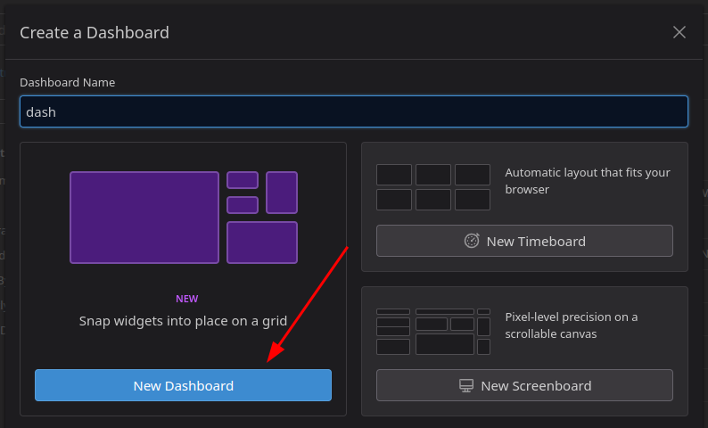
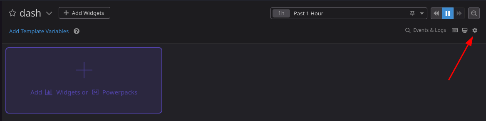
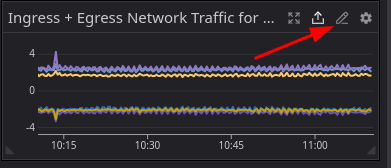

# Cloud Physical Resource Usage - Custom Datadog Dashboard

## Overview

Get started with custom dashboards and begin monitoring the physical resource
usage of your OpenMetal cloud nodes.

## Goal

In this article you will learn how to import a custom Datadog dashboard, from a
JSON formatted definition, providing a basic overview of your clouds physical
resource usage and availability.

## Prerequisites

- [Enable Datadog Monitoring](../openmetal-central/enable-datadog-monitoring.md)

## Access Datadog

Access Datadog from OpenMetal Central with [single sign-on](../openmetal-central/enable-datadog-monitoring.md#access-datadog)

## Create new dashboard

1. Navigate to Dashboards if not there already.

   

1. Click **[+ New Dashboard]**.

1. In the new window, again click **New Dashboard**

   

   > **Note:** The name field will be overwritten the imported JSON

## Import JSON

You now have a blank dashboard and Datadog has provided a handy sidebar for
quickly searching and adding widgets. This is covering the settings menu we
need so our first task is:

1. Close the widget quick add sidebar

   

1. Click the now revealed gear icon to open the settings menu

   

1. Select **Import dashboard from JSON...**

   

1. The next window asks for the dashboard JSON you wish to import. You can
   drag and drop, browse for a file, or paste from your clipboard.

   > See [code block](datadog-resource-dashboard.md#code-block)

   

2. Confirm overwrite action

   

## Cloud Physical Resource Usage dashboard

If all went well you should now see your new dashboard.


To find out more about any of the widgets, mouse over its title bar and click
the pencil (edit) icon.



This opens the editor for the selected widget.


On this page you can view and edit all aspects of the widget.


   1. **Visualization type**
   1. **Data sources**
   1. **Display preferences**
   1. **Graph title**

Here you can also view and/or edit your data source JSON directly.


## Dashboard JSON

This JSON code creates a custom Datadog dashboard monitoring and visualizing
the following values for each host:

- **CPU Idle**
- **Percent Usable Memory**
- **Network Traffic - Ingress + Egress**
- **Percent Used Disk Space**
- **Total Ceph Disk Usage**

### Code block

```json
{"title":"Cloud Physical Resource Usage","description":"## Title\n\nDescribe this dashboard. Add links to other dashboards, monitors, wikis,  and docs to help your teammates. Markdown is supported.\n\n- [This might link to a dashboard](#)\n- [This might link to a wiki](#)","widgets":[{"id":8462073962564395,"definition":{"title":"CPU Idle for all Hosts","title_size":"16","title_align":"left","show_legend":false,"time":{"live_span":"4h"},"type":"timeseries","requests":[{"formulas":[{"formula":"query1"}],"response_format":"timeseries","queries":[{"query":"sum:system.cpu.idle{*} by {host}","data_source":"metrics","name":"query1"}],"style":{"palette":"dog_classic","line_type":"solid","line_width":"normal"},"display_type":"line"}],"markers":[{"value":"y = 0","display_type":"error dashed"},{"value":"y = 100","display_type":"ok dashed"}]},"layout":{"x":0,"y":0,"width":4,"height":2}},{"id":8190888575322488,"definition":{"title":"Percent Usable Memory per Host","type":"treemap","requests":[{"formulas":[{"formula":"query1"}],"response_format":"scalar","queries":[{"query":"avg:system.mem.pct_usable{*} by {host}","data_source":"metrics","name":"query1","aggregator":"avg"}]}]},"layout":{"x":4,"y":0,"width":4,"height":2}},{"id":6935696381171286,"definition":{"title":"Ingress + Egress Network Traffic for all Hosts","title_size":"16","title_align":"left","show_legend":false,"legend_layout":"auto","legend_columns":["avg","min","max","value","sum"],"type":"timeseries","requests":[{"formulas":[{"formula":"query1"}],"response_format":"timeseries","queries":[{"query":"sum:system.net.bytes_rcvd{*} by {host}","data_source":"metrics","name":"query1"}],"style":{"palette":"dog_classic","line_type":"solid","line_width":"normal"},"display_type":"line"},{"formulas":[{"formula":"0 - query1"}],"response_format":"timeseries","queries":[{"query":"sum:system.net.bytes_sent{*} by {host}","data_source":"metrics","name":"query1"}],"style":{"palette":"dog_classic","line_type":"solid","line_width":"normal"},"display_type":"line"}]},"layout":{"x":8,"y":0,"width":4,"height":2}},{"id":4847638474091271,"definition":{"title":"Total Ceph Disk Usage","title_size":"16","title_align":"left","type":"query_value","requests":[{"formulas":[{"formula":"query1"}],"conditional_formats":[{"comparator":"<=","palette":"white_on_green","value":70},{"comparator":">","palette":"white_on_yellow","value":70},{"comparator":">","palette":"white_on_red","value":80}],"response_format":"scalar","queries":[{"query":"avg:ceph.aggregate_pct_used{*}","data_source":"metrics","name":"query1","aggregator":"avg"}]}],"autoscale":true,"precision":2},"layout":{"x":0,"y":2,"width":4,"height":2}},{"id":4208572359463889,"definition":{"title":"Percent Used Disk Space for each Host","title_size":"16","title_align":"left","show_legend":false,"legend_layout":"auto","legend_columns":["avg","min","max","value","sum"],"type":"timeseries","requests":[{"formulas":[{"formula":"query1"},{"formula":"query1 * 100"}],"response_format":"timeseries","queries":[{"query":"avg:system.disk.in_use{host:*} by {host}","data_source":"metrics","name":"query1"}],"style":{"palette":"dog_classic","line_type":"solid","line_width":"normal"},"display_type":"line"}],"markers":[{"value":"y = 100","display_type":"error dashed"}]},"layout":{"x":4,"y":2,"width":4,"height":2}}],"template_variables":[],"layout_type":"ordered","is_read_only":false,"notify_list":[],"reflow_type":"fixed","id":"xsb-5ef-g4d"}
```

## Resources

- Datadog provides robust and comprehensive [documentation](https://docs.datadoghq.com)
