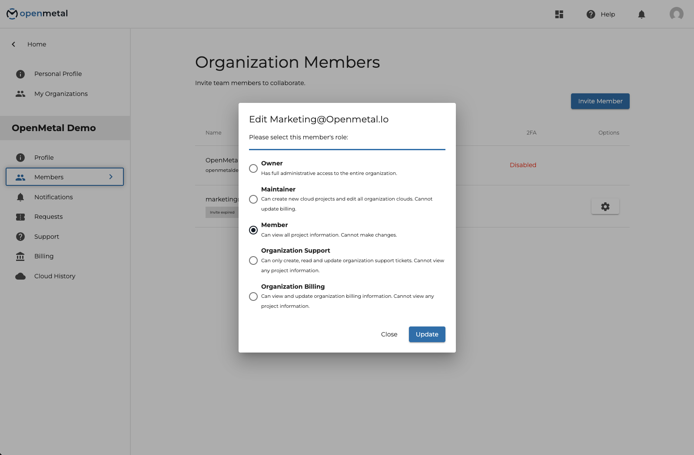

# Creating an Organization in OpenMetal Central

OpenMetal Central has native collaboration tools. This makes it easy to add team
members to a cloud project. It also allows outsourcing parts of your project to
a vendor or agency. In order to invite people to your project, you need to create
an organization. You can even create multiple organizations. You can also be a
member of several organizations at once.

There are two ways to create an Organization inside of OpenMetal Central.

## Create an Organization During Initial Registration

You can get started with an organization. As you sign up in OpenMetal Central,
you will be prompted to create an organization in step 4 of the process. This
step is not required to create an OpenMetal account. Many choose to skip it.

## Add an Organization to an Existing Account

The second way to create an organization is to add one after you have made your
account. You can create an organization at any time.

After logging into OpenMetal Central hover over the icon on the top right.

On the drop-down click **_My Organizations_**.

Click **_Create an Organization._**

You will be asked to fill out this form.

Once you have created an organization, you are the owner by default.

## Adding Members to Your Organization

You can invite team members into your organization. To do so, hover over the 3
dots on the right of your organization name on the organization page. In the
drop-down select **_Members_**.

When you land on the Members page you will see that you are currently the only
member of the organization. Click **_Invite Member_** to add people to your
organization.

You will see a pop-up that prompts you to enter the email address of the person
you wish to invite.

Once you invite someone, they will be sent an email. The email instructs them to
create an account and verify their email address. You may want to notify your
invitee to expect the invitation. They should check their spam or junk mailboxes
if they don’t receive it.

Your Members dashboard will indicate if your invited members responded to the
invitation. Your invitation will expire if not responded to. If that happens you
will need to resend it.

To resend an invitation, click the gear to the right of the member’s name that
you want to invite. The drop-down menu associated with this gear allows you
to resend your invitation. You can also revoke your invitation if it was sent
in error.

## Managing Organization Member Permissions

To manage the permissions for a member click the gear to the right of the
member’s name. The drop-down menu associated with this gear will give you the
option to **_Edit Permissions_** for this member.

There are five options for permissions that you can extend to a member.

- **Owner:** Has full administrative access to the entire organization.
- **Maintainer:** Can create new cloud projects and edit all organization
    clouds.  Cannot update billing.
- **Member:** Can view all project information. Cannot make changes.
- **Organization Support:** Can only create, read and update organization
    support tickets.  Cannot view any project information.
- **Organization Billing:** Can view and update organization billing information.
    Cannot view any project information.

To transfer ownership of the organization, update an invited member to the owner.
You can then change your own permissions or actually leave the organization
completely.

Need help or have questions that are not covered here? You can also submit a
support request or book meetings with our customer teams [here](https://openmetal.io/schedule-meeting/).
