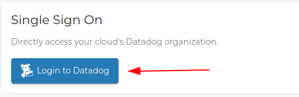

# Enable Datadog Cloud Monitoring in OpenMetal Central

In this guide you will obtain a Datadog license and enable monitoring on your
OpenMetal Cloud.

## Add Datadog to your Cloud

1. Access Datadog from the account navigation menu.

    

1. Click "Add Datadog"

    

1. Check your email and accept the Datadog invitation.

    

### Await Deployment Completion

The next page will display a banner while the initial configuration and
deployment complete.

## Access Datadog

Once deployment has completed and the emailed invitation accepted, you can use
the "Single Sign On" option in OpenMetal Central to access your clouds' Datadog
organization directly.

Additionally, the API and application keys can be retrieved for scripting and
code integration.

### Next Steps

Datadog provides fairly comprehensive guides you will want to review.

- [Getting Started](https://docs.datadoghq.com/getting_started/application/)
- [Alerting](https://docs.datadoghq.com/getting_started/monitors/)
- [Dashboards](https://docs.datadoghq.com/getting_started/dashboards/)

 As we expand our platform specific guides we will link them here.
