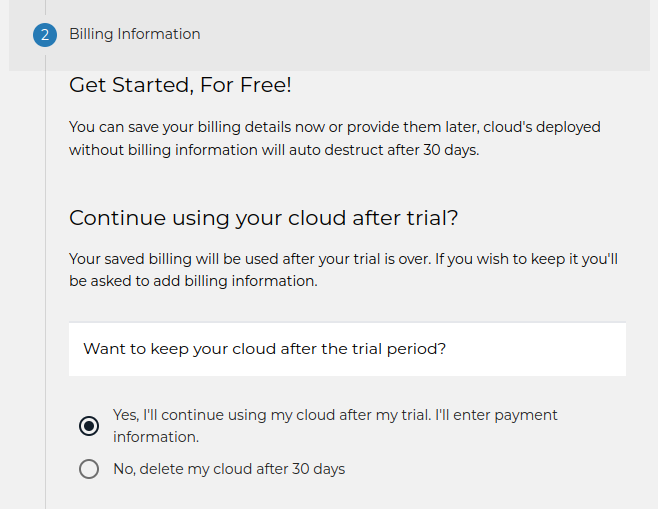

# How to Purchase an OpenMetal Private Cloud

In this article, you will learn how to purchase an OpenMetal Private Cloud using
the OpenMetal Central portal. Through OpenMetal you get the benefits of private
cloud control on-demand.

Purchase options available

- Buy your trial cloud
- Buy a cloud other than your trial cloud
- Keep your trial cloud and purchase an additional cloud
- Get a longer trial before purchase

## Buy your trial cloud

You can set up your trial cloud as a proof of concept and be prepared to
simply move your cloud into production after your trial period is over. You
can set this up before you even launch your trial cloud.

1. From the [Cloud Home Page](https://central.openmetal.io/clouds), select the
   _Get Started_ button.

    

1. Choose desired hardware.

    

1. Select "Yes, I'll continue using my cloud..."

1. Select Continue to Billing in the bottom right. Your cloud will go live at
   the end of the trial.

    

1. Add your Credit Card Information.

    

When your cloud trial expires, your cloud will remain active for production.

## Purchase your trial cloud after it has launched

If you didn't set up your purchase intention initially, you can do it after your
trial cloud is launched. Simply log back in and update your billing parameters.

> **NOTE!** This needs to be done before your trial cloud expires. Once a trial
> expires, the cloud cannot be recovered.

1. Sign in to your [OpenMetal Central Account](https://central.openmetal.io/auth/sign-in).

1. After logging into OpenMetal Central hover over the icon on the top right.

    

1. On the drop-down click _Personal Profile_.

    

1. On the left menu click _Payment Methods_.

    

1. Please note that if you have an organization in Central you can follow the
   prompt at the top of this page to update your organizational billing instead.

    

1. Add your billing information.

1. Update your choice to purchase your cloud after the trial is over.

1. Please note that you cannot purchase your trial cloud after the trial cloud
   has expired. If you need to add time to your trial cloud to prevent this
   please let us know.

### Extending your current trial

1. To extend a current trial cloud [Create a Support Request](https://openmetal.io/docs/manuals/openmetal-central/creating-a-support-request)
   in your OpenMetal Central portal. Request a trial extension and why you need
   it.

    - This needs to be done as soon as you can.
  
        - Only select requests will result in an extended trial.
  
        > OpenMetal is not responsible for any complications that result in a
            trial cloud expiring.

## If you want a cloud other than your trial cloud

If you used your trial cloud to learn the platform and want to purchase a cloud
other than the cloud that you launched for your trial.

### Buy a new cloud after the trial has expired

1. After your cloud expires, go back to the [Central Home page](https://central.openmetal.io/clouds).

1. Click get started.

    

1. Choose your cloud size.

    

1. Add your billing information as prompted. (Skip this step if already added.)

1. Log back in before the trial period ends, add billing information, and
   request to pay for that trial.

## To start with a longer cloud trial

An _Organization Trial_ is required if you know up-front that the standard
cloud trial does not provide enough time to develop and test your required
functionality, or you wish to invite a team to develop and test your trial
cloud. For this, you need to have an _Organization Trial_.

### Requesting an Organizational Trial

1. If you have not already done so, [create an organization](creating-an-organization.md)
   inside OpenMetal Central.

2. [Submit a _Support Request_](creating-a-support-request.md) requesting your
   organizational trial be approved.

Need help or have questions that are not covered here? [Submit a support request](creating-a-support-request.md)
or [book a meeting](https://openmetal.io/schedule-meeting/) with one of our teams.
