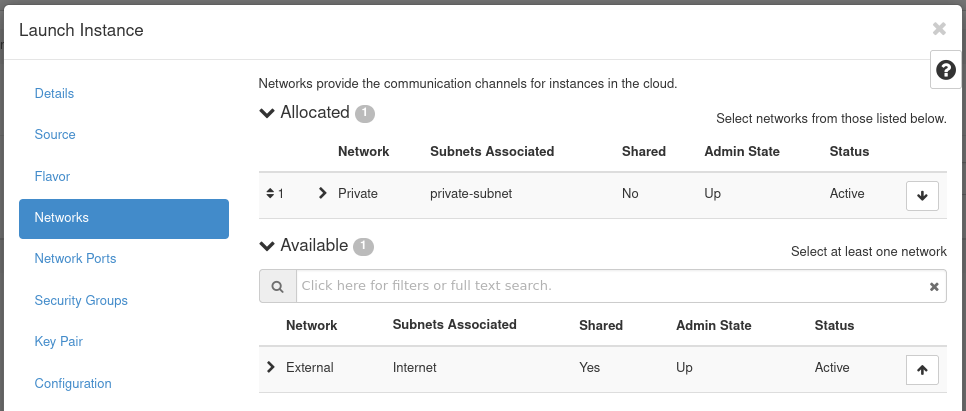

# How to Create an Instance in OpenStack Horizon

## Introduction

With OpenStack, instances, or virtual machines, play a large role in a
cloud's workload. OpenStack provides a way to create and manage
instances with its compute service, called
[Nova](https://docs.openstack.org/nova/latest/). In this guide, we cover
the preparatory steps required to create an instance, including setting
up a private network and router, creating a security group, and how to
add an SSH key pair. Then, we explain how to create an instance using
Horizon.

## Table of Contents

1. - [Networking](create-first-instance#networking)

        1. [Create a Private
            Network](create-first-instance#create-a-private-network)

        2. - [Create a
                Router](create-first-instance#create-a-router)

                1. [Connect Router to Private
                    Network](create-first-instance#connect-router-to-private-network)
                2. [View Network
                    Topology](create-first-instance#view-network-topology)

        3. - [Security
                Groups](create-first-instance#security-groups)

                1. [Create an SSH Security
                    Group](create-first-instance#create-an-ssh-security-group)
                2. [Add Rule to SSH Security
                    Group](create-first-instance#add-rule-to-ssh-security-group)

2. - [How to Create your First
        Instance](create-first-instance#how-to-create-your-first-instance)

        1. [Prerequisites](create-first-instance#prerequisites)

        2. - [Create your First
                Instance](create-first-instance#create-your-first-instance)

                1. [SSH Public
                    Key](create-first-instance#ssh-public-key)
                2. [Operating System
                    Image](create-first-instance#operating-system-image)

## Networking

In this section, we explain how to create a private network and router.
The instance created later in this guide is created on this private
network. The router is created so the private network can be connected
to your cloud's public network, allowing you to assign a floating IP
address to it, making the instance accessible over the Internet. Next,
we cover where security groups can be found and managed. In these next
few sections, we explain how to create the components with a screenshot
then follow up with an explanation of the details to fill out.

### Create a Private Network

To create a private network, begin by navigating to **Project -\>
Network -\> Networks**.

**Figure 1:** Networks in Horizon

Load the form to create a network, by navigating to **Create Network**
near the top right.

**Figure 2:** Network Tab

- **Network Name**: Set a name for the network. This example is called
    **Private**.
- **Enable Admin State**: Leave this checked to enable the network.
- **Create Subnet**: Leave this checked to create a subnet.
- **Availability Zone Hints**: Leave this option as default.

Next, move on to the **Subnet** tab of this form.

**Figure 3:** Subnet Tab

- **Subnet Name**: Set a name for the subnet. This example subnet is
    called **private-subnet**.
- **Network Address**: Select a private network range. For example:
    `192.168.0.1/24`
- **IP Version**: Leave this as IPv4.
- **Gateway IP**: This is optional. If unset, a gateway IP is selected
    automatically.
- **Disable Gateway**: Leave this unchecked.

Next, move on to the **Subnet Details** tab of this form.

**Figure 4:** Subnet Details Tab

- **Enable DHCP**: Leave this option checked.
- **Allocation Pools**: Optional, can specify the range from which IPs
    are selected.
- **DNS Name Servers**: Optional. Specify any DNS name servers here.
- **Host Routes**: Optional. Specify any host routes here.

Click **Create** to create the network. Once created, it appears in the
list of networks.

**Figure 5:** Network Listing

### Create a Router

You next need to create a router to bridge the connection between the
private network and the public network. The public network is called
**External**.

To create a router, begin by navigating to **Project -\> Network -\>
Routers**.

**Figure 6:** Router Listing

Load the form to create a router by navigating to **Create Router** near
the top right.

**Figure 7:** Create a Router

- **Router Name**: Set a name for the router here. This example router
    is called **Router**.
- **Enable Admin State**: Leave this checked to enable the router.
- **External Network**: Choose the network **External**.
- **Availability Zone Hints**: Leave this as the default.

Once complete, create the router by pressing **Create Router**.

#### Connect Router to Private Network

Next, connect the router to the private network, by attaching an
interface. Performing this step allows network communication between the
**Private** and **External** networks.

To attach an interface to the router, first navigate to the list of
routers and locate the one previously created.

**Figure 8:** Router List

Click the name of the router to access its details page. This is where
the interface is attached. There are three tabs: **Overview**,
**Interfaces**, and **Static Routes**. To attach an interface, navigate
to the **Interfaces** tab then load the form to attach an interface by
clicking **Add Interface** near the top right.

**Figure 9:** Router Details

**Figure 10:** Attach Interface

- **Subnet**: Select the appropriate subnet. In this example, we
    choose the **private-subnet**.
- **IP Address**: Optional. Specify an IP if required, otherwise one
    is selected automatically.

Press **Submit** to attach the **Private** network to this router. The
interface is then attached and now listed.

**Figure 11:** Interface Listing

#### View Network Topology

Should you want to visually see the network topology for your cloud,
navigate to **Project -\> Network -\> Network Topology**.

**Figure 12:** Network Topology

This figure indicates the **External** network is connected to the
**Private** network through the router called **Router**.

### Security Groups

Security groups allow control of network traffic to and from instances.
For example, port 22 can be opened for SSH for a single IP or a range of
IPs. In this demonstration, we create a security group for SSH access.
This security group is then applied to the instance we later create.

To view and manage security groups, navigate to **Project -\> Network
-\> Security Groups**.

**Figure 13:** Security Groups

In this cloud, there exists a single security group called **default**.
This security group restricts all incoming (ingress) network traffic and
allows all outgoing (egress) network traffic. When an instance is
created, this security group is applied by default. To allow the network
traffic your instance requires, only open ports as required to just the
needed IP ranges.

#### Create an SSH Security Group

To create a security group for SSH, load the form by navigating to
**Create Security Group** near the top right.

**Figure 14:** Create Security Group Form

- **Name**: Specify a name for the security group. This example
    security group is called **SSH**.
- **Description**: Optional. Describe the security group if
    applicable.

#### Add Rule to SSH Security Group

After creating the SSH security group, we need to add a rule allowing
SSH traffic. This example demonstrates allowing SSH traffic from the
first hardware node in this cloud to this instance.

**Figure 15:** Manage Security Group Rules

To add a rule, load the form by navigating to **Add Rule** near the top
right.

To follow this example, obtain the IP address of the first hardware node
of your cloud. You can find this using [OpenMetal
Central](https://central.openmetal.io/) under your cloud's [Assets
Page](../intro-to-openmetal-private-cloud#how-to-view-your-hardware-assets).
To be consistent, this guide assumes you are working with the first
hardware node's IP address and the remaining instruction is created with
that understanding.

**Figure 16:** Add SSH Rule

- **Rule**: Select **SSH**. When adding rules you can choose from
    predefined options. In this case, we choose the **SSH** rule from
    the first drop down.
- **Description**: Optional. Provide a description of the rule.
- **Remote**: Select **CIDR**.
- **CIDR**: Specify the IP address of your first hardware node.

Press **Add** to add this rule to the security group. This concludes
creating the security group.

## How to Create your First Instance

With the previous steps complete, almost everything is in place to
create your first instance.

### Prerequisites

#### SSH Public Key

An SSH public key is required to access an instance over SSH. This key
is injected into the instance when created. An SSH key cannot be added
to an already running instance.

For this guide, we are arranging it so this instance can be accessed
over SSH from one of the cloud's hardware nodes. Due to this, you must
create an SSH key pair in one of the hardware nodes. The public portion
of that key pair is associated with the instance created later in this
guide. To learn how to create this key pair, see the supplementary
guide: [Create SSH Key Pair for an OpenStack Control Plane
Node](../command-line/create-ssh-key).

#### Operating System Image

Several operating system images are available with which to create
instances. To view available options, navigate to **Project -\> Compute
-\> Images**. To upload your own images, see [How to Upload Operating
System Images using Horizon](images).

### Create your First Instance

To create the first instance, begin by navigating to **Project -\>
Compute -\> Instances**.

**Figure 17:** Instances

Pull up the form to create an instance by navigating to **Launch
Instance** near the top right.

**Figure 18:** Instance Details

- **Instance Name**: Set a name for the instance. This example
    instance is called **Jumpstation**.
- **Description**: Optional. Set a description if this applies.
- **Availability Zone**: Leave as the default, which is **nova**.
- **Count**: Controls the number of instances spawned. This example
    creates a single instance.

Next, move to the **Source** tab allowing you to specify an operating
system image.

**Figure 19:** Instance Source

- **Select Boot Source**: In this example, we use **Image** as the
    boot source.
- **Create New Volume**: Leave this checked as **Yes**. This creates a
    new Cinder volume where the specified operating system image is
    copied into it. The volume ultimately exists with the Ceph cluster,
    in the `vms` pool.
- **Volume Size**: Allow the system to determine this for you.
- **Delete Volume on Instance Delete**: Leave this option set as
    **No**. If checked, when the instance is deleted, the volume is as
    well.

Under the **Available** section, select the appropriate operating
system. This example uses `CentOS 8 Stream (el8-x86_64)`.

This concludes configuring the instance's source. Next, move to the
**Flavor** tab.

**Figure 20:** Instance Flavor

Flavors are a way to define the VCPUs, RAM, and Disk space used by an
instance. Pre-built flavors are available for you. For this step, select
an appropriate flavor from the options under the **Available** heading.
This example uses the `m1.small` flavor.

Next, move to the **Networks** tab.

**Figure 21:** Instance Networks

In this section, you specify the network with which the instance is
associated. For this example, select the **Private** network created
previously. You can choose the **External** network as well, but this is
generally recommended against in favor of using a floating IP should
your instance require Internet connectivity.

**Note\!** Only expose portions of your network as necessary. This
reduces the attack surface and improves application security. If a
private network is not created and an instance is created in a default
cloud, it is associated with the **External** network. This means the
instance consumes a public IP and it could be reached over the Internet.

Next, skip over the **Network Ports** tab and move to the **Security
Groups**.

**Figure 22:** Instance Security Groups

This is where you select security groups for the instance. This example
uses the **SSH** security group in the **Availalble** section.

As the final step, move to the **Key Pair** tab.

**Figure 23:** Instance Key Pair

In this section, you specify an SSH public key to inject into the
instance. You can upload your key at this stage using this form using
the **Import Key Pair** button. For this demonstration, we use **Import
Key Pair** to import the existing SSH public key [created
previously](../command-line/create-ssh-key) for
one of the control plane nodes.

**Figure 24:** Import Key Pair Form

- **Key Pair Name**: Set a name for the SSH public key. This example
    public key is called `relaxed-flamingo-key`.
- **Key Type**: This example uses an **SSH Key** key type.
- **Load Public Key from a file**: Specify the location of the public
    key on your machine.
- **Public Key**: Here you can paste in the public key.

Once the public key is imported, create the instance by pressing
**Launch Instance**.

**Note\!** -- We skip some sections of the instance creation form as
they are not required for this demonstration.

The instance goes through a build process. Allow a few minutes for this
to occur. When complete, the instance appears in the **Instances
Listing** page.

**Figure 25:** Instance Listing

### Assign and Attach Floating IP

The instance created previously is associated with a private network.
Presently, the only way to access this instance is to connect to it from
with the cloud's hardware nodes. Another option for connecting is to use
a floating IP. In this section, we demonstrate how to allocate a
floating IP and attach it to this instance.

To allocate a floating IP, first navigate to **Project -\> Network -\>
Floating IPs**.

**Figure 26:** Floating IPs Listing

Next, load the form to allocate a floating IP by pressing **Allocate IP
to Project**.

- **Pool**: Select **External** for the allocation pool.
- **Description**: Optional. Set a description for the floating IP.

Press **Allocate IP** to add this floating IP address for use.

Next, in the same section, allocate the IP to the Jumpstation instance
by clicking the **Associate** button at the far right.

**Figure 27:** Associate Floating IP

**Figure 28:** Manage Floating IP Associations

- **IP Address**: This field comes pre-selected with the floating IP
    so there's no need to change anything here.
- **Port to be associated**: Select the instance created previously.
    In this case, we use the Jumpstation instance.

This concludes allocating the floating IP to the instance. This instance
is now accessible over SSH from the first hardware node of your cloud.
