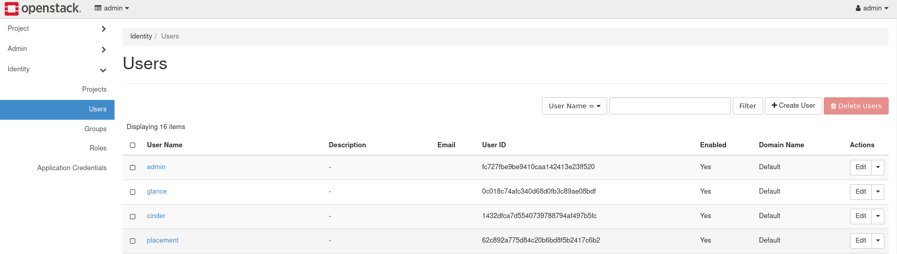

# Create a User and Project in OpenStack Horizon

## Introduction

In OpenStack, the cloud is divided through the use of projects. Projects
have associated with them users, who have differing levels of access,
defined by roles. An administrator defines resource limits per project
by modifying quotas. In this guide, we explain how to create a project
and associate a user with it. Additionally, we explain how project
quotas can be adjusted.

1.  [Quick Overview: Project, Admin, and Identity
    Tabs](operators_manual/day-1/horizon/create-user-project.md#quick-overview-project-admin-and-identity-tabs)

2.    - [How to Create a
        Project](operators_manual/day-1/horizon/create-user-project.md#how-to-create-a-project)
        
        1.  [Create your First
            Project](operators_manual/day-1/horizon/create-user-project.md#create-your-first-project)
        2.  [Project
            Quotas](operators_manual/day-1/horizon/create-user-project.md#project-quotas)

3.  [How to Create a User and Associate with
    Project](operators_manual/day-1/horizon/create-user-project.md#how-to-create-a-user-and-associate-with-project)

4.  [Reference](operators_manual/day-1/horizon/create-user-project.md#reference)

## Quick Overview: Project, Admin, and Identity Tabs

Upon initially logging in to Horizon as **admin**, you see on the left
tabs that group areas together. The three primary tabs seen are
**Project**, **Admin**, and **Identity**. Only a user with the **admin**
role sees the **Admin** tab. Administrative functions, such as live
migrating an instance, occurs through the **Admin** section. Project
users with the **member** role see only the **Project** and **Identity**
tabs and can only perform actions within their specific project.

**Figure 1:** Project, Admin, Identity tabs

## How to Create a Project

When you first log in to Horizon as the administrator account, you find
yourself in the project called **admin**. You can see this by looking at
the very top and near the left of the screen.

**Figure 2:** Admin Project Overview

The left most column contains links to different areas in which
different tasks can be performed. There are three primary groupings:
**Project**, **Admin**, and **Identity**. Only an account with the
administrator role can see the **Admin** tab. The **Identity** tab is
used to create a project.

### Create your First Project

To create your first project, navigate to **Identity -\> Projects**.

**Figure 3:** Project Listing

Several projects already exist, including the **admin** project. These
projects are deployed by default and generally should not be modified.

Pull up the form to create a project by navigating to the **Create
Project** button near the top right.

**Figure 4:** Create Project Form

Under the **Name** field, specify a name for the project. This example
project is called **Development**. There are tabs for adding Project
Members and Project Groups, but these are not covered for this
demonstration. This guide later explains how to create a user and attach
it to this project. Click **Create Project** to finish creating the
first project.

Once created, the project appears in the Project Listing page.

**Figure 5:** Development Project Listed

### Project Quotas

While in the project listing page, you can view and adjust quotas for
this project as the **admin** user. Quotas are limits on resources, like
the number of instances for example.

To view the quotas for this project while in **Identity -\> Projects**
tab, find the drop down to the right with the first option being
**Manage Members**. From this drop down, click **Modify Quotas** to view
the default quota values.

**Figure 6:** Modify Quotas

A form appears with several tabs and you are presented with the quotas
for the Compute service. Quotas exist for the Volume and Network
services as well.

**Figure 7:** Edit Quotas

You may want to adjust the parameters in this form depending on your
workload.

**Note\!** -- We have seen issues appears where an item, like an
instance, cannot be created. This is often related to a hard limit set
for a specific quota. Typically the error message received indicates the
quota has been reached.

**Note\!** -- Setting a value to `-1` means that quota is unlimited.

## How to Create a User and Associate with Project

With your first project created, you can now create and associate a user
with it. The intention of this guide is to have you create a user,
associate it with the project created earlier, and then log out of
Horizon as **admin**, and log back in with the new user.

To create a user, first navigate as **admin** to **Identity -\> Users**.
By default, there are several users already listed, and this is
expected. These are created during cloud deployment and should generally
not be modified.

**Figure 8:** User Listing

Next, load the form to create a user by navigating to **Create User** in
the upper right of the screen.

**Figure 9:** Create User Form

For this example, we set values for **User Name**, **Password**,
**Primary Project**, and **Role**.

  - **User Name**: Specify your user here
  - **Password**: Set a unique, randomly generated password
  - **Email**: Optional, but is useful for password resets
  - **Primary Project**: Choose the project created earlier
  - **Role**: This example selects the `member` role

For **Role**, there are several options, depending on the level of
access required. The default OpenStack roles are **reader**, **member**,
and **admin**. Additional roles exist in the drop down, which is
expected. This example sets the role **member** for this user. For more
about roles in OpenStack, see the latest [Keystone Default Roles
documentation](https://docs.openstack.org/keystone/latest/admin/service-api-protection.html).

Press **Create User** to create the user.

Next, log out of Horizon as **admin**, and log back in with your new
user. Upon logging back in you are by default in the newly created
project. You can see the project you are currently in at the top left
and your user can be seen at the top right of Horizon.

**Figure 10:** New User Login

For the rest of this guide, we assume you are working out of the newly
created project and using the user associated with it.

## Reference

[OpenStack Victoria Horizon Administrator
Guide](https://docs.openstack.org/horizon/victoria/admin/index.html)
