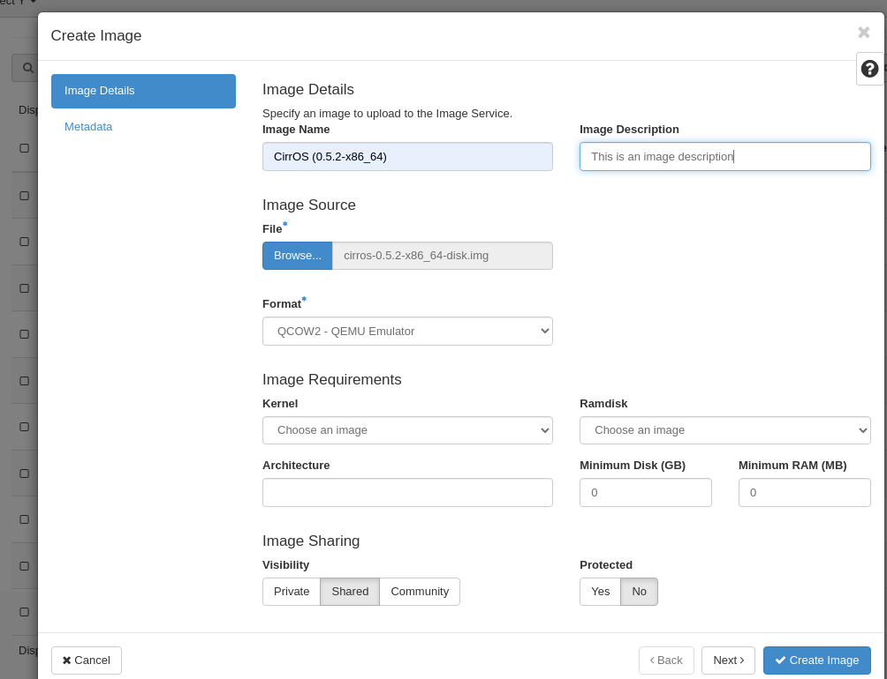

# Manage and Upload Images in OpenStack Horizon

## Introduction

This guide provides instructions for how to upload an image into
OpenStack as well as create images out of an existing instance. Images
contain a bootable operating system that is used to create instances.
Within your OpenMetal Cloud, there are several different images that are
readily available including CentOS, Debian, Fedora, and Ubuntu. In
addition to this, you have the option to upload images from other
sources or create your images. Images can either be built from ISO or
images can be created out of snapshots of instances. This guide will
walk you through how to upload images to Glance through Horizon and how
to create an image from an instance snapshot.

## Table of Contents

1.  [Managing
    Images](operators_manual/day-1/horizon/images#managing-images)
2.  [Uploading
    Images](operators_manual/day-1/horizon/images#uploading-images)
3.  [Create Images from Running
    Instances](operators_manual/day-1/horizon/images#create-images-from-running-instances)
4.  [Reference](operators_manual/day-1/horizon/images#reference)

## Managing Images

The primary tool for managing images is OpenStack's Glance service.
Glance uses Ceph to store images instead of the local file system. You
can upload images through Glance and uploaded images cannot be changed.
For further information on how to create and modify virtual images
within OpenStack, view the [Virtual Machine Image
Guide](https://docs.openstack.org/image-guide/).

To access images from within your Horizon Dashboard, navigate to the
Projects tab. Within the projects tab, select Compute and you are
presented with the option to select Images. This tab contains a list of
all your images within OpenStack.

**Figure 1:** Image List Within Horizon Dashboard

## Uploading Images

Images can be uploaded through your Horizon dashboard. With our
configuration, the recommended format for images is **QCOW2 - QEMU
emulator**. QCOW2 is the most common format for Linux KVM, expands
dynamically, and supports [copy on
write](https://en.wikipedia.org/wiki/Copy-on-write). In this section, we
explain how to upload images through Horizon.

In order to upload an image on Horizon, you must first have the image
locally on your machine. In this example, we demonstrate uploading the
CirrOS image. To download this image visit [CirrOS Latest
Download](https://download.cirros-cloud.net/0.5.2/cirros-0.5.2-x86_64-disk.img).

After downloading the image locally to your machine, navigate in your
Horizon dashboard to **Project -\> Compute -\> Images**, where you are
presented with a list of options for managing images. To begin uploading
this image, click the **Create Image** button near the top right.

**Figure 2:** Creating an Image Within Horizon Dashboard

**Figure 3:** Create Image Form

For this demonstration, we enter in values for the following fields:

  - **Image Name**: Name of the image
  - **Image Description**: Optional description of the image
  - **File**: The source file on your machine
  - **Format**: - For this example, we are using QCOW2 - QEMU Emulator

Fill out the details as needed and submit the form. It may take some
time to complete uploading the image.

**Figure 3:** CirrOS Image Listed in Horizon Dashboard

## Create Images From Running Instances

To create an image from a running instance, you must first create a
snapshot of your instance. Once created, a snapshot is a usable image
within Glance that can create instances.

To create a snapshot in Horizon, navigate to **Project -\> Compute -\>
Instances** and locate the **Create Snapshot** option from the listed
instance's drop down menu. In the form that appears, enter a name for
your snapshot.

**Figure 4:** Create Snapshot Button Within Horizon Dashboard

Once your snapshot has been created, the snapshot name is added to your
list of images. You can use this image to launch new instances.

## Reference

[OpenStack Victoria Glance
Documentation](https://docs.openstack.org/glance/victoria/)
