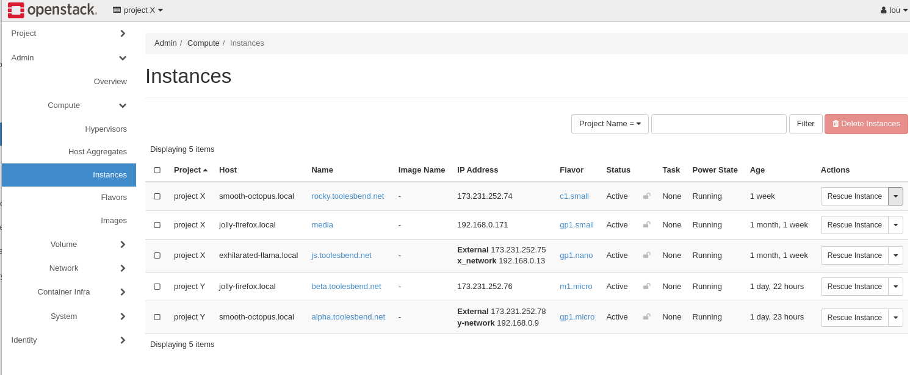

# How to Live Migrate Instances Using OpenStack Horizon

## Introduction

This guide provides instructions for cloud administrators on how to
migrate instances through your Horizon dashboard. Migration is the
process that a server administrator can move instances to a different
host. Live migration keeps instances in an active state during the
migration process. This process is useful when applications need to
remain running and shutting down an instance is not possible or
advantageous.

## Table of Contents

1.  [Prerequisite](operators_manual/day-2/live-migrate-instances.rst#prerequisite)
2.  [Determining an Instance's Parent
    Host](operators_manual/day-2/live-migrate-instances.rst#determining-an-instance-s-parent-host)
3.  [Migrate
    Instance](operators_manual/day-2/live-migrate-instances.rst#migrate-instance)

## Prerequisite

Live migrating instances requires having a user account with the
administrator role. This is typically the account called **admin**.

## Determining an Instance's Parent Host

To determine an instance's parent host, navigate to **Admin -\> Compute
-\> Instances**. You have the option to see the project, the host, as
well as the IP address, and the state of your instance.

**Figure 1:** Summary of Instances

## Migrate Instance

Once you have determined the instance you want to migrate, navigate to
**Admin -\> Compute -\> Instances**. On this page, you are presented
with a series of actions. To access these actions click the small
triangle next to the button called **Rescue Instance**.

**Figure 2:** Link for Live Migration Drop Down Menu

From the drop-down menu, select **Live Migrate Instance**.

**Figure 3:** Drop down menu for live migration

Within Live Migrate, the options for **Disk Over Commit** and **Block
Migration** are options for local storage. Block live migration uses
ephemeral disks on instances. These disks are not shared between source
and destination hosts. The storage for OpenMetal uses a shared storage
system through Ceph. Because of the shared storage system in OpenMetal,
neither option should be selected.

**Figure 4:** Live Migration Options

Live Migrate does have the option to either auto-select a new host or to
choose one manually. If you have a specific node for your instance,
select the name of the node under the **New Host** option. Once you have
made your selection, click submit. During the live migration process, a
status bar appears under tasks, upon completion, the task returns to
none and your instance host changes to a new node.

**Figure 5:** Task list for migrating instances
