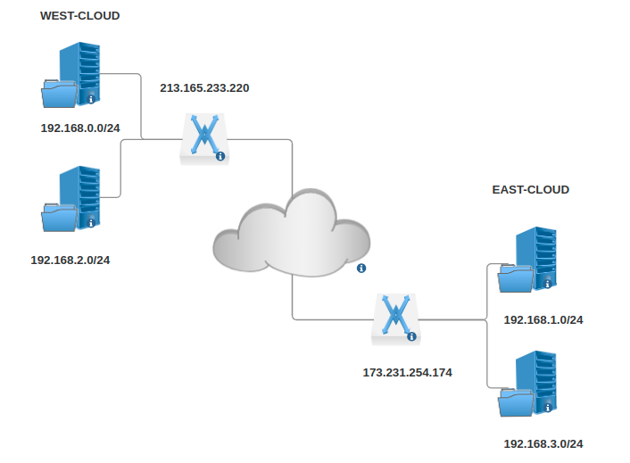

# Create a Site-to-Site VPN Connection with Endpoint Groups in Horizon

Author: Ramon Grullon

Neutron provides Site-to-Site IPsec VPN through VPN as a Service (VPNaaS).
IPsec policies and connections are configured within OpenStack meaning
no dedicated virtual machines are required to use this service.

For CLI procedure please use - [CLI VPN Site-to-Site](https://openmetal.io/docs/tutorials/create-site-to-site-vpn.md)

## Prerequisites

- Familiarity with OpenStackClient

## Notable Changes

- In Bobcat, the VPN driver changed from Libreswan to strongSwan

## Overview

This article explains how to configure a VPN Site-to-Site connection using OpenStack.
This allows you to configure communication between private networks across different
locations.

We will be using 2 OpenStack clouds which will be referred to as East Cloud and
West Cloud. Each cloud will have 1 router attached to subnets utilizing 1 VPN service.

In this guide, we'll be creating West-Cloud as our local VPN and all steps
should be duplicated for East-Cloud



### Step One: West Network Setup

Create all prerequisite network components. In this example we used

```shell
Router- West-Router
Network - west-primary & west-secondary
Subnet - west-primary-subnet & west-secondary-subnet
```

- [Networking in OpenStack](https://openmetal.io/docs/manuals/users-manual/network-ip-traffic)

Associate both subnets created


### Step Two: Create an IKE and IPSec Policy

An IKE and IPSec policy will need to be created. It is recommended that you set
explicit parameters to provide higher security than the defaults. In our example
we are setting these on two OpenStack clusters, but the settings will be similar
on third party VPN tools. The goal is to configure both ends with the same IKE
and IPSec Policy settings.

Go to VPN - IKE Policies - Add IKE Policy


Go to VPN - IPsec Policies - Add IPsec Policy


### Step Three: Create a VPN Service

Now create a VPN service for both sites. You will want to take note of the
external IP addresses assigned to each.

> Note: The VPN services are configured without a subnet defined. This allows
> you flexibility to configure multiple local subnets in a local endpoint group
> per IPSec site connection or multiple site connections with different local
> subnets.
> Each remote endpoint group requiring its own site2site connection.


 **Take note as the external IP may be different from the router.**

### Step Four: Create Endpoint Groups

The Endpoint Group is used to configure multiple local and remote subnets in a
VPN service.

Create west **local** endpoint groups

Local endpoint groups define subnets given by name or UUID. The site west
local endpoint contains `west-localendpointgroup`.


Create west **peer** endpoint groups

```shell
    Peer endpoint groups are CIDRs. The site west peer endpoint group will
    contain the peer subnet CIDR. In this case that's the site `east subnet`.
```


### Step Six: Create VPN Site Connections

Create west site connection

Create a site connection (`west-ipsec1`) from site west (VPN service
`west-vpnservice`) to site east (peer IP address `173.231.254.174`) defining
the local (`west-localendpointgroup`) and peer (`west-remoteendpointgroup1`)
endpoint groups.

Repeat this process for each individual remote endpoint group.
(A remote endpoint group can only have 1 subnet per)


### Step Seven: Test Site-to-Site Connection

Create instances connected to both subnets on west and both subnets on east.
Confirm they can communicate via ICMP echo requests to local IPs.


## References

- <https://https://docs.openstack.org/neutron/latest/admin/vpnaas-scenario.html>
