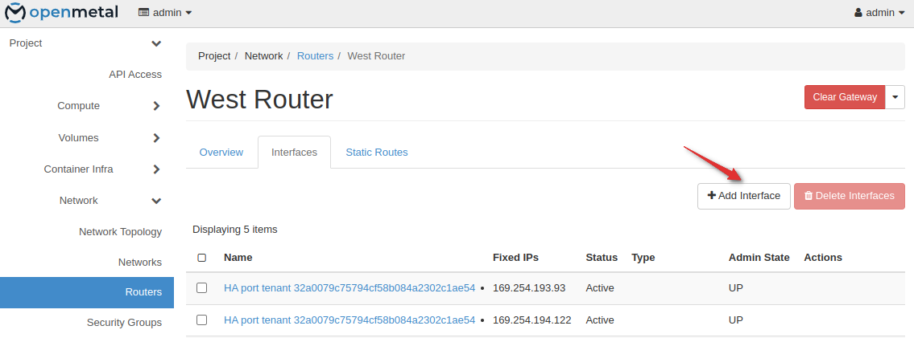
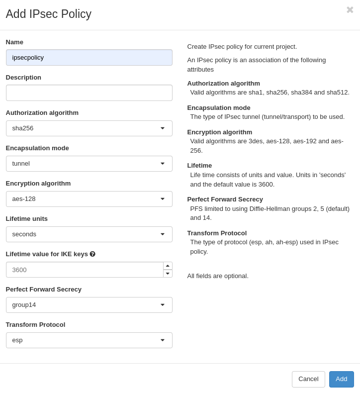
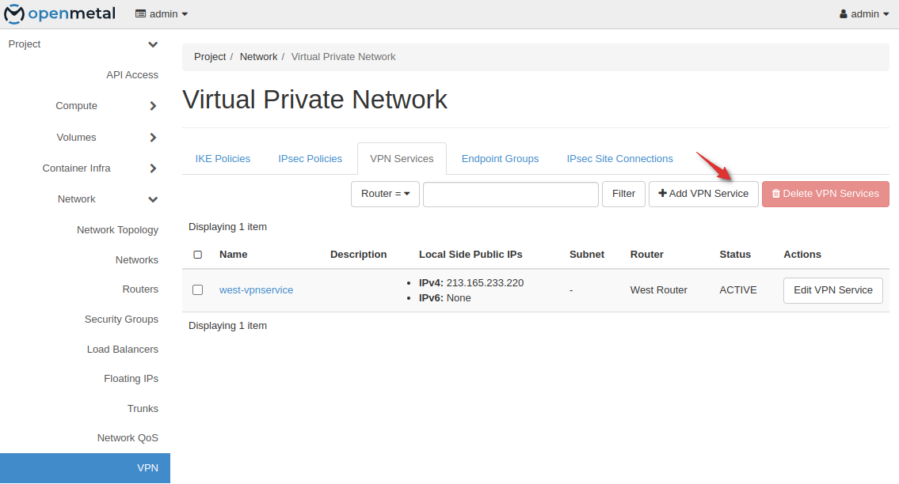
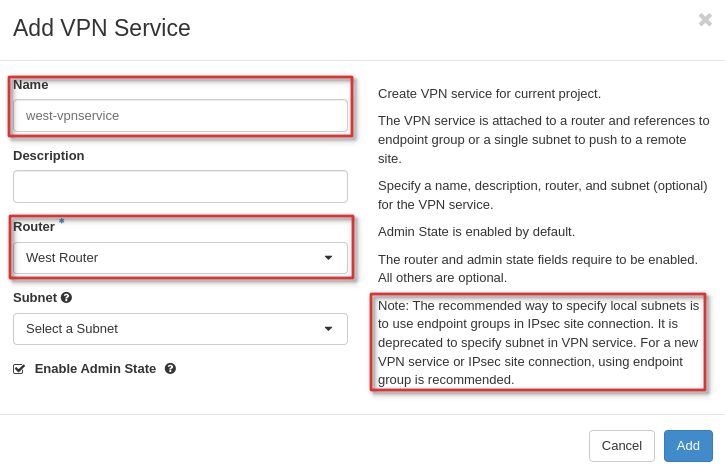
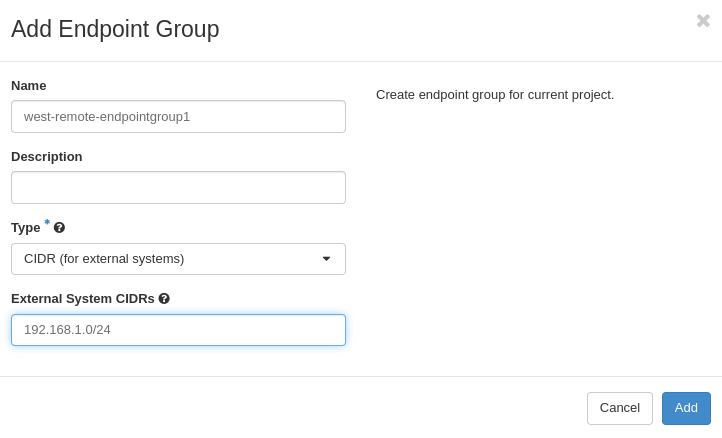

# Create a Site-to-Site VPN Connection with Endpoint Groups on OpenStack

Neutron provides Site-to-Site IPsec VPN through VPN as a Service (VPNaaS).
IPsec policies and connections are configured within OpenStack meaning
no dedicated virtual machines are required to use this service.

## Prerequisites

- Cloud configured for [VPNaaS](vpnaas-configure-deploy.md)
- Familiarity with OpenStackClient

## Notable Changes

- In Bobcat, the VPN driver changed from libreswan to Strongswan

## Overview

In this guide you will create a site-to-site IPSec VPN connection. This allows
you to configure communication between private networks across regions.

### Step One: West Network Setup

Create all prerequisite network components

- [Networking in OpenStack](https://openmetal.io/docs/manuals/users-manual/network-ip-traffic)

1. Associate subnet

### Step Two: East Network Setup

Create all prerequisite network components

- [Networking in OpenStack](https://openmetal.io/docs/manuals/users-manual/network-ip-traffic)

1. Associate subnet

### Step Three: Create an IKE and IPSec Policy

An IKE and IPSec policy will need to be created. It is recommended that you set
explicit parameters to provide higher security than the defaults. In our example
we are setting these on two OpenStack clusters, but the settings will be similar
on third party VPN tools. The goal is to configure both ends with the same IKE
and IPSec Policy settings.

1. Go to VPN - IKE Policies - Add IKE Policy

1. Go to VPN - IPsec Policies - Add IPsec Policy

### Step Four: Create VPN Service for Both Sites

Now create a VPN service for both sites. You will want to take note of the
external IP addresses assigned to each.

> Note: The VPN services are configured without a subnet defined. This allows
> you flexibility to configure multiple local subnets in a local endpoint group
> per IPSec site connection or multiple site connections with different local
> subnets.
> Current limitations require each remote endpoint group to have a single subnet.
> Each remote endpoint group requiring its own site2site connection.

1. Create VPN west

    Take note as the external IP may be different from the router.

1. Create VPN east

### Step Five: Create Endpoint Groups

1. Create west local endpoint groups

    Local endpoint groups define subnets given by name or UUID. The site west
    local endpoint contains `west-localendpointgroup`.

1. Create west peer endpoint groups

    Peer endpoint groups are CIDRs. The site west peer endpoint group will
    contain the peer subnet CIDR. In this case that's the site `east subnet`.

1. Create east local endpoint group

    Local endpoint groups define subnets given by name or UUID. The site east
    local endpoint contains `subnet-east`.

1. Create east peer endpoint groups

    Peer endpoint groups are CIDRs. The site east peer endpoint group will
    contain the peer subnet CIDR. In this case that's the site west subnet.

### Step Six: Create VPN Site Connections

1. Create west site connection

    Create a site connection (`west-ipsec1`) from site west (VPN service
    `west-vpnservice`) to site east (peer IP address `173.231.254.174`) defining
    the local (`west-localendpointgroup`) and peer (`west-remoteendpointgroup1`)
    endpoint groups.

    Repeat this process for each individual remote endpoint group.
    (A remote endpoint group can only have 1 subnet per)

1. Create east site connection

    Create a site connection (`east-ipsec1`) from site west (VPN service
    `east-vpnservice`) to site east (peer IP address `213.165.233.220`) defining
    the local (`east-localendpointgroup`) and peer (`east-remoteendpointgroup1`)
    endpoint groups.

    Repeat this process for each individual remote endpoint group.
    (A remote endpoint group can only have 1 subnet per)

### Step Seven: Test Site-to-Site Connection

Create instances connected to both subnets on west and both subnets on east.
Confirm they can communicate via ICMP echo requests to local IPs.

## References

- <https://https://docs.openstack.org/neutron/latest/admin/vpnaas-scenario.html>
