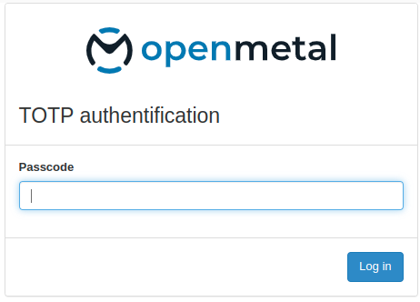
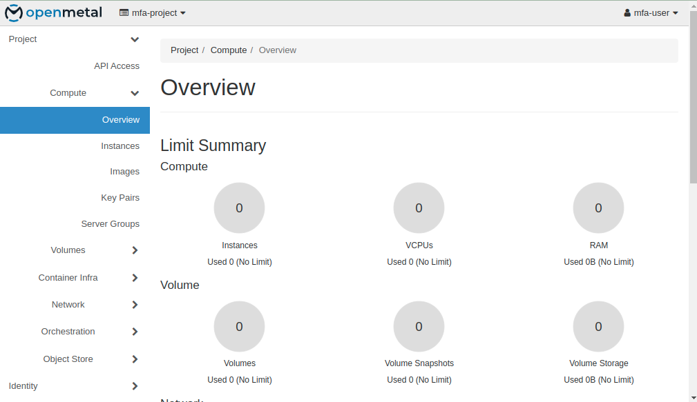

# Configuring Time-Based One-Time Password (TOTP) on OpenStack

Author: Ramon Grullon

## Introduction

Horizon added time-based one-time password (TOTP) authentication support,
leveraging the already existing two factor authentication from Keystone.
Now, if a user activates TOTP on Keystone, it gets activated on Horizon too.

## Prerequesites

- A working OpenStack 2023.2 environment deployed using kolla-ansible.
- Enabled totp on all control nodes
- Admin access to the OpenStack dashboard and CLI.
- Access to the kolla-ansible configuration files.

### Create and Configure a TOTP Credential

On one of your control nodes with OpenStack CLI configured:

Create a project and user to utilize TOTP

```bash
openstack project create mfa-project

openstack user create --password <strong password> mfa-user

openstack role add --user mfa-user --project mfa-project member
```

TOTP uses a base32 encoded string for the secret. The secret must be at least
128 bits (16 bytes). The following python code can be used to generate a TOTP secret:

```python

import base64
message = b'1234567890123456'
print(base64.b32encode(message).rstrip(b'='))
```

Example output:

```bash
GEZDGNBVGY3TQOJQGEZDGNBVGY

```

### Configure credentials and mfa rules for user

```bash
openstack credential create --type totp mfa-user GEZDGNBVGY3TQOJQGEZDGNBVGYZ

openstack user set --multi-factor-auth-rule password,totp mfa-user

openstack user set --enable-multi-factor-auth mfa-user
```

### Set Up TOTP

This typically involves:
Scanning a QR code with a TOTP app like Google Authenticator.
On a device install Google Authenticator and inside the app click on
‘Set up account’ and then click on ‘Enter provided key’. In the input fields
enter account name and secret.

To quickly verify your configuration you can use <https://totp.app> and enter your
secret to get your code.

Verify TOTP Authentication

Log out of the OpenStack dashboard.

Attempt to log back in. After entering your password, you should be prompted to
enter your TOTP code.





Enter TOTP Code:

Open your TOTP app and enter the current code to complete the login process.

Ensure that administrators can manage users and their TOTP settings.
By following these steps, you should have successfully enabled TOTP
authentication in OpenStack 2023.2 using kolla-ansible, allowing users to
enhance the security of their accounts with TOTP through the Horizon dashboard.

## References

- <https://docs.openstack.org/keystone/latest/admin/auth-totp.html>
- <https://www.youtube.com/watch?v=JEniPHp1l74>
