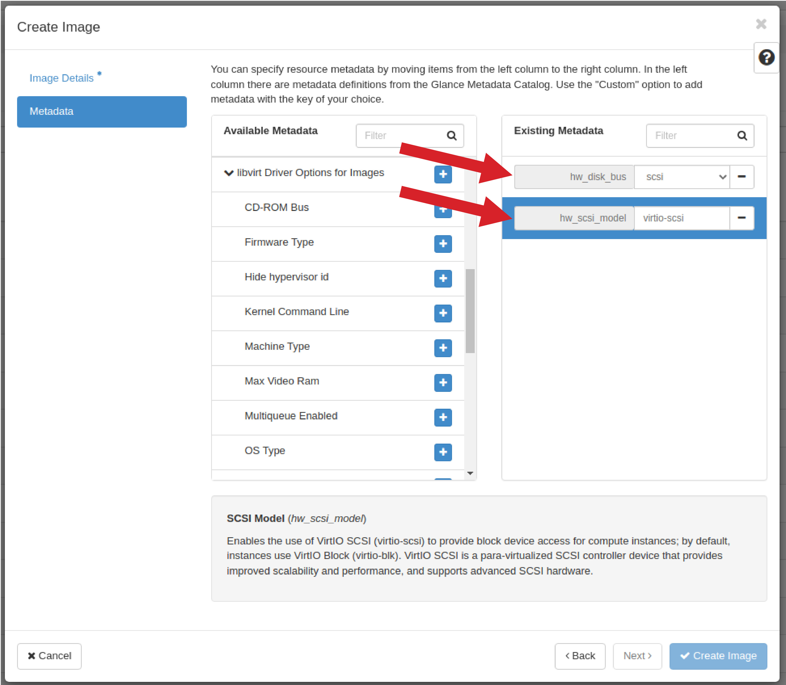
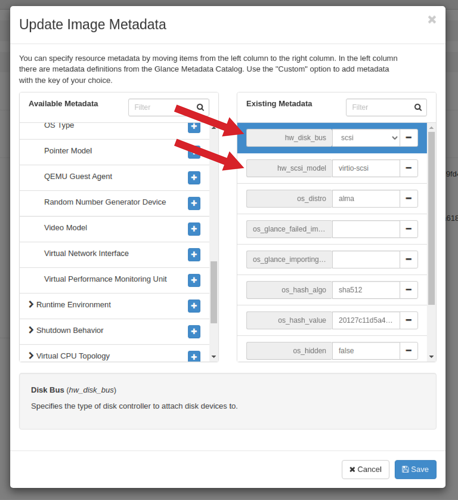

# Adding TRIM support to OpenStack Glance images

## What is TRIM Support?

TRIM support is the ability of the virtualization software to pass the TRIM
command from the guest operating system to the underlying physical storage
device. The TRIM command is used to inform the storage device which blocks
of data are no longer in use and can be safely erased, allowing the device
to maintain optimal performance over time.

Without TRIM support, the storage device would not know which blocks are free
and which are still in use by the guest operating system. As a result, the
device may not be able to efficiently manage the available storage space,
leading to decreased performance over time.

## Intro to virtio-scsi

Virtio-scsi is a virtualization interface that allows virtual machines (VMs)
to communicate with storage devices using a SCSI protocol. One of the main
benefits of using virtio-scsi in a virtual environment is its support for the
TRIM command, which can help to improve the performance and longevity of
solid-state drives (SSDs) used as storage devices for VMs.

## How to add TRIM support to OpenStack Glance

### Required Image Metadata

The following metadata is required for the Glance image in order to provide
TRIM support

#### **`hw_scsi_model=virtio-scsi`**

This enables the use of VirtIO SCSI (virtio-scsi) to provide block device
access for compute instances; by default, instances use VirtIO Block
(virtio-blk). VirtIO SCSI is a para-virtualized SCSI controller device that
provides improved scalability and performance, and supports advanced SCSI hardware.

#### **`hw_disk_bus=scsi`**

This specifies the type of disk controller to attach disk devices to. In our
case we want to utilize `**scsi`** for TRIM support.

## Creating an image with fstrim support

### Using the OpenStack CLI

```bash
# Create image with required properties
$ openstack image create --file <PATH_TO_FILE> \
                         --disk-format qcow2 \
                         --container-format bare \
                         --public \
                         --property hw_qemu_guest_agent=yes \
                         --property hw_scsi_model=virtio-scsi \
                         --property hw_disk_bus=scsi \
                         "Trim_Image"

# (Optional) Set distro/version/arch
$ openstack image set "Trim_Image" \
                      --os-distro <DISTRO> \
                      --os-version <VERSION> \
                      --architecture <ARCH> \
```

### Via Horizon (Web GUI)

When creating a new image within the Horizon web interface, simply select the
Metadata tab and under “**libvirt Driver Options for Images**” and select the
“**+**” next to  “**Disk Bus**” and “**SCSI Model**”



## Adding fstrim support to an existing image

### Via the OpenStack CLI

```bash
openstack image set <IMAGE_NAME_OR_UUID> \
                    --property hw_scsi_model=virtio-scsi \
                    --property hw_disk_bus=scsi
```

### Using Horizon (Web GUI)

First, select the drop down on the image you want to modify then select
“**Update Metadata**”


Next, on the left hand tab under “**libvirt Driver Options for Images**” and
select the “**+**” next to  “**Disk Bus**” and “**SCSI Model**”


