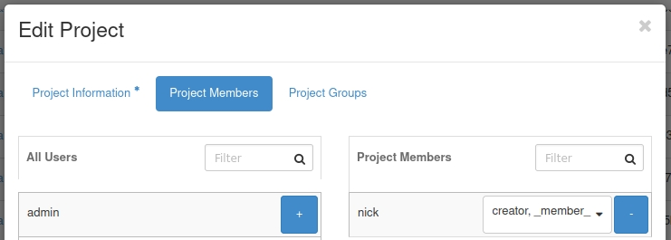

# Working with OpenStack Barbican

Barbican is the OpenStack Key Manager service. It provides secure storage,
provisioning and management of secret data. This includes keying material such
as Symmetric Keys, Asymmetric Keys, Certificates and raw binary data. In our
default Cloud Core deployment, Cinder, Nova, and Octavia use Barbican to manage
secrets. In this guide, we demonstrate booting a VM with an encrypted volume.

## What can I do with a Secret Store?

With Barbican configured the service can be utilized for a number of use cases.

- Image signature verification
- Disk and volume encryption
- SSL/TLS keypair storage
- Secure password storage

See the [OpenStack Security
Guide](https://docs.openstack.org/security-guide/secrets-management/secrets-management-use-cases.html)
for additional information.

:::info

If Barbican is not installed to your cloud, see our
[guide](docs/tutorials/install-barbican.md) or [submit a support
ticket](operators-manual/day-1/intro-to-openmetal-private-cloud.md#how-to-submit-a-support-ticket)
for installation.

:::

## Creator Keystone Role

The `creator` Keystone role is required by non-admin users who wish to use
Barbican to manage secrets. The `admin` role is required to modify the roles of
a user.

Set the creator role using:

```sh
openstack role add creator --user nick --project 966582d3de534089a36cc39a2e5d0ff9
```

Alternatively, in Horizon, you can adjust the role for a user by navigating to **Identity -> Projects**


## Encrypted Volume Type

You can create encrypted volumes with Cinder. Before creating an encrypted
volume, a new volume type in Cinder must be created. Create a new Encrypted
Volume type using:

```sh
openstack volume type create --encryption-provider luks --encryption-cipher aes-xts-plain64 --encryption-key-size 256 --encryption-control-location front-end encrypted
```

Output:

```sh
+-------------+-----------------------------------------------------------------------------------------------------------------------------------------------+
| Field       | Value                                                                                                                                         |
+-------------+-----------------------------------------------------------------------------------------------------------------------------------------------+
| description | None                                                                                                                                          |
| encryption  | cipher='aes-xts-plain64', control_location='front-end', encryption_id='bd8cc91f-877a-4c13-a0b1-65b236f0c3c6', key_size='256', provider='luks' |
| id          | 6677cb0d-b548-4eb5-b789-aadacfd6ec94                                                                                                          |
| is_public   | True                                                                                                                                          |
| name        | encrypted                                                                                                                                     |
+-------------+-----------------------------------------------------------------------------------------------------------------------------------------------+
```

### Encrypted Volume

Create an encrypted volume using:

```sh
openstack volume create --size 10 --type encrypted --image 'Ubuntu 22.04 (Jammy)' --bootable ubuntu22
```

Output:

```sh
+---------------------+--------------------------------------+
| Field               | Value                                |
+---------------------+--------------------------------------+
| attachments         | []                                   |
| availability_zone   | nova                                 |
| bootable            | false                                |
| consistencygroup_id | None                                 |
| created_at          | 2023-10-05T19:37:09.563568           |
| description         | None                                 |
| encrypted           | True                                 |
| id                  | dd4fc56c-d1f1-4700-add2-d06c0183dbe3 |
| migration_status    | None                                 |
| multiattach         | False                                |
| name                | ubuntu22                             |
| properties          |                                      |
| replication_status  | None                                 |
| size                | 10                                   |
| snapshot_id         | None                                 |
| source_volid        | None                                 |
| status              | creating                             |
| type                | encrypted                            |
| updated_at          | None                                 |
| user_id             | 2d1fd7d55b4f49f3b5bde488b6bc949f     |
+---------------------+--------------------------------------+
```

## Spin up a VM with Encrypted Volume

Using the encrypted volume created in the previous step, spin up a VM with it
using:

```sh
vol=dd4fc56c-d1f1-4700-add2-d06c0183dbe3
openstack server create --flavor gen.small --volume $vol --network External --security-group "SSH ingress" --key-name key ubuntu22_encrypted
```

Output:

```sh
+-------------------------------------+---------------------------------------------+
| Field                               | Value                                       |
+-------------------------------------+---------------------------------------------+
| OS-DCF:diskConfig                   | MANUAL                                      |
| OS-EXT-AZ:availability_zone         |                                             |
| OS-EXT-SRV-ATTR:host                | None                                        |
| OS-EXT-SRV-ATTR:hypervisor_hostname | None                                        |
| OS-EXT-SRV-ATTR:instance_name       |                                             |
| OS-EXT-STS:power_state              | NOSTATE                                     |
| OS-EXT-STS:task_state               | scheduling                                  |
| OS-EXT-STS:vm_state                 | building                                    |
| OS-SRV-USG:launched_at              | None                                        |
| OS-SRV-USG:terminated_at            | None                                        |
| accessIPv4                          |                                             |
| accessIPv6                          |                                             |
| addresses                           |                                             |
| adminPass                           | NWqPR38Qj48L                                |
| config_drive                        |                                             |
| created                             | 2023-10-05T19:45:51Z                        |
| flavor                              | gen.small (gen.small)                       |
| hostId                              |                                             |
| id                                  | ea82e509-7efa-44a7-ba2b-e6364f458958        |
| image                               | N/A (booted from volume)                    |
| key_name                            | key                                         |
| name                                | ubuntu22_encrypted                          |
| progress                            | 0                                           |
| project_id                          | 4993ac59480646b6b15ae7727279ca11            |
| properties                          |                                             |
| security_groups                     | name='6ffcdf91-d8dd-4499-98e1-0860267ea08e' |
| status                              | BUILD                                       |
| updated                             | 2023-10-05T19:45:51Z                        |
| user_id                             | 2d1fd7d55b4f49f3b5bde488b6bc949f            |
| volumes_attached                    |                                             |
+-------------------------------------+---------------------------------------------+
```
