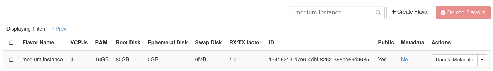

# Manage Flavors in OpenStack

## Introduction

Flavors in OpenStack control the amount of VCPUs, RAM, and disk storage
allocated to an instance. Flavors are managed by an administrative user.
Further control is available by setting metadata for a flavor. In this
guide, we outline how to manage flavors in your Private Cloud.

## Prerequisite

You must use an OpenStack administrator account. By default, this is the
user `admin`, but can be any user with the `admin` role.

## How to Create a Flavor

Begin by navigating in Horizon to **Admin -\> Compute -\> Flavors**. By
default, our Private Clouds come with flavors defined so you should see
several options.

**Figure 1**: List of Flavors

Click **Create Flavor** to create a new flavor.

**Figure 2**: Create Flavor Form

Fill out the details as needed and submit the form.

**Figure 3**: Newly Created Flavor Listed

## Update Flavor Metadata

After a flavor is created, you can apply additional metadata to it. For
our case, we use metadata for specific flavors to control on which hosts
instances are scheduled. This is useful when you want to spawn an
instance that uses strictly ephemeral storage with our compute-only
nodes. For clusters using the NVIDIA A100 GPU nodes, we add metadata to
specific flavors which when applied to an instance causes it to spawn on
the GPU node.

### How to Update Flavor Metadata

To update the metadata for a flavor, first navigate to **Admin -\>
Compute -\> Flavors**, and locate the flavor in the list. From the drop
down on the right, select the option **Update Metadata**.

**Figure 4**: Update Flavor Metadata

## Deleting a Flavor

Flavors can also be deleted. This action is irreversible.

### How to Delete a Flavor

To delete a flavor, first navigate to **Admin -\> Compute -\> Flavors**,
and locate the flavor in the list. From the drop down on the right,
select the option **Delete Flavor**.

**Figure 5**: Delete Flavor

## References

- <https://docs.openstack.org/horizon/latest/admin/manage-flavors.html>
- <https://docs.openstack.org/nova/latest/admin/flavors.html>
- <https://docs.openstack.org/nova/latest/user/metadata.html>
