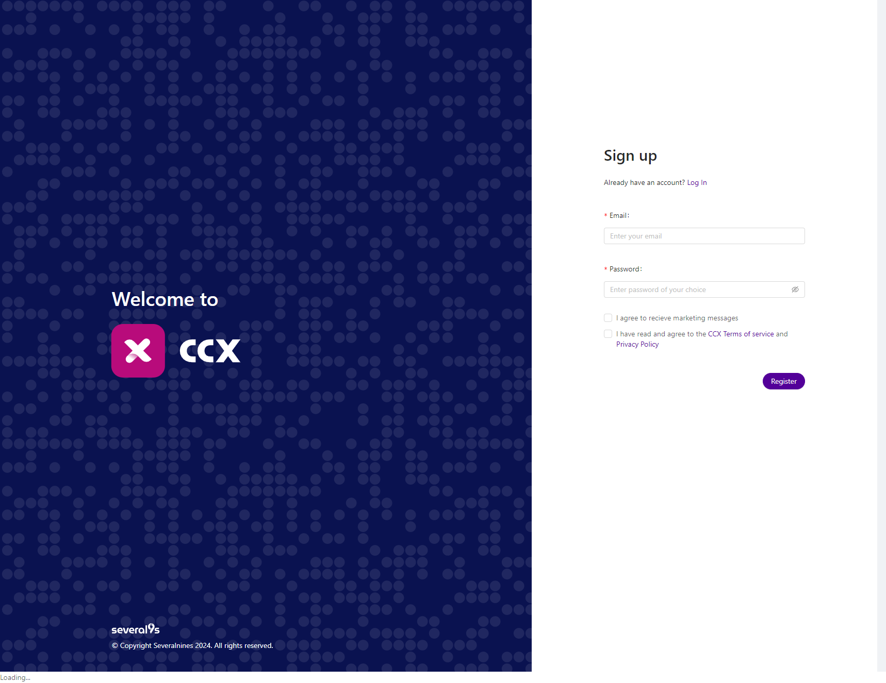
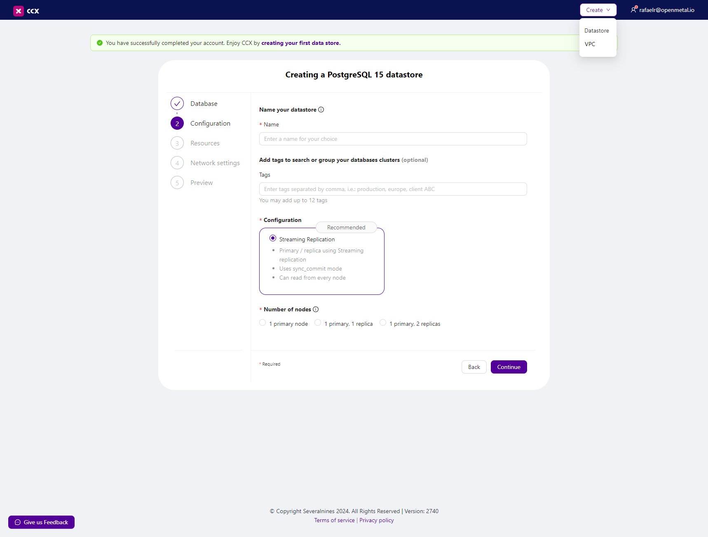

# Severalnines CCX on OpenStack

## Introduction

Severalnines provides database automation solutions, enabling high-availability
and scalable database management for hybrid environments. Their key product,
CCX, supports various databases like PostgreSQL, MongoDB, and MySQL, offering
features like failover, backups, monitoring, and alerting.

For more information on Severalnines, visit [https://severalnines.com/](https://severalnines.com/).

---

In this tutorial, we will show you how to set up Severalnines
CCX V2 on OpenStack in an OpenMetal Cloud. We used this guide from Severalnines
as a reference: <https://github.com/severalnines/ccx-admin-guide/wiki/Installation-V2>.

## Prerequisites

1. OpenStack
    - You can deploy an OpenStack cloud on OpenMetal. For more
   information, refer to [OpenStack on OpenMetal Cloud](https://openmetal.io/products/on-demand-openstack-cloud/).
    - We recommend setting up TLS on your OpenStack environment, otherwise you may
     run into issues connecting to the OpenStack API.

2. Kubernetes Cluster
    - In this guide, we deployed a Kubernetes cluster using [Kubespray](../kubernetes-guides/deploying-a-kubespray-cluster-to-openstack-using-terraform).
    - Ensure can access to the Kubernetes cluster API from the node you're
      using to install CCX.

3. Severalnines CCX License

## Step 1 - Create a new VM

This installation process requires several components to be installed.
We will use a new VM to initiate the installation process,
but you can also use your local device.

Note this node will need to have access to the Kubernetes cluster API.

1. Log in to the OpenStack Horizon dashboard.
2. Click on the `Compute` tab.
3. Click on `Instances` and then click on `Launch Instance`.
4. Fill in the required details like `Instance Name`, `Flavor`, `Image`, `Network`, and `Security Group`. Select
    `Ubuntu 22.04 (Jammy)` for the image name.
5. Click on `Launch Instance`.
6. Once the instance is launched, SSH into the instance.

If you need help launching an instance, refer to the
[Creating an Instance](../../manuals/users-manual/how-to-create-an-instance/) tutorial.

## Step 2 - Setup requirements

Installing CCX is done by installing two
Helm charts. Severalnines provides a convenient script that creates the `yaml` file
to configure your deployment. Let's install the dependencies for this process.

1. Install `jq`

```bash
sudo apt update
sudo apt install jq
```

2. Install Helm 3

```bash
curl -fsSL -o get_helm.sh https://raw.githubusercontent.com/helm/helm/main/scripts/get-helm-3
chmod 700 get_helm.sh
./get_helm.sh
```

3. Install yq <https://github.com/mikefarah/yq>

```bash
sudo wget https://github.com/mikefarah/yq/releases/latest/download/yq_linux_amd64 -O /usr/bin/yq
sudo chmod +x /usr/bin/yq
```

4. Install kubectl

```bash
curl -LO "https://dl.k8s.io/release/$(curl -L -s https://dl.k8s.io/release/stable.txt)/bin/linux/amd64/kubectl"
sudo install -o root -g root -m 0755 kubectl /usr/local/bin/kubectl
```

5. Save the kube config file from your Kubernetes cluster to the VM and test
the connection.


## Step 3 - OpenStack CLI Client

We'll be using the OpenStack client to fetch the required information
for the CCX `yaml` generator script.

Install dependencies for OpenStack client

```bash
sudo apt install python3-pip
sudo apt install python3.10-venv
```

Please follow the steps in the [OpenStack CLI](../../manuals/users-manual/openstackclient)
guide.

## Step 4 - Run the Severalnines CCX yaml generator script

### Clone the Severalnines CCX repository

```bash
git clone https://github.com/severalnines/helm-charts
cd helm-charts
```

### Gather OpenStack information

   The script will need some information from your OpenStack environment.
   Run the following commands and save the response for later.

Images

```bash
openstack image list
```

Networks

```bash
openstack network list
```

Security Groups

```bash
openstack security group list
```

### Optional - Create Object Store container

The script will ask for s3 access key and secret key. You'll
need to provide this if you plan on enabling backups.

```bash
openstack container create ccx-backups
```

### Create a namespace for the CCX installation

```bash
kubectl create namespace ccx
kubectl config set-context --current --namespace=ccx
```

### Run the yaml generator script

There are many prompts in the script. The script generates a `yaml` file
and saves your credentials for OpenStack and the Object Store in a secret.
We've provided the output of our script as a reference.

When prompted for ccx-deps proceed with `y`, it will install the dependencies
for you. For the purposes of this tutorial, we did not install External DNS.

```bash
charts/ccx/scripts/ccx-yaml-gen.sh
```

Note: The s3 section is optional. If you don't have an object store, you can
skip this section.

```yaml
# Output: values.yaml
ccx:
  cloudSecrets:
    - openstack-creds
    - openstack-s3
  services:
    deployer:
      config:
        openstack_vendors:
          openmetal:
            auth_url: https://openstack.url:5000
            network_api_version: NetworkNeutron
            compute_api_microversion: "2.79"
            floating_ip_api_version: FloatingIPV3
            project_id: fbf2c7b0637549af975a25dc9d243e7a
            floating_network_id: c000423b-72a7-42c7-a6b3-89c2faa105fa
            network_id: c000423b-72a7-42c7-a6b3-89c2faa105fa
            max_jobs: 5
            retries: 5
            regions:
              IAD3:
                image_id: 7332b0b3-7c48-4a8f-a33b-324985c1f93a
                secgrp_name: default
            s3:
              endpoint: https://openstack.url:6780/swift/v1/AUTH_hash
              access_key: hash
              secret_key: api_key
  config:
    clouds:
      - code: openmetal
        name: openmetal
        regions:
          - code: IAD3
            display_code: IAD3
            name: IAD3
            country_code: US
            continent_code: NA
            city: VA
            availability_zones:
              - code: iad3
                name: iad3
        network_types:
          - name: Public
            code: Public
            info: All instances will be deployed with public IPs. Access to the public IPs is controlled by a firewall
            in_vpc: false
        instance_types:
          - code: gen2.medium
            name: gen2.medium
            type: gen2.medium
            cpu: 4
            ram: 4096
            disk_size: 100
        volume_types:
          - code: 669a5ea4-a3b0-4147-8df5-3a092ad9161a
            name: 669a5ea4-a3b0-4147-8df5-3a092ad9161a
            info: Storage is directly attached to the server
            has_iops: false
            size:
              min: 80
              max: 8000
              default: 80
  userDomain: ccx.domain.io
sessionDomain: domain.io
ccxFQDN: ccx.domain.io
ccFQDN: cc.domain.io
storageClassName: cinder-default
cmon:
  license: YourLicense
  password: YourChosenPassword
---
```

## Step 5 - Depoly CCX

### Add the Severalnines Helm repository

```bash
helm repo add s9s https://severalnines.github.io/helm-charts/
helm repo update
```

### Install the Severalnines Helm chart

Note: Ensure to check all pods, jobs are running without any errors.

```bash
helm install ccx s9s/ccx --wait --debug --values values.yaml
```

```bash
kubectl get pods -n ccx
```

## Step 6 - Verify CCX

### Fetch the CCX URL

```bash
kubectl get ingress ccx-ingress -n ccx
```

### Access the CCX URL in your browser

```bash
https://ccx.domain.io/
```

### Register for a new account



### Deploy a datastore



## Conclusion

You have successfully installed Severalnines CCX on OpenStack in an OpenMetal Cloud!
For more information and troubleshooting, refer to the [Severalnines documentation](https://severalnines.com/docs/).
