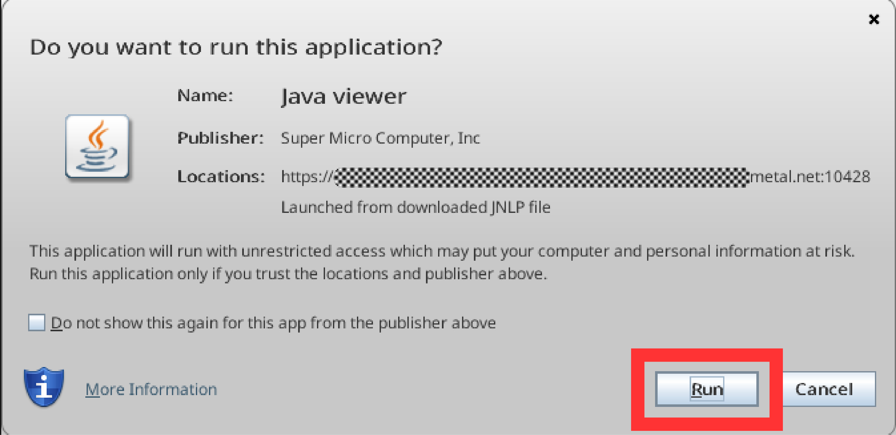

# How to access the IPMI KVM console

## Objective

The main purpose of IPMI KVM is to facilitate remote server management,
troubleshooting, and maintenance tasks, providing administrators with a way to
interact with a server's operating system, BIOS, and other pre-boot environments
remotely.

## Requirements

- Access to [OpenMetal Central](https://central.openmetal.io/)
- Java is installed on your local machine.
  - To download and install the latest version of Java, click [here](https://www.java.com/en/download/).

:::caution
Please bear in mind that while the IPMI Java applet can be utilized on macOS,
certain compatibility concerns may arise. Therefore, it is advisable to opt for
a system running either the Windows or Linux operating system for a smoother
experience.
:::

:::caution
In order to access the IPMI of some legacy products you may need to adjust the
Java security settings to allow `SHA1`. In your downloaded copy of Java 8, open
the file `lib/security/java.security` and navigate to where
`jdk.jar.disabledAlgorithms` is defined and change the `denyAfter` date
associated with `SHA1`:

```conf
# Before
jdk.jar.disabledAlgorithms=MD2, MD5, RSA keySize < 1024, \
      DSA keySize < 1024, include jdk.disabled.namedCurves, \
      SHA1 denyAfter 2019-01-01

# After
jdk.jar.disabledAlgorithms=MD2, MD5, RSA keySize < 1024, \
      DSA keySize < 1024, include jdk.disabled.namedCurves, \
      SHA1 denyAfter 2020-01-01
```
:::

## Instructions

First, you will want to navigate to the `Assets` page for the cloud with the
node you wish to access.


Next, select the menu (**`⋮`**) next to the server you want to access, then
select `IPMI Access` :


On the next menu, select `Download JNLP` :


Once the `<hostname>.jnlp` has downloaded, open it and hit `Run` when prompted:



You will then enter into the virtual console where you can enter your `root` credentials:


