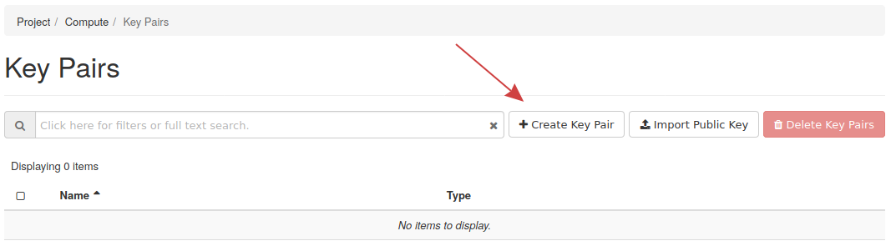
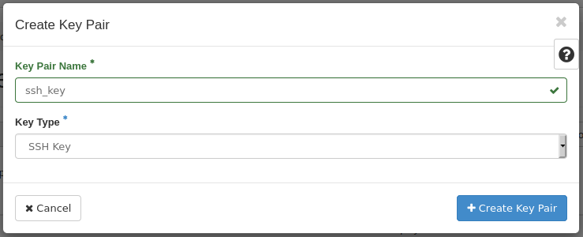
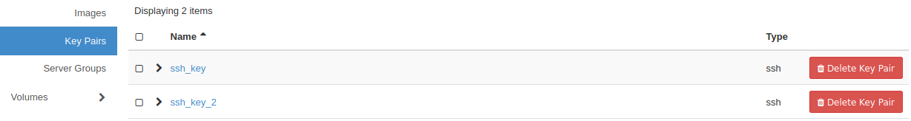
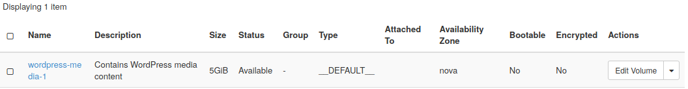
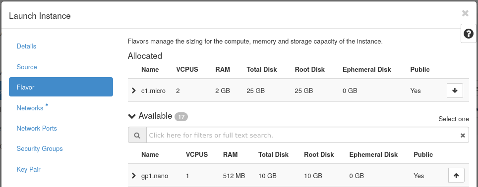
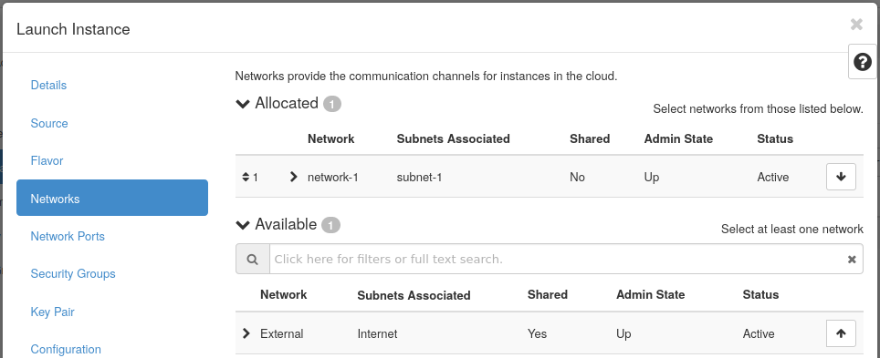

# How to Create an Instance

Instances in OpenStack comprise the cloud's computing power. This guide
demonstrates how to make an instance using Horizon.

You will also learn how to upload or create an SSH key pair, assign
storage using a volume, and create a security group. Each of these
components will be added to the instance.

## **Before Creating an Instance**

Before creating an instance, several pieces need to be in place.

Generally speaking, these items should exist before creating an
instance:

- An SSH public key -- The public portion of an SSH key pair
- A security group -- Defines network traffic rules
- A flavor -- Defines resources, like vCPUs, RAM, and disk storage
- An image -- This is a bootable operating system
- A network -- This is typically a private network

Each item will be explained throughout this guide.

-----

## **SSH Key Pairs**

An SSH key pair is required to access any instances over SSH. Password
authentication is by default disabled in the operating system images.

You can either have an SSH key created or you can upload the public key
of your SSH key pair.

This section explains how to create an SSH key pair within OpenStack and
also how to upload your own SSH public key.

-----

### **Create an SSH key pair**

To create an SSH key pair, locate **Project -\> Compute -\> Key Pairs**
in Horizon.

Next, click **Create Key Pair** near the top and to the right.

In the following form, input the key pair name and the type of key it
will be. Once done, you will be prompted to download the private key
which needs to be stored in a safe place. Only you should have access to
your private SSH key pair\! The public key portion of the key pair now
exists in Horizon.

-----

### **Upload an SSH key pair**

Should you already have an SSH key pair you want to use, you can instead
upload your public key. This can be done in the same **Key Pairs**
section.

-----

Locate the **Import Key Pair** button near the top right of the screen.
Fill out the name of the key pair, specify the type of key it is, and
finally choose the public key from your computer or paste the public key
in.

### **Confirm SSH key pair upload**

To confirm success, navigate back to the SSH key pair listing and
confirm the key pair was uploaded.

## **Security Groups**

A security group in OpenStack controls inbound and outbound network
access. OpenStack, by default, assigns a security group to each instance
that restricts all incoming traffic. It is up to you to determine what
traffic should or should not be allowed to or from an instance. This can
be accomplished by creating the required security groups for your
instance traffic.

This section demonstrates creating a security group allowing inbound SSH
traffic for a specific IP address.

-----

**Step 1** -- List security groups

To list security groups, find **Project -\> Network -\> Security
Groups** in Horizon on the left.

**Step 2** -- Create SSH security group

Fill out the name and description of the group. Once done, you will be
taken to a page where you can define egress (outbound) and ingress
(inbound) rules for the group.

When the rule is created, two egress rules allowing all outbound traffic
are added to it by OpenStack. You can see these as follows:

**Step 3** -- Add ingress SSH rule

To add the rule for SSH, click the **Add Rule** button near the top
right, which loads this form:

From this page you can define a custom rule or choose from options
created for you, such as SSH or HTTPS.

For this example, choose the SSH option from the first drop down.

**Note\!** -- You may notice that all traffic is allowed through when
choosing the SSH option. This is same thing as having port 22 open for
all SSH traffic to come through and may not be desired.

To allow traffic for a single host, in the **CIDR** field add the IP
allowed to connect over SSH. Similarly if a range of IPs needs to be
allowed, allow the range using CIDR notation.

With the new rule added you will see it listed like so:

-----

## **Add a Volume**

Additional disk space can be added to instances through volumes. A
volume in OpenStack is like a removable USB drive that can be attached
to instances as seen fit. Cinder is the OpenStack block storage service
that allows volumes to be created. A volume can also be used to boot an
instance.

This section explains how to create a volume in Horizon by creating a
5GB example volume. This is an optional step should your instance not
require additional storage through a volume.

-----

### **Create and attach a volume**

**Step 1** -- List volumes

In Horizon, look to the left for **Project -\> Volumes -\> Volumes** to
pull up the page to manage and create volumes.

**Step 2** -- Create a volume

To create a volume, click **Create Volume**, then fill out the form
details.

Specify a name and size for the volume. The remaining options are not
required to create the volume.

After creating the volume you will be taken back to the volume listing
page. The **Status** column will read "Available" if the volume is ready
to be used.

-----

## **Create an Instance**

An instance is another name for a virtual machine in OpenStack.
Instances are created by the Nova service and contribute to the
processing power of the cloud.

With the previous steps followed, you have everything needed to make an
instance.

This section will explain how to create a **volume-backed** instance.

-----

### **How to Create an Instance**

**Step 1** -- List Instances

To get started, in Horizon find **Project -\> Compute -\> Instances**.

**Step 2** -- Launch Instance -\> Details

Next, use **Launch Instance** near the top right, which loads this form:

Fill out a name for the instance and optionally a description. Specify
the number of instances to spawn using the **Count** drop down. Take
note of the available instances to your project in this screen as well.

**Step 3** -- Launch Instance -\> Source

After the **Details** section is filled out, move on to the **Source**
tab on the left. Here you will specify a source to boot from, which is
typically going to be an image.

- **Select Boot Source**: Select **Image** from the drop down.
- **Create New Volume**: Select **Yes**
- **Volume Size**: Set an appropriate amount of disk space
- **Delete Volume on Instance Delete**: Leave the default of **No**
    selected

You should see a variety of operating systems images to choose from.
This example will use the CentOS 8 Stream image. Select the appropriate
image using the up arrow on the right. After doing so, you will see the
image listed in the **Allocated** section.

This example demonstrates one way to create an instance, which is a
volume-backed instance, and is useful for persistent storage.

**Step 4** -- Launch Instance -\> Flavor

With the Source section done, it is time to set a flavor. A flavor is a
way to define resource allocation to an instance. The number of vCPUs,
RAM, and disk space are defined using flavors.

Flavors are listed in the same way images are. Select the flavor
required for the instance workload using the up arrow on the right. Once
set, you will see the flavor listed in the **Allocated** portion.

**Step 5** -- Launch Instance -\> Networks

With a flavor set, move on to the **Networks** section to specify a
network the instance will be associated with.

**Note\!** -- Place all cloud infrastructure on private networks and
only expose what is needed to the Internet, such as a load balancer, or
front-end web servers.

This example uses the private network created from the [networking
guide](network-ip-traffic).

**Step 6** -- Launch Instance -\> Security Groups

Next, a security group should be set. Note that security groups can
later be added to an existing instance. OpenStack by default disables
all incoming network traffic to instances so the traffic you want to
allow needs to specified using security groups.

Choose from the list the security group to apply to this instance. This
example applies the **ssh** security group, allowing SSH access.

**Step 7** -- Launch Instance -\> Key Pair

The last step is to add your SSH key pair.

Choose from the key pair listing the SSH key to add. You can also create
a key pair or upload a public key using this form.

**Step 8** -- Launch Instance

This concludes all steps required to create an instance. Use **Launch
Instance** to spin up the instance.

As the instance is spawning you will see it appear like so:

Once the instance creation is complete, it will show like so and the
**Status** column will display **Active** and **Power State** will be
**Running**:

-----

### **How to Access the Instance over SSH**

Since this instance is on a private network, it is only possible to
access it over SSH from the OpenStack hardware nodes, which is not a
feasible way to access it.

To access this instance over SSH, assign a floating IP to it. This can
be done from the instance listing page using the drop down on the right.

This floating IP can now be used to access the instance over the
Internet. The default username of the instance is typically the same as
the name of the operating system.

In this example the CentOS 8 Stream image was used so the default user
is **centos**. The Ubuntu's image default user is **ubuntu**. Debian's
is **debian**.

## **Next Steps**

Navigate to the [next guide](how-to-make-backups-in-openstack) in this series
to learn how to back up and restore instance data.
