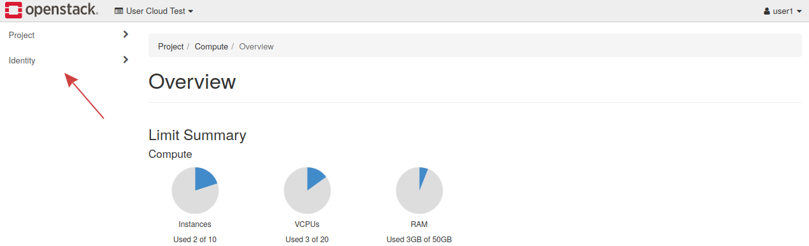
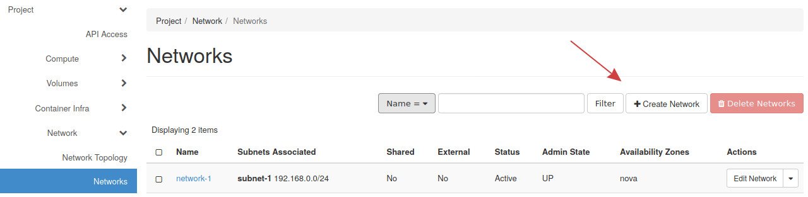
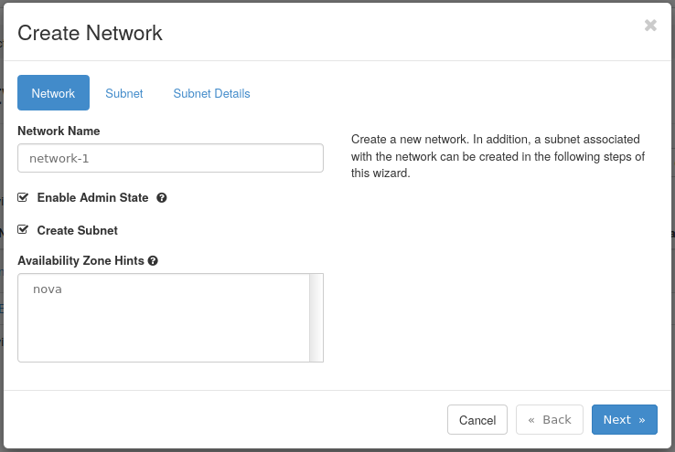

# Networking in OpenStack

This guide explains networking in OpenStack including how to create a
private network, a router, and allocate and assign floating IPs.

You will learn how to create a private network on which instances will
be deployed. The network created in this guide will be used later when
creating an instance.

**Note** -- Private networks should be used where possible. Only expose
the portions of your cloud to a public network when needed.

[Neutron](https://docs.openstack.org/neutron/latest/) is the name of the
service that manages networking in OpenStack. It provides "network
connectivity as a service" between interfaces and uses the OpenStack
Networking API.

Neutron allows networks, routers, floating IPs, and security groups to
be created.

-----

## **Table of Contents**

1. [Create a Network and
    Router](network_ip_traffic#create-a-network-and-router)
2. [Floating IPs](network_ip_traffic#floating-ips)

-----

## **Create a network and router**

This section demonstrates creating a private network and router. The
router is important as it will allow you to create a route between
networks, such as from the private network to the Internet.

-----

### **Create a network**

**Step 1** -- Getting started

In Horizon, notice the sections on the left called **Project** and
**Identity**. Components of an OpenStack cloud, like a private network,
are created through the Project tab.

-----

To create a network, under **Project** on the left, find **Network**,
then navigate to **Networks**. Finally, locate the **Create Network**
button near the top right.

-----

**Step 2** -- Create network

- **Network Name** -- This is the name of the network. In this
    example, the network is called **network-1**.
- **Enable Admin State** -- This enables the network and should remain
    checked.
- **Create Subnet** -- Leave checked to create a subnet.
- **Availability Zone Hints** -- This option's default is sufficient
    for this guide.

Fill out any other needed details and navigate to the **Subnet** tab.

**Step 3** -- Create subnet

- **Subnet Name** -- Specify a name for the subnet, this example is
    called **subnet-1**

- **Network Address** -- Choose a network in CIDR notation. This
    example uses **192.168.0.1/24**.

- **Gateway IP** -- Optionally choose the gateway IP for this network.
    If the gateway IP is not filled out, one will be chosen by the
    neutron service.

    The final tab is called **Subnet Details**. This tab does not need
    to be filled out to create the network and subnet. This example will
    stop here, however on this page you can enable or disable DHCP,
    specify specific IPs to be allocated, set DNS name servers, and set
    Host Routes.

**Step 4** -- Confirm network creation

With the previous steps done, the network has been created. Loading the
**Network -\> Networks** tab will display the new network:

-----

### **Create a Router**

With a network created, the next step is to create a router which will
bridge the connection from the **External** or **provider network** to
the private network.

-----

**Step 1** -- Getting started

To make a router in Horizon, under **Project**, find the **Network**
section, then **Routers** under that. This page will list current
routers and allows you to create a router.

To create a new router, click the **Create Router** button near the top
right.

**Step 2** -- Create a router

- **Router Name** -- Choose a name for the router. This example router
    will be called **router-1**.
- **Enable Admin State** -- Leave checked to enable the router.
- **External Network** -- The **External** network will be used
- **Availability Zone Hints** -- This option's default is sufficient
    for this guide.

The router will need to be connected to an external network, which will
be the provider network. The network called **External** will be used.

-----

**Step 3** -- Confirm the router has been created

Once created it will show in the list of routers, under **Network -\>
Routers**.

**Step 4** -- Connect router to private network

To allow the router to communicate with the **External** and the
**network-1** network, the **network-1** network will need to be
attached. Connecting the router to a network is called attaching an
interface.

First, pull up the newly created router from the **Network -\> Routers**
section of Horizon.

Next, to add an interface to this router, click the router's name in the
listing of routers, then click the **Add Interface** button near the top
right.

In the following choose the **subnet-1** subnet to connect the router to
and optionally choose an IP address for the interface. If you don't
choose an IP, the gateway IP of the subnet will be used.

**Step 5** -- Confirm the networks are connected

With the interface added to the router, the **External** and
**network-1** networks are now connected. This can visually be seen by
navigating to the **Network** tab on the left, then the **Network
Topology** tab under that.

-----

## **Floating IPs**

Floating IPs in OpenStack are publicy routable IP addresses that can be
attached and detached to instances. For example if there's an instance
associated with a private network but needs to be accessed from the
Internet, a floating IP can be associated with the instance, allowing
communication from the Internet.

-----

### **Allocate and Assign Floating IPs**

To use Floating IPs they will first need to be allocated from the
provider network's pool of IPs.

-----

### Allocate floating IP

To allocate floating IPs in Horizon, navigate to the **Network** tab on
the left, and find **Floating IPs**.

Click **Allocate IP To Project** to allocate a new IP.

Next, fill out needed details in the IP allocation form.

The IP will be obtained from the **External** provider network. This is
the only network floating IPs can be assigned from.

Once the IP is added, it will appear in the floating IP list.

This floating IP address will be used later to access an instance over
SSH.

-----

## **Next Steps**

The [next guide](using_creating_images) goes over
images in OpenStack, which are bootable operating systems.
