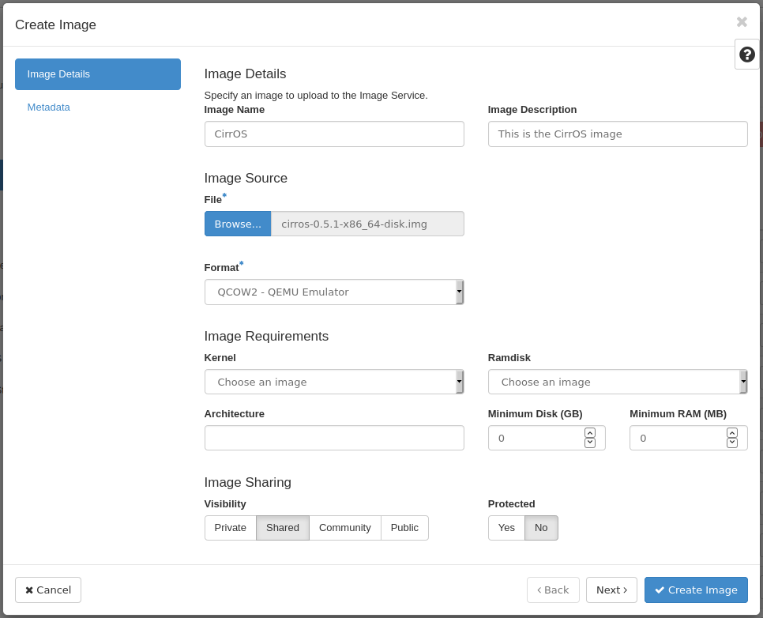

Working with Images
=======================

Images in OpenStack are what powers instances. In this guide, you will
learn how to view images, upload your own, and make snapshots of images.

An image is a file that contains a bootable operating system. Many
different cloud image sources are available for download from major
operating system providers like CentOS, Ubuntu, and Debian to name a
few. You can also make your own images from
[scratch](https://docs.openstack.org/image-guide/create-images-manually.html)
or create them from volumes or running instances. Snapshots of instances
can be created which can serve both as a backup and also a template for
other instances.

------------------------------------------------------------------------

List and Upload Images
----------------------

### **List images**

To begin, you will need to know where to find images in OpenStack.

In Horizon, images are found on the left through **Project -\> Compute
-\> Images**.

### **Upload images**

To upload an image into OpenStack, the image needs to first exist on
your machine, and then you can use Horizon to upload it.

This section will walk you through uploading the
[CirrOS](https://github.com/cirros-dev/cirros) image.

------------------------------------------------------------------------

**Step 1** \-- Download the CirrOS image

To start, first download the CirrOS image to your machine.

The [latest version of
CirrOS](https://download.cirros-cloud.net/0.5.2/cirros-0.5.2-x86_64-disk.img)
is available from their download page. Ensure the latest version of the
CirrOS image is downloaded.

**Step 2** \-- Upload the image into OpenStack

To upload an image navigate to **Project -\> Compute -\> Images**. From
there, click the **Create Image** button.

Next, fill in the required details.

-   **Image Name** - This is what you want to call this image in
    OpenStack
-   **Image Description** - This is an optional description for the
    image
-   **File** - Where is the file located on your machine?
-   **Format** - The format should be **QCOW2 - QEMU Emulator**

Optionally, you can specify requirements, like minimum disk space and
RAM, for the image under the **Image Requirements** heading.

Click the **?** icon for assistance with specifics.

------------------------------------------------------------------------

Next Steps
----------

With this guide complete, move on to the next guide, which explains [how
to create an Instance](users_manual/create_an_instance.rst) in Horizon.
