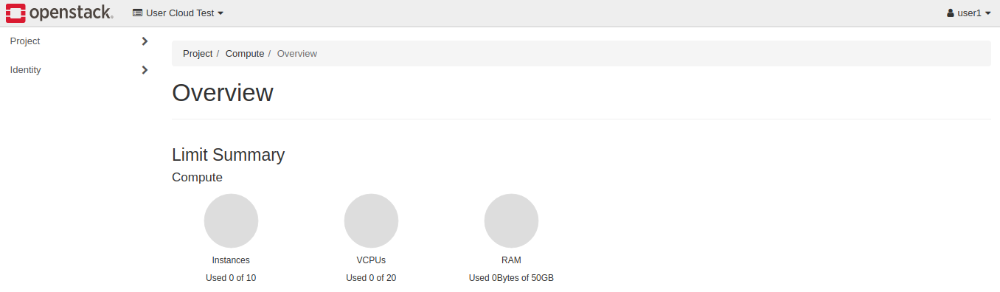

# How to Get Started with OpenStack

To get started using OpenStack, you will need to log in to Horizon,
OpenStack's browser-based dashboard. Your administrator should provide
you with the details you need to log in. If you do not have these
details, reach out to your OpenStack administrator.

Once logged in, you are presented with the main dashboard of your
OpenStack project. From here you can see a number of links on the left
under the **Project** and **Identity** tabs as well as a summary of the
cloud usage in the center. You will do most of your work out of the
**Project** tab, where you can spin up instances, create networks and
such. The **Identity** tab is where you will find user-based
information, such as what project your user is associated with or
details about your user.

-----

## **Log in to Horizon** 

This section demonstrates how to log in to Horizon.

**Step 1** -- Navigate to Horizon

Pull up the domain name provided for Horizon from your administrator in
a browser to load the Horizon login page.

**Horizon Login Page:**

**Step 2** -- Log in to Horizon

From here, enter in the provided credentials to log in.

**Initial Horizon Dashboard:**

-----

## **Next Steps**

The [next guide](network_ip_traffic) in this series
explains how to create a private network, a basic building block of an
OpenStack cloud.
