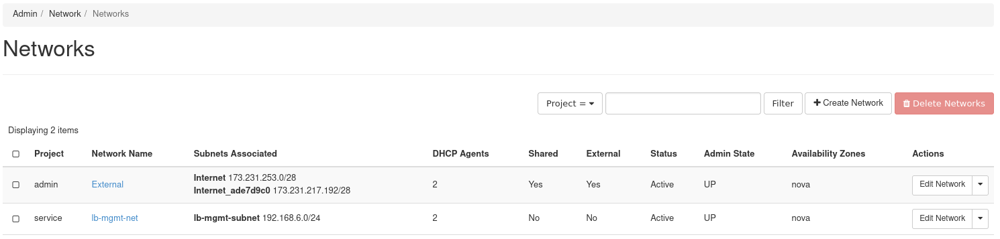

# How to Add Additional Provider IP Blocks

## Introduction

With OpenMetal Private Clouds, multiple provider IP blocks are
supported. This guide explains how to request an additional provider IP
block and how to use the IPs in Horizon.

## Getting Started

To add the IP block you need to reach out to your Account Manager who
will submit the request. Our support staff will handle the addition and
inform you through a OpenMetal Central ticket sent to your primary
e-mail address when complete.

### Confirm new Provider Block Addition

First to confirm the addition of the IP block, log in to Horizon with a
user that has the administrator role. This is typically the account
called "admin".

Next, navigate to **Admin -\> Network -\> Networks**, then click on the
"External" network.

**Figure 1:** List of Networks

Choose the Subnets tab and confirm that the new subnet has been added.

**Figure 2:** List of Subnets for the External network

The new subnet will be prefixed with **Internet\_** and will have a
series of hex values following it.

### How are the new Provider Block IPs Used?

When creating a resource that requires an IP from this block, specify
the name of the newly added provider block to add IPs from it.
