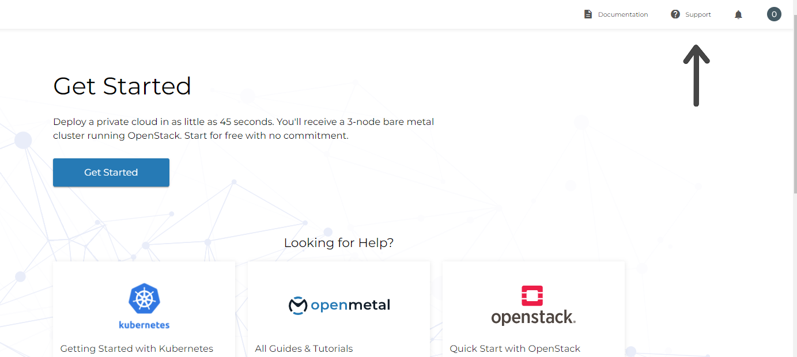
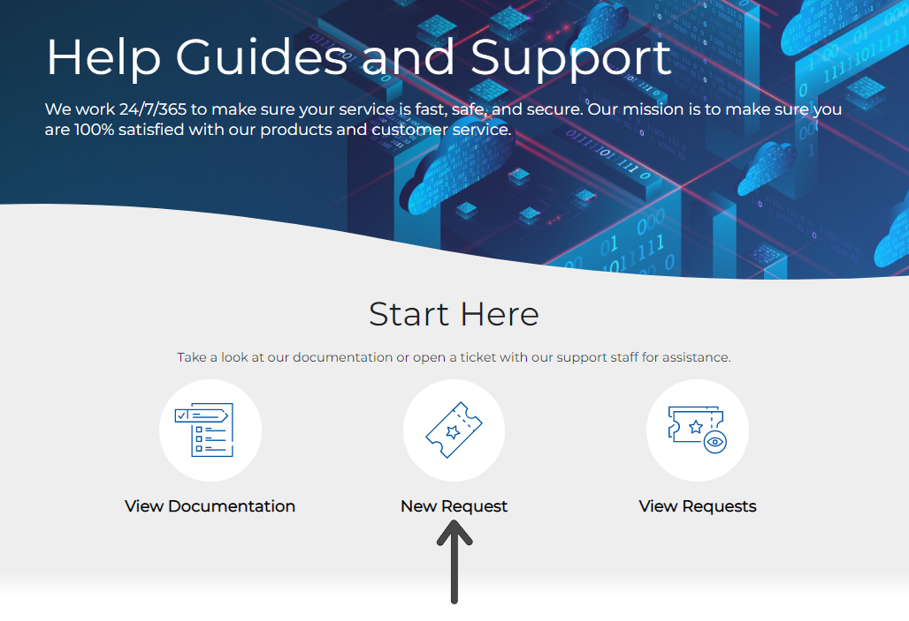
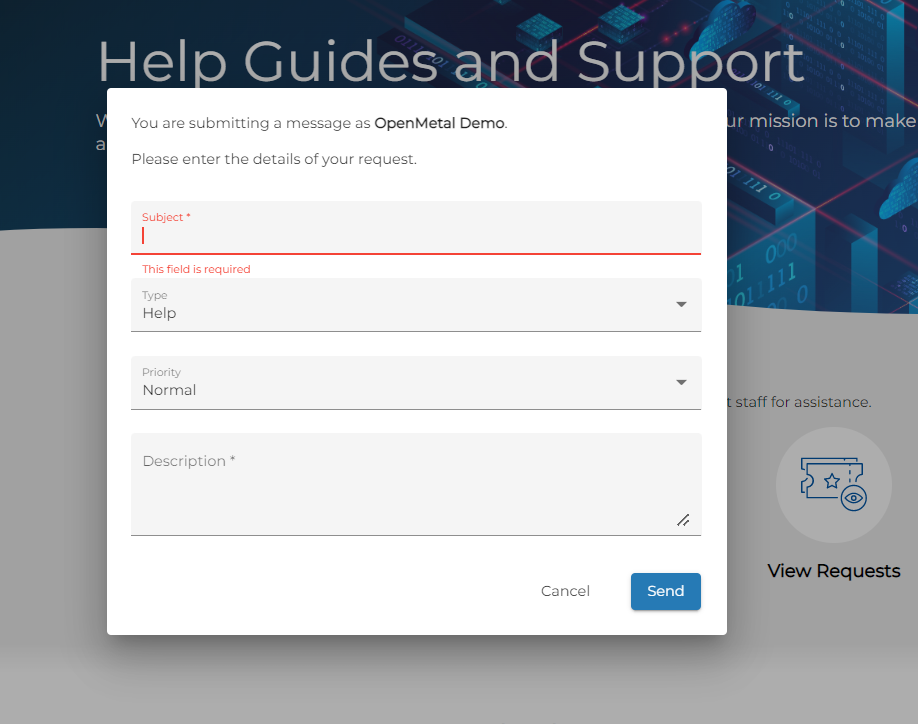
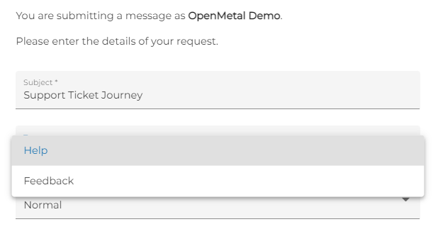
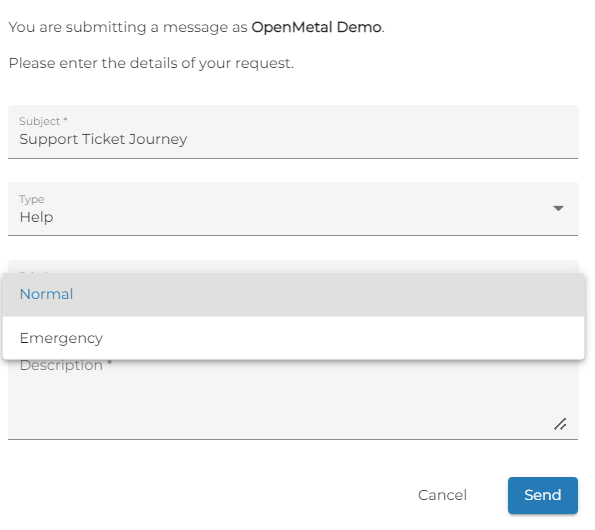
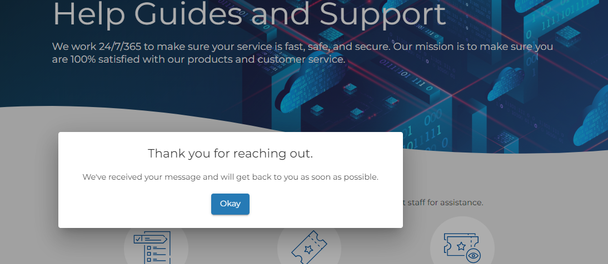
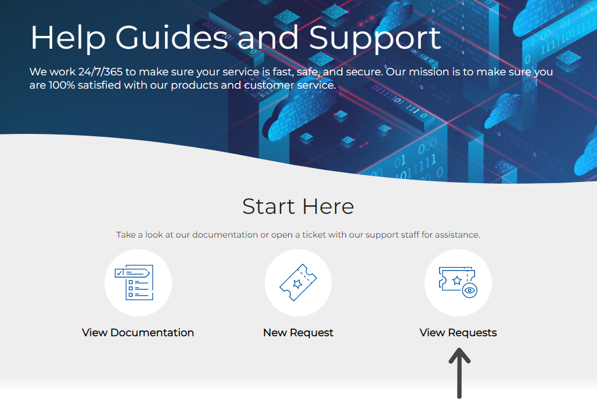
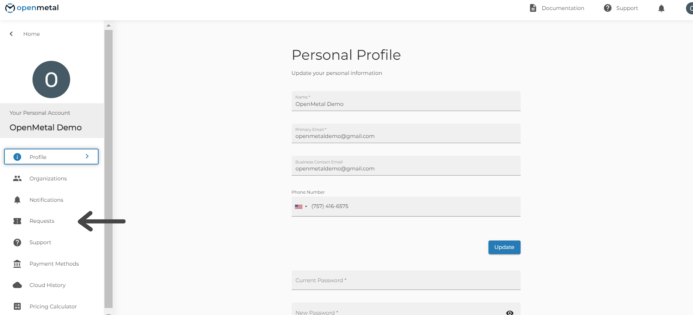
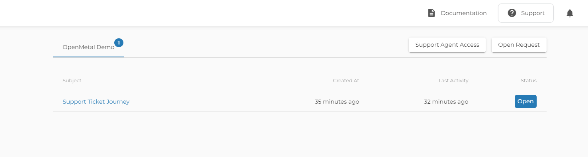
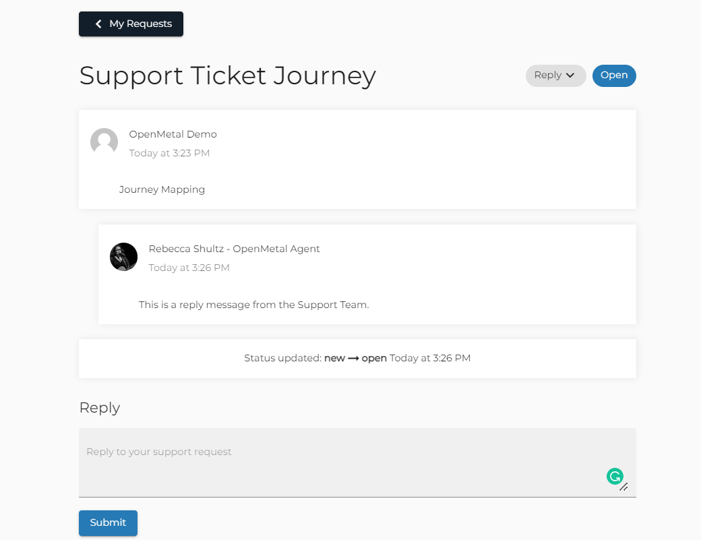

# Creating a Support Request in OpenMetal Central

You can reach _OpenMetal Support_ for your technical, account-related, and
billing-related questions. Just create a _Support Request_ in the
_OpenMetal Central Portal._

## Submitting a Support Request

Log in to your [OpenMetal Central account.](https://central.openmetal.io/auth/sign-in)

Click **_Support_** in the top right of the home page.

Under **_Start Here_**, click the middle Icon titles **_New Request_**

You will get a pop-up form that you can use to outline the details of your
request.

Through the **_Type_** drop-down, you can choose if you need **_Help_** or want
to give **_Feedback._**

Through the **_Priority_** drop-down, you can relate to us if this request is
an emergency. Unless there is a support contract in place, our Support Team defines
an Emergency as
**a service disruption that impacts one or more physical servers or networks.**
We don’t consider free trial request issues to be emergencies.

After you have populated the form, click _Send._ You will get a pop-up
confirmation.

## Track Your Support Ticket

To view the status of a ticket, can click Support from the top right of the
[Central Home Page](https://central.openmetal.io/clouds). Once you are on the
Support Page click the icon on the right titled **_View Requests._**

Likewise, if you are in your Personal Profile you can click Requests on the
left menu

The **_Requests_** page enables you to see all of your support requests in one
place and see their status.

Clicking on the **_Subject_** of any of your _Support Requests_ will open the
request detail. Here you can see any messages from your support agent, ask
additional questions, or send a reply.

Need help or have questions that are not covered by support requests? You can
also book meetings with our customer teams [here](https://openmetal.io/schedule-meeting/).
