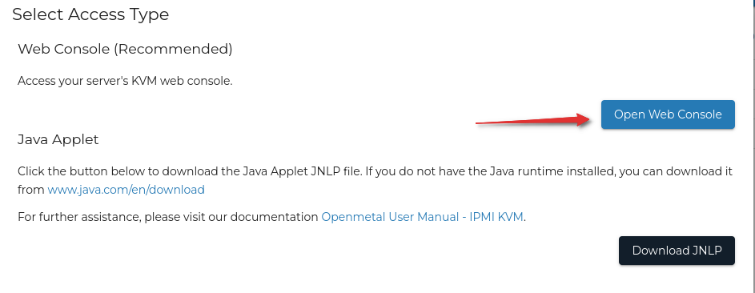
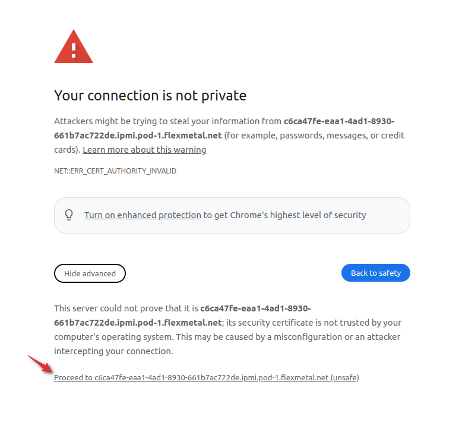
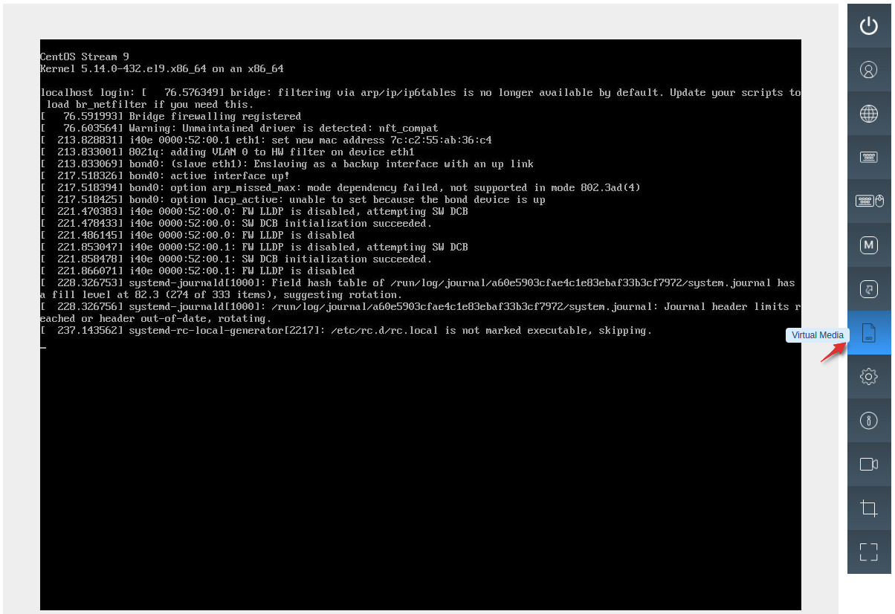
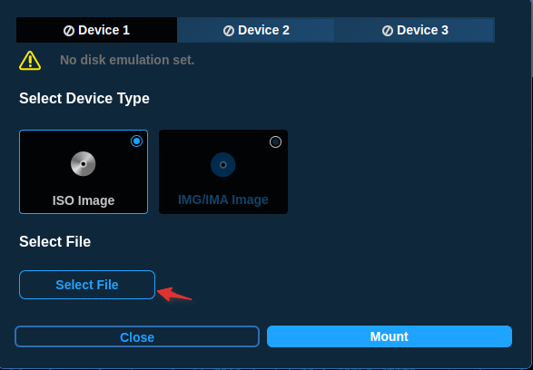
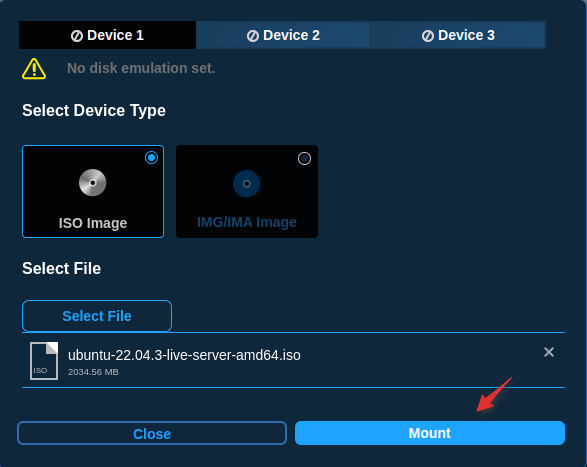
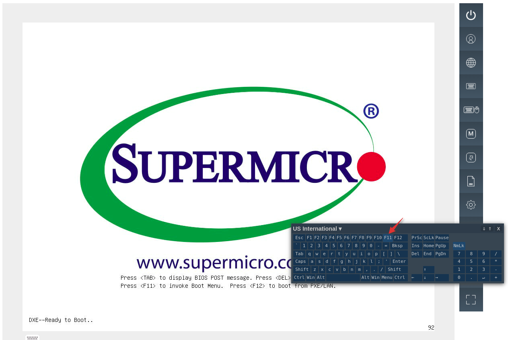
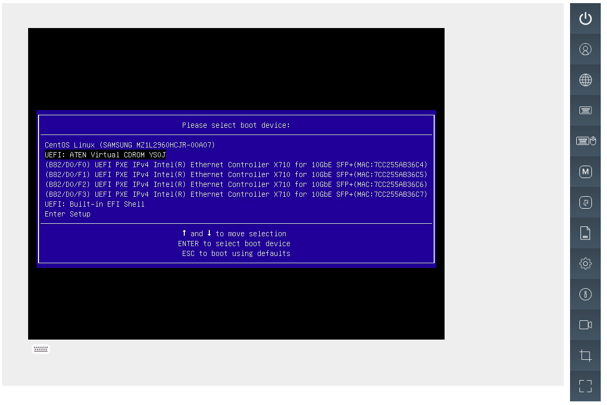
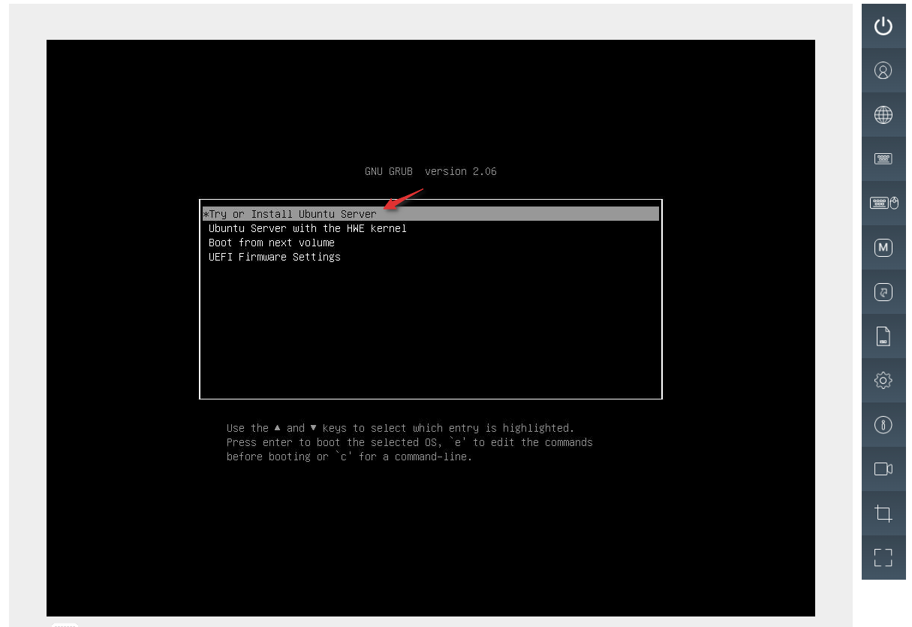

# Accessing IPMI on Central Dashboard

Author: Ramon Grullon

## Prerequisites

You have login credentials for the Central Dashboard.

## Step 1: Log In to the Central Dashboard

Open your preferred web browser and go to the URL of your Central Dashboard.
Enter your username and password.
Click Login.

## Step 2: Navigate to the Server's Asset Information

- Once logged in, locate and click on the Assets section from the main dashboard
menu.

- In the Assets page, your inventory of servers will be available. Find the
server you wish to manage.

- Click on the three dots on the right hand side next to the server to view more
information.

- Select the IPMI Access button

## Step 3: Select Access Type

- In the select access page, the default type utilized by OpenMetal is HTML5,

- Click the Open Web Console to continue

## Step 4: Handle Unsecured SSL Certificate Warning

If you encounter an SSL certificate warning, it’s typically because the server
is using a self-signed or untrusted certificate.

- Click on Proceed or Advanced (depending on your browser) to continue past the warning.

## Step 5: Access & Use of Virtual Media

After proceeding past the SSL warning, the IPMI HTML5 interface will load,
allowing you to interact with your server remotely.

Press the virtual media button to mount your ISO.

Select the File on your local storage and Mount the ISO.

Restart the server and invoke the BOOT Menu by pressing F11.
The mounted ISO will appear on the Menu as a CDROM device.

Select the Install OS option and allow some time (UP TO 2 HOURS) for your ISO
to load.

## Summary

You have successfully completed the process of accessing and managing your server
via the Central Dashboard's IPMI interface. By following this guide, you were
able to:

Log in to the Central Dashboard.
Navigate to the server's asset information and select IPMI access.
Handle SSL certificate warnings to safely proceed to the remote console.
Mount an ISO file and install an operating system using the IPMI HTML5 interface.

This process is essential for remote server management, especially when
performing OS installations or troubleshooting critical issues.
If you encounter any challenges or require additional assistance, don't hesitate
to reach out to your support team.
