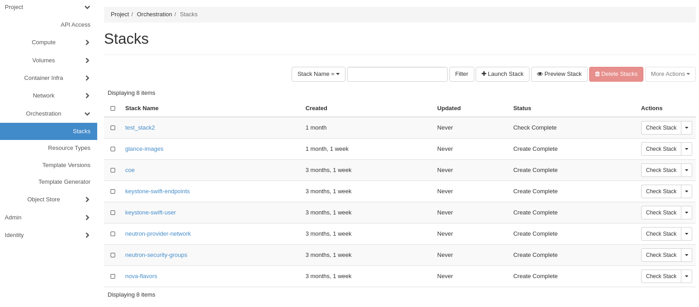
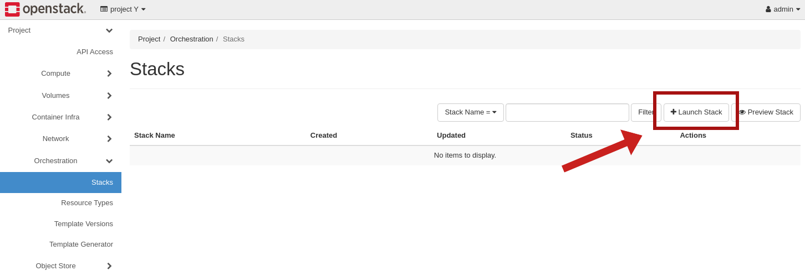
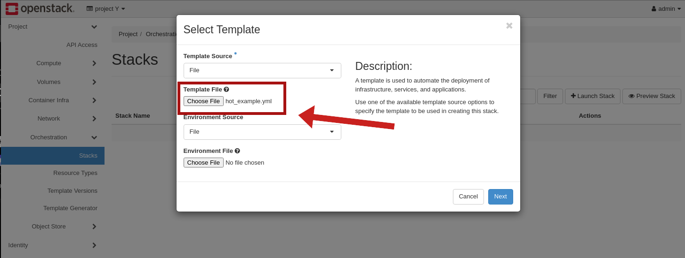
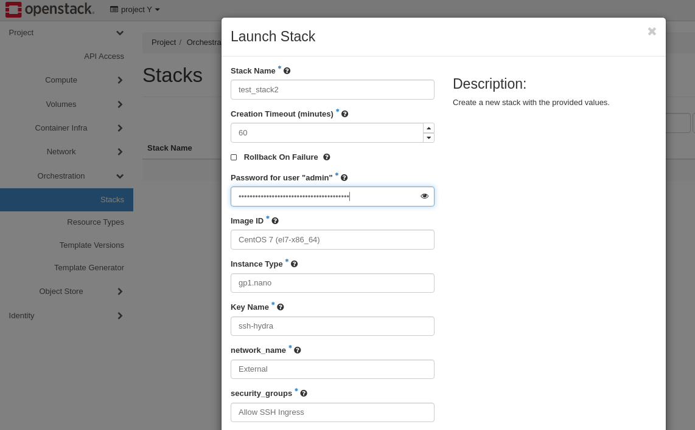
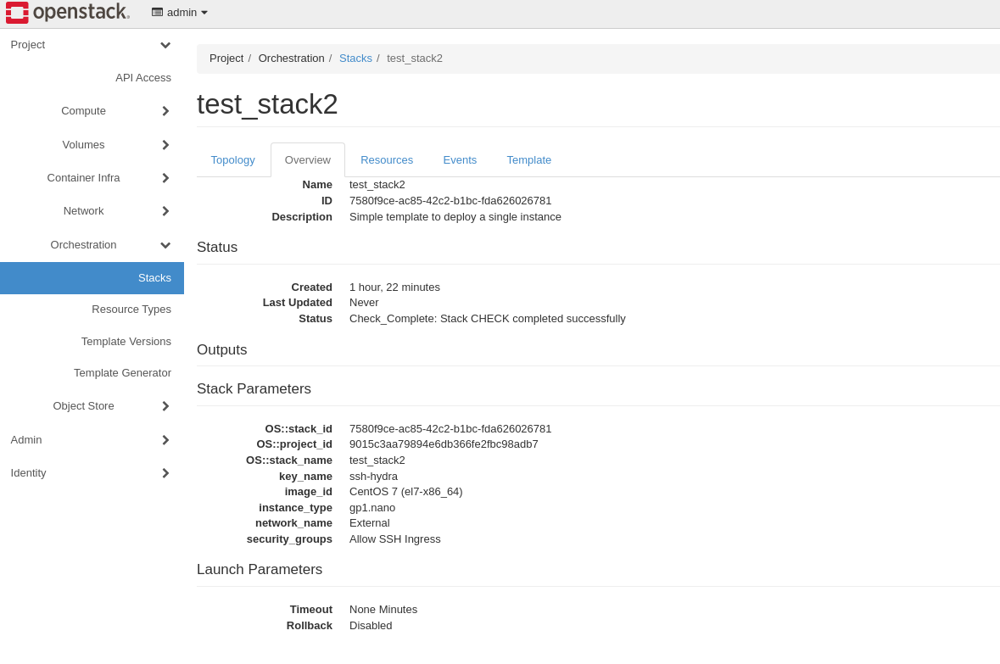

# Container Orchestration with OpenStack Heat

## Introduction

This guide provides an introduction to Heat Orchestration through
OpenStack. Outlined within this article are the basics of Orchestration
and the mechanics of the Heat Orchestration Engine. Then we review a
sample of a Heat Orchestration Template and provide the appropriate
syntax. Lastly, we cover how to deploy a template and check the status
of a Heat Stack.

## Overview of Heat Orchestration

Orchestration tools utilize automation to deploy, manage, scale, and
network containers. Within OpenStack, the primary orchestration
component is Heat. Heat uses an orchestration engine for the automation
of resources, infrastructure, applications, and services. These created
resources are referred to as Stacks. Heat Stacks are deployed using Heat
Orchestration Templates also referred to as HOT templates. HOT templates
are created in YAML that passes instructions to the Heat Engine
specifying the resources to be deployed.

### How to View Heat Stacks in Horizon

To view all current Stacks within your OpenMetal Cloud, navigate to
**Project -\> Orchestration -\> Stacks**. Within this section, you can
view all your current stacks as well as launch and preview HOT
templates.

### Architecture

Heat API receives rest API calls from the following sources: Horizon,
HOT Templates, and through the Heat Client. The Heat API is then passed
to RabbitMQ or another message broker which activates the Heat
Orchestration Engine. The Heat Orchestration Engine then connects to
resources including Nova, Glance, Neutron, and Cinder and parses
instructions from the HOT template for functions and parameters. These
functions and parameters are then used to create resources known as
stacks.

## Heat Orchestration Template Components

Central to the deployment of Heat and the creation of Stacks is the use
of templates. Heat Templates are written in YAML with the following
structure:

### Template Version

The template version is formatted as date and corresponds to different
versions of heat. The template version tells Heat how the template will
be structured, what features can be validated, and what resources can be
created. Currently, the latest template version that is supported is
2018-08-31 (rocky).

### Description

Although optional, a description is highly recommended as it outlines
the intended function of the template. This is particularly useful for
templates that are not frequently used or are intended to be shared
among various members of a team or project.

### Parameters

Parameters are optional but allow a user to pass additional values to
the template. These values are used to overwrite any default settings
that are specified in the resources section.

### Resources

Resources are what are ultimately created by the Heat Orchestration
Engine. These values can be default values or input from the parameters
above.

### Output

Output in a Heat Template is optional. However, you can pass values from
Heat upon execution of the template. These values are accessed through
Heat API or client tools.

## Sample Heat Orchestration Template

The following is an example of a Heat Orchestration Template to deploy
an instance. In this example, all resources receive their values fed
separately as parameters. When formatting parameters, each parameter is
grouped in a nested block. The first line contains the name of the
parameter and additional attributes are grouped below each element.

### Attributes

- Parameter Name: Name of Parameter
- Type: Required value that supports the following types: **string**,
    **comma\_delimited\_list**, **json**, **boolean**
- Label: Optional attribute, creates a name for the parameter for
    additional readability
- Description: Optional attribute, creates a description for parameter
- Default: Optional attribute, default values for parameters if input
    is not specified by the user

Example Heat Orchestration Template:

    heat_template_version: 2018-03-02
    
    description: Simple template to deploy a single instance
    
    parameters:
      key_name:
        type: string
        label: Key Name
        description: Name of key-pair to be used for compute instance
      image_id:
        type: string
        label: Image ID
        description: Image to be used for compute instance
      instance_type:
        type: string
        label: Instance Type
        description: Type of instance (flavor) to be used
      network_name:
        type: string
        description: The network to be used
      security_groups:
        type: comma_delimited_list
        description: Name of the Security Group
    
    resources:
      my_instance:
        type: OS::Nova::Server
        properties:
          key_name: { get_param: key_name }
          image: { get_param: image_id }
          networks:
            - network: { get_param: network_name }
          flavor: { get_param: instance_type }
          security_groups: { get_param: security_groups }

## Deploying a Heat Template in Horizon

To deploy a heat template in Horizon, first, check to see that you have
selected the appropriate project for your deployment and then navigate
to **Project -\> Orchestration -\> Stacks** and locate **Launch Stack**
near the top right.

**Figure 1:** Launch Stack

For this example, we have uploaded the template example as a file called
`hot_example.yml` using the **Choose File** button. After uploading your
example template, click **Next**.

**Figure 2:** Select Template

For the example template listed above, the following parameters are
needed to launch a running instance:

- Stack Name
- Image
- Instance Type
- Key
- Network
- Security groups

In the Launch stack window, fill out the following parameters with the
type of stack you wish to deploy.

**Note:** Instance type refers to the flavor of instance you wish to set
up.

**Figure 3:** Launch Stack

## Viewing Recently Deployed Stacks in Horizon

To view recently deployed stacks in Horizon, switch to the appropriate
project where the stack was created. Then navigate to **Project -\>
Orchestration -\> Stacks** to view all created stacks.

**Figure 4:** Stacks Created within Admin Project

Figure 4 shows the newly created test stack that was created by the
example. You have the option to check the stack as well as view its
current status.

If you need additional information, click the link under **Stack Name**
and you can view an overview of the stack information, resources,
events, and even a copy of the template used to create the stack.

**Figure 5:** Overview of Test Stack

## Additional Resources for OpenStack Heat Service

For the latest on OpenStack Heat Documentation visit [Welcome to the
Heat documentation](https://docs.openstack.org/heat/latest/#). Further
reading regarding Heat architecture can be found at [Heat
architecture](https://docs.openstack.org/heat/latest/developing_guides/architecture.html).
Additionally, OpenStack has a guide for creating your first stack
through heat that can be found at [Creating your first
stack](https://docs.openstack.org/heat/latest/getting_started/create_a_stack.html).
