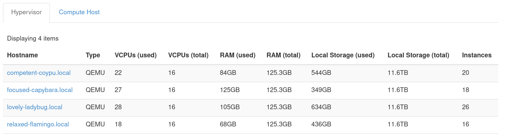
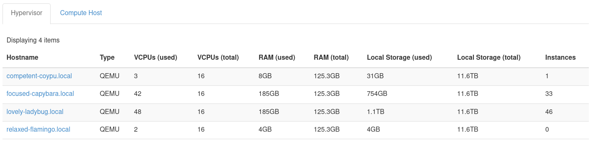

# OpenStack Watcher Demonstration

## Introduction

Watcher is an OpenStack project that monitors infrastructure and
performs optimizations on demand. With Watcher, an administrator can
create objectives for resource optimizations within their cloud, and
Watcher either performs the actions necessary to meet these goals or
provides an action plan. Watcher does this by leveraging existing
OpenStack services such as Keystone, Nova, Ironic, and Ceilometer to
find ways to reduce the total operating cost of your cloud. There are a
number of pre-defined goals Watcher can help accomplish. In this guide,
we use demonstrate using a pre-defined Watcher goal to consolidate a
cloud's workload.

## Use Watcher to Consolidate your Cloud's Workload

This section demonstrates use of Watcher's [VM Workload Consolidation
Strategy](https://docs.openstack.org/watcher/latest/strategies/vm_workload_consolidation.html).
The commands and their output are recorded to provide an example Watcher
demonstration. We provide the state of the cloud prior to and after
applying Watcher.

### Cloud State Before Watcher is Applied

The following screenshot shows the state of the hypervisors and the
count of instances associated with each compute node.

**Figure 1:** Hypervisor list and instance count prior to applying
Watcher

This is a cloud with four compute nodes and a relatively even
distribution of instances spread across them.

### How to use Watcher's VM Workload Consolidation Strategy

#### Step 1: Obtain List of Goals

First, obtain a list of available goals with:

    openstack optimize goal list

For example:

    # openstack optimize goal list
    +--------------------------------------+----------------------+----------------------+
    | UUID                                 | Name                 | Display name         |
    +--------------------------------------+----------------------+----------------------+
    | 05260080-9aca-40e3-9ff5-f6d8f398d671 | airflow_optimization | Airflow Optimization |
    | d3618295-7dd2-4174-83ee-8cd466b3381a | cluster_maintaining  | Cluster Maintaining  |
    | 4488913d-b0d6-44eb-b6c6-8f1b4c6c7578 | dummy                | Dummy goal           |
    | cb10ae8f-a1f5-41e4-ac6a-2e2dfbe63648 | hardware_maintenance | Hardware Maintenance |
    | 6f676623-71b8-4eaa-a36b-fb133120db42 | noisy_neighbor       | Noisy Neighbor       |
    | 6c0ae27a-d978-46e9-9562-67ef7ee00e65 | saving_energy        | Saving Energy        |
    | 916bb6dc-84df-495e-8b40-1bfa868d93e1 | server_consolidation | Server Consolidation |
    | 5aed3f2b-7d5d-48af-b69c-35afc886bc10 | thermal_optimization | Thermal Optimization |
    | debf193e-50a8-4c90-a0b6-d82fb78b6d98 | unclassified         | Unclassified         |
    | fb940ef6-47bd-4c82-8e3a-caf9de813b03 | workload_balancing   | Workload Balancing   |
    +--------------------------------------+----------------------+----------------------+

This example makes use of the **Server Consolidation** goal available
from the above list. **Note** that the following command line examples
reference this goal as `server_consolidation`.

#### Step 2: List Strategies Available for a Goal

Next, obtain a list of available strategies for the **Server
Consolidation** goal, using:

    openstack optimize strategy list --goal <goal-uuid-or-name>

Replace `<goal-uuid-or-name>` with the appropriate goal.

For example:

    # openstack optimize strategy list --goal server_consolidation
    +--------------------------------------+-----------------------------+--------------------------------------+----------------------+
    | UUID                                 | Name                        | Display name                         | Goal                 |
    +--------------------------------------+-----------------------------+--------------------------------------+----------------------+
    | eae7ae0f-1498-45ac-a226-248739a79785 | basic                       | Basic offline consolidation          | server_consolidation |
    | b0f2838e-0eb2-4baf-8976-62744897827b | node_resource_consolidation | Node Resource Consolidation strategy | server_consolidation |
    | 4ad7dbdb-9c90-4208-8dc0-e476c803519c | vm_workload_consolidation   | VM Workload Consolidation Strategy   | server_consolidation |
    +--------------------------------------+-----------------------------+--------------------------------------+----------------------+

Here, we can see the **Server Consolidation** has three strategies that
can be used to accomplish the goal. For this case, we are using the
`vm_workload_consolidation` strategy.

#### Step 3: Create Audit Template

Next, create an audit template based on the previously selected goal and
strategy using:

    openstack optimize audittemplate create <template-name> <goal> \
        --strategy <strategy>

- `<template-name>`: Specify a name for the audit template
- `<goal>`: Specify a goal
- `<strategy>`: Specify a strategy

For example, the following creates an audit template called
**server\_consolidation-template** based on the goal
`server_consolidation` and strategy `vm_workload_consolidation`:

    # openstack optimize audittemplate create server_consolidation-template server_consolidation --strategy vm_workload_consolidation
    +-------------+--------------------------------------+
    | Field       | Value                                |
    +-------------+--------------------------------------+
    | UUID        | 234069e4-d03a-4a63-af54-02763056ac55 |
    | Created At  | 2022-01-21T18:22:09.385581+00:00     |
    | Updated At  | None                                 |
    | Deleted At  | None                                 |
    | Description | None                                 |
    | Name        | server_consolidation-template        |
    | Goal        | server_consolidation                 |
    | Strategy    | vm_workload_consolidation            |
    | Audit Scope | []                                   |
    +-------------+--------------------------------------+

#### Step 4: Execute Audit

Run an audit based on the audit template to generate an action plan:

    openstack optimize audit create -a server_consolidation-template

For example:

    # openstack optimize audit create -a server_consolidation-template
    +---------------+------------------------------------------------------+
    | Field         | Value                                                |
    +---------------+------------------------------------------------------+
    | UUID          | 50b571c6-faff-4b0e-803d-558708bc5ec5                 |
    | Name          | vm_workload_consolidation-2022-01-21T18:23:37.360815 |
    | Created At    | 2022-01-21T18:23:37.387673+00:00                     |
    | Updated At    | None                                                 |
    | Deleted At    | None                                                 |
    | State         | PENDING                                              |
    | Audit Type    | ONESHOT                                              |
    | Parameters    | {'period': 3600, 'granularity': 300}                 |
    | Interval      | None                                                 |
    | Goal          | server_consolidation                                 |
    | Strategy      | vm_workload_consolidation                            |
    | Audit Scope   | []                                                   |
    | Auto Trigger  | False                                                |
    | Next Run Time | None                                                 |
    | Hostname      | None                                                 |
    | Start Time    | None                                                 |
    | End Time      | None                                                 |
    | Force         | False                                                |
    +---------------+------------------------------------------------------+

This step may take some time to complete. You can use
`openstack optimize audit show <audit-uuid>` to get the status of the audit.
For example:

    # openstack optimize audit show 50b571c6-faff-4b0e-803d-558708bc5ec5
    +---------------+------------------------------------------------------+
    | Field         | Value                                                |
    +---------------+------------------------------------------------------+
    | UUID          | 50b571c6-faff-4b0e-803d-558708bc5ec5                 |
    | Name          | vm_workload_consolidation-2022-01-21T18:23:37.360815 |
    | Created At    | 2022-01-21T18:23:37+00:00                            |
    | Updated At    | 2022-01-21T18:55:15+00:00                            |
    | Deleted At    | None                                                 |
    | State         | SUCCEEDED                                            |
    | Audit Type    | ONESHOT                                              |
    | Parameters    | {'period': 3600, 'granularity': 300}                 |
    | Interval      | None                                                 |
    | Goal          | server_consolidation                                 |
    | Strategy      | vm_workload_consolidation                            |
    | Audit Scope   | []                                                   |
    | Auto Trigger  | False                                                |
    | Next Run Time | None                                                 |
    | Hostname      | focused-capybara.local                               |
    | Start Time    | None                                                 |
    | End Time      | None                                                 |
    | Force         | False                                                |
    +---------------+------------------------------------------------------+

The audit is complete when the `State` field reflects `SUCCEEDED`.

#### Step 5: Retrieve Action Plan

Retrieve the action plan generated by the audit:

    openstack optimize actionplan list --audit <audit-uuid>

Replace `<audit-uuid>` with the UUID of the of audit.

For example:

    # openstack optimize actionplan list --audit 50b571c6-faff-4b0e-803d-558708bc5ec5
    +--------------------------------------+--------------------------------------+-------------+------------+-------------------------------+
    | UUID                                 | Audit                                | State       | Updated At | Global efficacy               |
    +--------------------------------------+--------------------------------------+-------------+------------+-------------------------------+
    | 2abb3cae-99e2-4339-b952-0f52db59155d | 50b571c6-faff-4b0e-803d-558708bc5ec5 | RECOMMENDED | None       | Released_nodes_ratio: 25.00 % |
    |                                      |                                      |             |            |                               |
    +--------------------------------------+--------------------------------------+-------------+------------+-------------------------------+

#### Step 6: Review Action Plan

Review the actions recommended by the audit:

    openstack optimize action list --action-plan <action-plan-uuid>

Replace `<action-plan-uuid>` with the UUID of the action plan.

For example:

    # openstack optimize action list --action-plan 2abb3cae-99e2-4339-b952-0f52db59155d
    +--------------------------------------+----------------------------------------------------------------------------------+---------+--------------------------------------+---------------------------+
    | UUID                                 | Parents                                                                          | State   | Action Plan                          | Action                    |
    +--------------------------------------+----------------------------------------------------------------------------------+---------+--------------------------------------+---------------------------+
    | 7caa5e76-0815-467d-8073-c1b1213e5e70 | []                                                                               | PENDING | 2abb3cae-99e2-4339-b952-0f52db59155d | change_nova_service_state |
    | 29c3a118-3aa7-4445-a5c0-ddc74d58a609 | ['7caa5e76-0815-467d-8073-c1b1213e5e70']                                         | PENDING | 2abb3cae-99e2-4339-b952-0f52db59155d | migrate                   |
    | 75cfa548-7679-4271-8d10-d8583beb7f54 | ['7caa5e76-0815-467d-8073-c1b1213e5e70']                                         | PENDING | 2abb3cae-99e2-4339-b952-0f52db59155d | migrate                   |
    | 47ae3e44-8bcb-4272-8582-1a24640c5f97 | ['29c3a118-3aa7-4445-a5c0-ddc74d58a609', '75cfa548-7679-4271-8d10-d8583beb7f54'] | PENDING | 2abb3cae-99e2-4339-b952-0f52db59155d | migrate                   |
    | 29a12a53-cd2d-4d39-8284-4273d07a92ee | ['29c3a118-3aa7-4445-a5c0-ddc74d58a609', '75cfa548-7679-4271-8d10-d8583beb7f54'] | PENDING | 2abb3cae-99e2-4339-b952-0f52db59155d | migrate                   |
    +--------------------------------------+----------------------------------------------------------------------------------+---------+--------------------------------------+---------------------------+

This action plan indicates the Nova service's state will be adjusted and
that a number of instances are to be migrated. Note that some of the
actions listed in the above output have been truncated for brevity.

#### Step 7: Execute Action Plan

If all actions presented in the action plan are reasonable, you can have
Watcher execute the action plan for you.

To execute the actions:

    openstack optimize actionplan start <action-plan-uuid>

Replace `<action-plan-uuid>` with the UUID of the action plan.

For example:

    # openstack optimize actionplan start 2abb3cae-99e2-4339-b952-0f52db59155d
    +---------------------+---------------------------------------------------------------------------------------------------------------------------------------------------------------------------------------------------------------------------------------------------------------------------------------------------------------------------------------------------------------------------------------------------+
    | Field               | Value                                                                                                                                                                                                                                                                                                                                                                                             |
    +---------------------+---------------------------------------------------------------------------------------------------------------------------------------------------------------------------------------------------------------------------------------------------------------------------------------------------------------------------------------------------------------------------------------------------+
    | UUID                | 2abb3cae-99e2-4339-b952-0f52db59155d                                                                                                                                                                                                                                                                                                                                                              |
    | Created At          | 2022-01-21T18:55:15+00:00                                                                                                                                                                                                                                                                                                                                                                         |
    | Updated At          | 2022-01-21T19:46:00+00:00                                                                                                                                                                                                                                                                                                                                                                         |
    | Deleted At          | None                                                                                                                                                                                                                                                                                                                                                                                              |
    | Audit               | 50b571c6-faff-4b0e-803d-558708bc5ec5                                                                                                                                                                                                                                                                                                                                                              |
    | Strategy            | vm_workload_consolidation                                                                                                                                                                                                                                                                                                                                                                         |
    | State               | PENDING                                                                                                                                                                                                                                                                                                                                                                                           |
    | Efficacy indicators | [{'name': 'compute_nodes_count', 'description': 'The total number of enabled compute nodes.', 'unit': None, 'value': 4.0}, {'name': 'released_compute_nodes_count', 'description': 'The number of compute nodes to be released.', 'unit': None, 'value': 1.0}, {'name': 'instance_migrations_count', 'description': 'The number of VM migrations to be performed.', 'unit': None, 'value': 35.0}] |
    | Global efficacy     | [{'name': 'released_nodes_ratio', 'description': 'Ratio of released compute nodes divided by the total number of enabled compute nodes.', 'unit': '%', 'value': 25.0}]                                                                                                                                                                                                                            |
    | Hostname            | None                                                                                                                                                                                                                                                                                                                                                                                              |
    +---------------------+---------------------------------------------------------------------------------------------------------------------------------------------------------------------------------------------------------------------------------------------------------------------------------------------------------------------------------------------------------------------------------------------------+

Get status of the action plan using
`openstack optimize actionplan show <action-plan-uuid>`.

For example:

    # openstack optimize actionplan show 2abb3cae-99e2-4339-b952-0f52db59155d
    +---------------------+-------------------------------------------------------------+
    | Field               | Value                                                       |
    +---------------------+-------------------------------------------------------------+
    | UUID                | 2abb3cae-99e2-4339-b952-0f52db59155d                        |
    | Created At          | 2022-01-21T18:55:15+00:00                                   |
    | Updated At          | 2022-01-21T19:46:00+00:00                                   |
    | Deleted At          | None                                                        |
    | Audit               | 50b571c6-faff-4b0e-803d-558708bc5ec5                        |
    | Strategy            | vm_workload_consolidation                                   |
    | State               | ONGOING                                                     |
    | Efficacy indicators | - Description: The total number of enabled compute nodes.   |
    |                     |   Name: compute_nodes_count                                 |
    |                     |   Unit: null                                                |
    |                     |   Value: 4.0                                                |
    |                     | - Description: The number of compute nodes to be released.  |
    |                     |   Name: released_compute_nodes_count                        |
    |                     |   Unit: null                                                |
    |                     |   Value: 1.0                                                |
    |                     | - Description: The number of VM migrations to be performed. |
    |                     |   Name: instance_migrations_count                           |
    |                     |   Unit: null                                                |
    |                     |   Value: 35.0                                               |
    |                     |                                                             |
    | Global efficacy     | Released_nodes_ratio: 25.00 %                               |
    |                     |                                                             |
    | Hostname            | lovely-ladybug.local                                        |
    +---------------------+-------------------------------------------------------------+

Here is the output of the action plan after it has finished executing:

    # openstack optimize actionplan show 2abb3cae-99e2-4339-b952-0f52db59155d
    +---------------------+-------------------------------------------------------------+
    | Field               | Value                                                       |
    +---------------------+-------------------------------------------------------------+
    | UUID                | 2abb3cae-99e2-4339-b952-0f52db59155d                        |
    | Created At          | 2022-01-21T18:55:15+00:00                                   |
    | Updated At          | 2022-01-21T22:09:49+00:00                                   |
    | Deleted At          | None                                                        |
    | Audit               | 50b571c6-faff-4b0e-803d-558708bc5ec5                        |
    | Strategy            | vm_workload_consolidation                                   |
    | State               | SUCCEEDED                                                   |
    | Efficacy indicators | - Description: The total number of enabled compute nodes.   |
    |                     |   Name: compute_nodes_count                                 |
    |                     |   Unit: null                                                |
    |                     |   Value: 4.0                                                |
    |                     | - Description: The number of compute nodes to be released.  |
    |                     |   Name: released_compute_nodes_count                        |
    |                     |   Unit: null                                                |
    |                     |   Value: 1.0                                                |
    |                     | - Description: The number of VM migrations to be performed. |
    |                     |   Name: instance_migrations_count                           |
    |                     |   Unit: null                                                |
    |                     |   Value: 35.0                                               |
    |                     |                                                             |
    | Global efficacy     | Released_nodes_ratio: 25.00 %                               |
    |                     |                                                             |
    | Hostname            | lovely-ladybug.local                                        |
    +---------------------+-------------------------------------------------------------+

### Cloud State After Watcher is Applied

The following screenshot shows the spread of this cloud's instances
after Watcher's VM Workload Consolidation Strategy has been applied.

**Figure 2:** Hypervisor list and instance count after Watcher has been
applied

For this case, Watcher determined it could run the same compute workload
with three hypervisors instead of four. Instances were live migrated to
free up a single compute host. Then, Watcher disabled the compute
service for the freed node.
