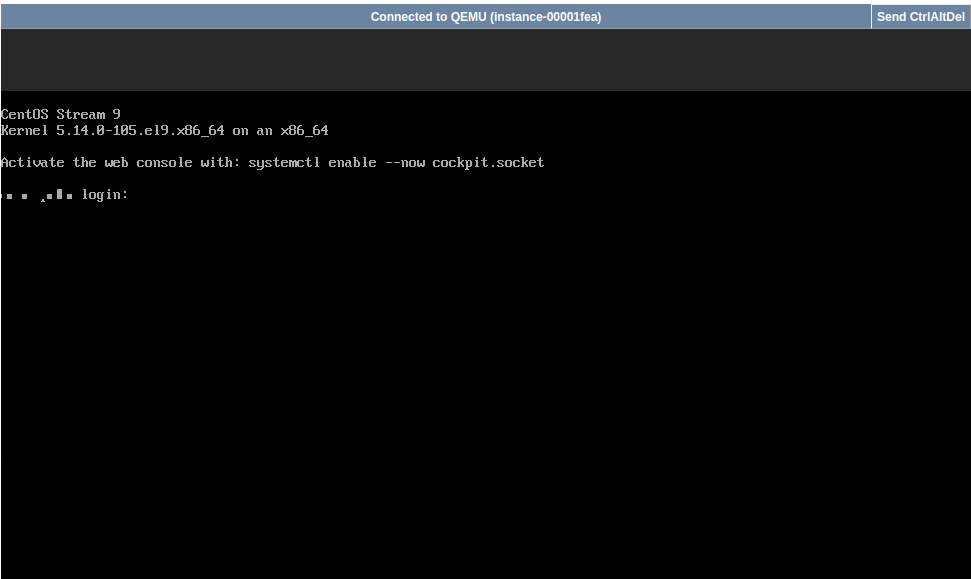
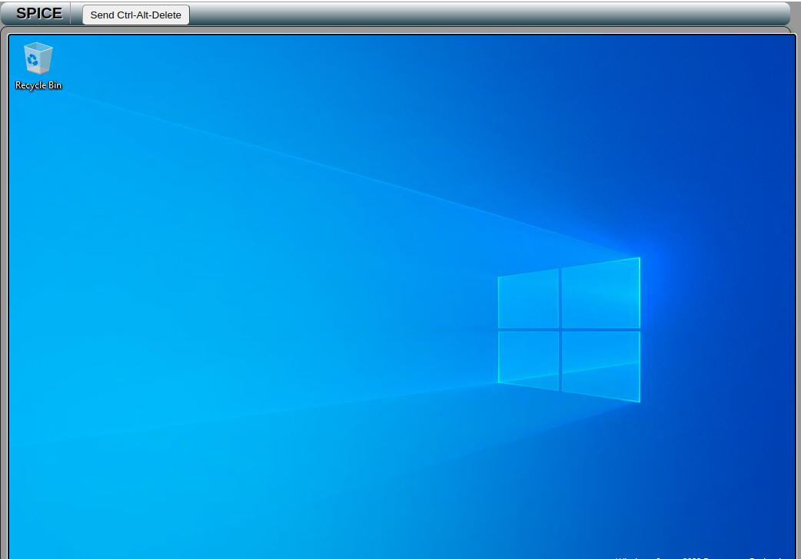

# Comparison of OpenStack NoVNC and SPICE Console

Author: Ramon Grullon

## Introduction

OpenStack provides multiple options for accessing virtual machine consoles,
including NoVNC (HTML5-based) and SPICE (Simple Protocol for Independent
Computing Environments). This document compares these two console access methods
in the context of OpenStack.

## Overview

### NoVNC (HTML5-based VNC client)

- Technology: NoVNC uses HTML5 and WebSockets to provide a VNC client that runs
entirely in the browser.

- Browser Compatibility: Works on most modern web browsers without requiring
additional plugins.

- Performance: Generally good performance for remote console access.

- Configuration: Usually configured as the default console access method in OpenStack.



### SPICE (Simple Protocol for Independent Computing Environments)

- Technology: SPICE is a protocol for remote computing environments. SPICE
clients are available as standalone applications.

- Client Installation: Requires a separate SPICE client to be installed on the
user's machine.

- Performance: Generally known for high-performance remote display capabilities.

- Integration: Integrated with QEMU/KVM hypervisors and provides additional
features like audio and video streaming.



## Features Comparison

### NoVNC

Pros:

- Platform Independence: Works on various platforms without requiring client installation.

- Browser Compatibility: Runs in most modern web browsers.

- Easy Integration: Default console access method in many OpenStack deployments.

Cons:

- Potential Performance: May experience lower performance compared to SPICE in
certain scenarios.

### SPICE

Pros:

- High Performance: Known for delivering high-performance remote display capabilities.

- Multimedia Support: Supports audio and video streaming in addition to console access.

- Integration: Integrated with QEMU/KVM hypervisors.

Cons:

- Client Installation: Requires users to install a separate SPICE client on
their machines.

- Limited Browser Support: Requires a standalone client and is not as
browser-friendly as NoVNC.

## Scenarios

### NoVNC Usage

- Suitability:

- Well-suited for users who need quick and easy console access without additional
client installations.

- Suitable for scenarios where platform independence and browser compatibility
are crucial.

### SPICE Usage

- Suitability:

- Ideal for users who prioritize high-performance remote display capabilities.

- Suitable for multimedia applications and scenarios where advanced features
like audio and video streaming are required.

## Configuration in OpenStack

- Easy Integration: Default console access method in many OpenStack deployments.

### NoVNC Configuration

- Typically configured as the default console access method in OpenStack.

- Configured in the Horizon dashboard.

### SPICE Configuration

- Configuration:

- Requires additional configuration in OpenStack.

- Configured in the Horizon dashboard, but users need to ensure SPICE support in
hypervisors.

#### Kolla Ansible method

Requires using kolla-ansible to deploy Spice support and reconfiguring Nova

- Edit your /etc/kolla/globals.yaml file for kolla-ansible

```bash
# Nova

enable_nova: true
nova_console: "spice"

```

- Edit your `/etc/kolla/nova-compute/nova.conf` and
`/etc/kolla/nova-spicehtml5proxy/nova.conf` file on each compute hosts to
include the following in the spice section.

```bash
agent_enabled = true

```

- Restart both nova-compute and nova-spicehtml5proxy containers

```bash
docker restart nova_compute nova_spicehtml5proxy
```

#### Manual Spice Configuration

To enable the SPICE console service, you must configure both the
nova-spicehtml5proxy service and the nova-compute service. Most options are
defined in the spice group.

Further reading on process to enable Spice manually

- <https://docs.openstack.org/nova/latest/admin/remote-console-access.html#spice-console>

## Summary

Choosing between NoVNC and SPICE depends on specific use cases, user preferences,
and the desired level of performance. While NoVNC offers platform independence
and ease of use, SPICE is known for its high-performance capabilities and
multimedia support.

Both options provide reliable console access, and the choice may be influenced
by factors such as the user environment, desired features, and performance
requirements. Consider the needs of your users and the nature of your virtualized
environment when selecting the most suitable console access method.

## References

- <https://docs.openstack.org/nova/latest/admin/remote-console-access.html>
